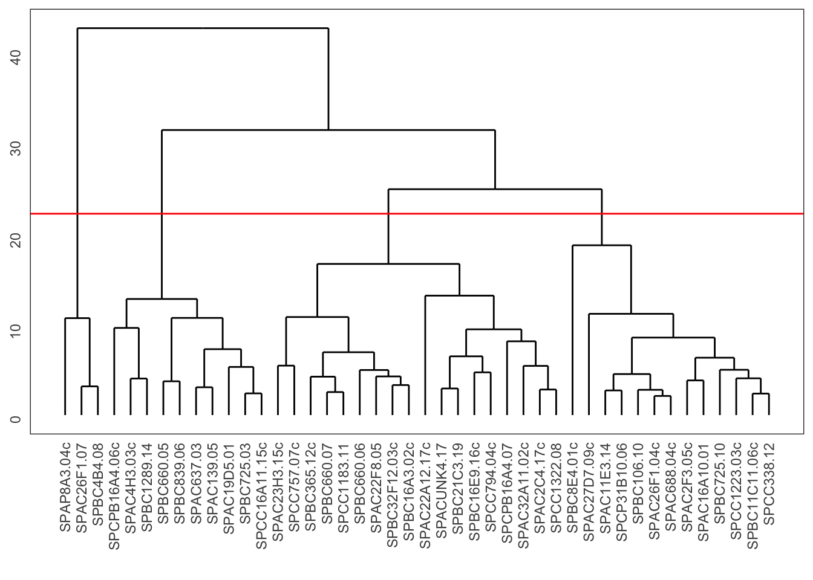
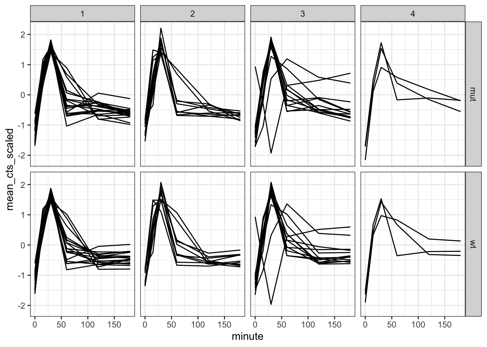
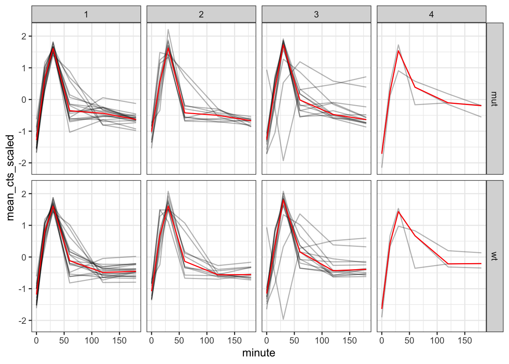
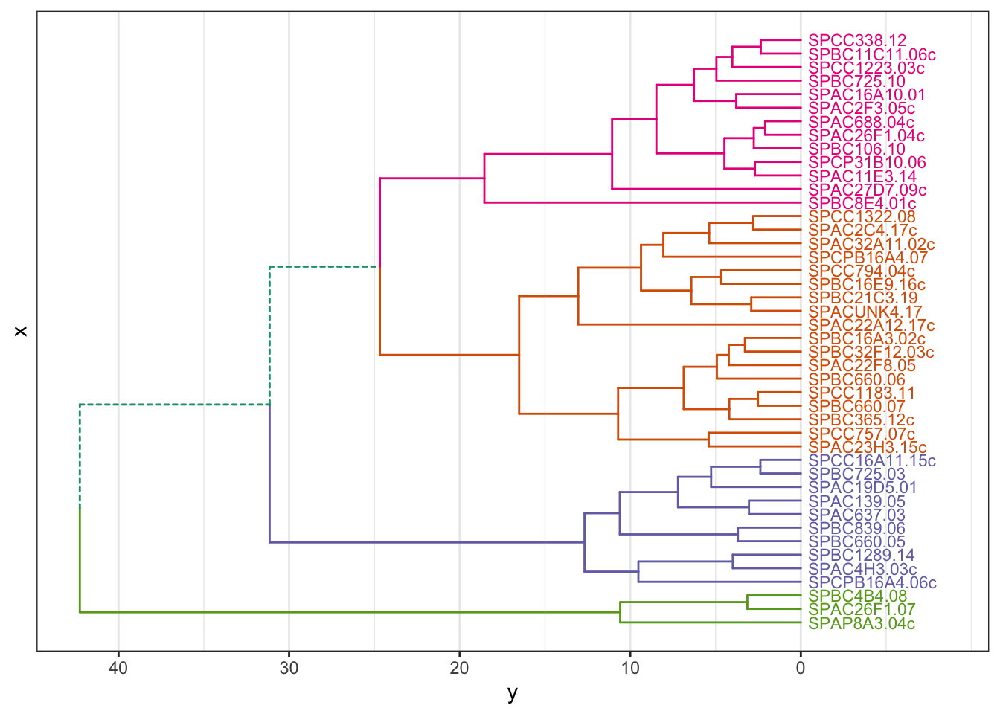

`<style>.panelset{--panel-tab-font-family: inherit;}</style>`{=html}


# Hierarchical clustering

## Objectives
:::objectives
**Questions**

- How do I...
- What do I...

**Objectives**

- Be able to...
- Use...
:::

## Purpose and aim
Hierarchical clustering is a form of cluster analysis, with the aim to create a hierarchy of clusters. The results are commonly displayed in a dendogram which displays the clusters found in the analysis.

## Libraries and functions

::::: {.panelset}

::: {.panel}
[tidyverse]{.panel-name}

| Library| Description|
|:- |:- |
|`tidyverse`| A collection of R packages designed for data science |
|`broom`| Summarises key information about statistical objects in tidy tibbles |
|`palmerpenguins`| Contains data sets on penguins at the Palmer Station on Antarctica.|
|`ggdendro`| Designed for simple visualisation of hierarchical clusters |

:::
:::::


```r
trans_cts <- read_csv("data/transcriptome/counts_transformed.csv")
sample_info <- read_csv("data/transcriptome/sample_info.csv")
test_result <- read_csv("data/transcriptome/test_result.csv")

# set of candidate genes for clustering
# we select the 50 genes with the lowest padj value
candidate_genes <- test_result %>% 
  slice_min(padj, n = 50) %>%  
  select(gene) %>% 
  distinct()

# Summarise counts 
trans_cts_mean <- trans_cts %>% 
  # convert to long format
  pivot_longer(cols = wt_0_r1:mut_180_r3, names_to = "sample", values_to = "cts")  %>% 
  # join with sample info table
  full_join(sample_info, by = "sample") %>% 
  # filter to retain only genes of interest
  semi_join(candidate_genes, by = "gene") %>%
  # for each gene
  group_by(gene) %>% 
  # scale the cts column
  mutate(cts_scaled = (cts - mean(cts))/sd(cts)) %>% 
  # for each gene, strain and minute
  group_by(gene, strain, minute) %>%
  # calculate the mean (scaled) cts
  summarise(mean_cts_scaled = mean(cts_scaled),
            nrep = n()) %>% 
  ungroup()

gene_hclust <- trans_cts %>%
  semi_join(candidate_genes, by = "gene") %>%
  column_to_rownames(var = "gene") %>% 
  dist(method = "euclidian") %>% 
  hclust()
```

Plot the dendrogram using `ggdendrogram()`.


```r
ggdendrogram(gene_hclust, rotate = FALSE, size = 3)
```


Cutting the tree:


```r
ggdendrogram(gene_hclust, rotate = FALSE, size = 3) +
  geom_hline(yintercept = 22, colour = "red")
```




```r
gene_cluster <- cutree(gene_hclust, k = 4) %>% 
  # turn the named vector into a tibble
  enframe() %>% 
  # rename some of the columns
  rename(gene = name, cluster = value)

head(gene_cluster)
```

```
## # A tibble: 6 × 2
##   gene          cluster
##   <chr>           <int>
## 1 SPAC22A12.17c       1
## 2 SPACUNK4.17         1
## 3 SPAC4H3.03c         2
## 4 SPAC2F3.05c         3
## 5 SPAC637.03          2
## 6 SPAC26F1.07         4
```


```r
trans_cts_cluster <- trans_cts_mean %>% 
  inner_join(gene_cluster, by = "gene")

head(trans_cts_cluster)
```

```
## # A tibble: 6 × 6
##   gene        strain minute mean_cts_scaled  nrep cluster
##   <chr>       <chr>   <dbl>           <dbl> <int>   <int>
## 1 SPAC11E3.14 mut         0          -1.06      3       3
## 2 SPAC11E3.14 mut        15           0.615     3       3
## 3 SPAC11E3.14 mut        30           1.83      3       3
## 4 SPAC11E3.14 mut        60          -0.553     3       3
## 5 SPAC11E3.14 mut       120          -0.353     3       3
## 6 SPAC11E3.14 mut       180          -0.635     3       3
```

Plot gene expression trends, separating the genes of interest by cluster:

```r
trans_cts_cluster %>% 
  ggplot(aes(minute, mean_cts_scaled)) +
  geom_line(aes(group = gene)) +
  facet_grid(rows = vars(strain), cols = vars(cluster))
```



We can update this, by adding a median line to each facet, showing the median expression for each cluster:

```r
trans_cts_cluster %>% 
  ggplot(aes(minute, mean_cts_scaled)) +
  geom_line(aes(group = gene), alpha = 0.3) +
  geom_line(stat = "summary", fun = "median", colour = "red", size = 0.5, 
            aes(group = 1)) +
  facet_grid(rows = vars(strain), cols = vars(cluster))
```



## Advanced: Colouring clusters

Adding colour to dendograms can be a bit tricky. There are different ways of doing so, but the simplest method I've found (so far) that does not require the installation of various, extensive packages is a bunch of functions written by Atrebas. See the [blogpost](https://atrebas.github.io/post/2019-06-08-lightweight-dendrograms/).

Basically, all you need to do is load the script I provided and off you go!


```r
source(file = "scripts/ggdendro_extended.R")
```


```r
# cut the dendrogram, specify the number of clusters
hcdata <- dendro_data_k(gene_hclust, 4)


plot_ggdendro(hcdata,
              direction   = "lr",
              expand.y    = 0.2,
              branch.size = 0.5)
```


We can also plot this as a circular dendogram:

```r
plot_ggdendro(hcdata,
              fan         = TRUE,
              label.size  = 3,
              nudge.label = 0.02,
              expand.y    = 0.4) +
  theme_void()
```


## Exercise

:::exercise ::::::

Exercise

::::: {.panelset}
::: {.panel}
[tidyverse]{.panel-name}

question

:::
:::::

<details><summary>Answer</summary>

::::: {.panelset}

::: {.panel}
[tidyverse]{.panel-name}

answer

:::
:::::

</details>

::::::::::::::::::

## Key points

:::keypoints
- Point 1
- Point 2
- Point 3
:::
