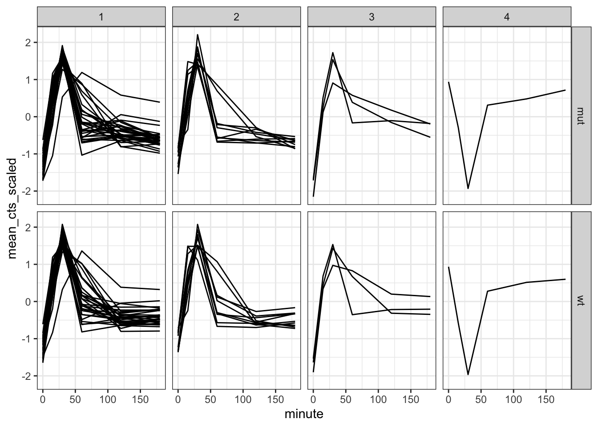
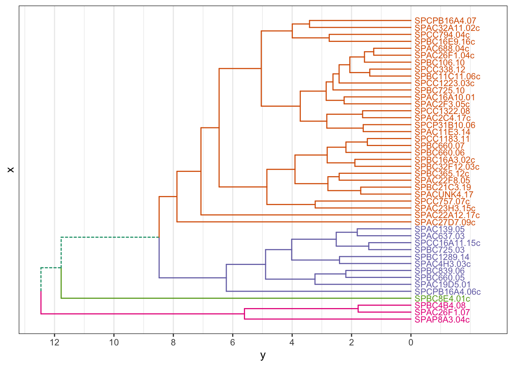

`<style>.panelset{--panel-tab-font-family: inherit;}</style>`{=html}


# Hierarchical clustering

## Objectives
:::objectives
**Questions**

- How do I...
- What do I...

**Objectives**

- Be able to...
- Use...
:::

## Purpose and aim
Hierarchical clustering is a form of cluster analysis, with the aim to create a hierarchy of clusters. The results are commonly displayed in a dendrogram, which displays the clusters found in the analysis.

## Libraries and functions

::::: {.panelset}

::: {.panel}
[tidyverse]{.panel-name}

| Library| Description|
|:- |:- |
|`tidyverse`| A collection of R packages designed for data science |
|`broom`| Summarises key information about statistical objects in tidy tibbles |
|`palmerpenguins`| Contains data sets on penguins at the Palmer Station on Antarctica.|
|`ggdendro`| Designed for simple visualisation of hierarchical clusters |

:::
:::::

## Data
For the example in this session we'll be using the yeast RNAseq data set.

::::: {.panelset}
::: {.panel}
[Yeast RNAseq]{.panel-name}

These data are from an experiment included in the [fission R/Bioconductor](https://bioconductor.org/packages/release/data/experiment/html/fission.html) package. Very briefly, we have transcriptome data for:

- Two yeast strains: wild type (`wt`) and _atf21del_ mutant (`mut`)
- Each has 6 time points of osmotic stress time (0, 15, 30, 60, 120 and 180 mins)
- Three replicates for each strain at each time point

Let’s say that you did this experiment yourself, and that a bioinformatician analysed it and provided you with four files of data:

1. `sample_info.csv` - information about each sample.
2. `counts_raw.csv` - raw or unprocessed read counts for all genes, which gives a measure of the genes’ expression. (these are simply scaled to the size of each library to account for the fact that different samples have more or less total number of reads).
3. `counts_transformed.csv` - normalised read counts for all genes, on a log scale and transformed to correct for a dependency between the mean and the variance. This is typical of count data.
4. `test_result.csv` - results from a statistical test that assessed the probability of observed expression differences between the first and each of the other time points in WT cells, assuming a null hypothesis of no difference.
:::
:::::

## Get to know your data

Let's load the data we need for this session (we don't need the raw data):


```r
trans_cts <- read_csv("data/transcriptome/counts_transformed.csv")
sample_info <- read_csv("data/transcriptome/sample_info.csv")
test_result <- read_csv("data/transcriptome/test_result.csv")
```
### Transformed counts
Let's look at the transformed count data:

```r
trans_cts
```

```
## # A tibble: 6,011 × 37
##    gene     wt_0_r1 wt_0_r2 wt_0_r3 wt_15_r1 wt_15_r2 wt_15_r3 wt_30_r1 wt_30_r2
##    <chr>      <dbl>   <dbl>   <dbl>    <dbl>    <dbl>    <dbl>    <dbl>    <dbl>
##  1 SPAC212…    4.95    4.97    5.66     5.45     5.44     6.50     5.08     5.25
##  2 SPAC212…    5.44    6.21    6.17     5.94     6.33     6.41     6.71     7.15
##  3 SPAC212…    5.75    5.06    5.54     5.68     5.18     5.10     5.82     6.31
##  4 SPNCRNA…    5.73    4.87    4.94     5.57     5.32     4.20     5.17     4.77
##  5 SPAC977…    7.05    6.84    6.79     6.87     6.09     6.19     6.91     6.66
##  6 SPAC977…    5.34    5.34    5.31     5.32     5.99     5.30     7.61     7.48
##  7 SPAC977…    6.50    6.23    6.70     7.03     6.92     7.53     6.44     6.68
##  8 SPAC977…    7.24    7.46    7.48     7.09     7.46     7.65     6.88     7.13
##  9 SPNCRNA…    5.96    5.69    5.94     5.92     5.87     4.84     7.38     7.30
## 10 SPAC1F8…    6.64    6.65    6.78     4.62     5.61     6.15     5.66     6.50
## # … with 6,001 more rows, and 28 more variables: wt_30_r3 <dbl>,
## #   wt_60_r1 <dbl>, wt_60_r2 <dbl>, wt_60_r3 <dbl>, wt_120_r1 <dbl>,
## #   wt_120_r2 <dbl>, wt_120_r3 <dbl>, wt_180_r1 <dbl>, wt_180_r2 <dbl>,
## #   wt_180_r3 <dbl>, mut_0_r1 <dbl>, mut_0_r2 <dbl>, mut_0_r3 <dbl>,
## #   mut_15_r1 <dbl>, mut_15_r2 <dbl>, mut_15_r3 <dbl>, mut_30_r1 <dbl>,
## #   mut_30_r2 <dbl>, mut_30_r3 <dbl>, mut_60_r1 <dbl>, mut_60_r2 <dbl>,
## #   mut_60_r3 <dbl>, mut_120_r1 <dbl>, mut_120_r2 <dbl>, mut_120_r3 <dbl>, …
```
Here we have a list of genes, with 37 columns. The columns encode information about the strain (wt/mut), time point (0, 15, etc) and repeat (r1, r2, r3). This is something we need to be aware of, because it's often not helpful to have that kind of information encoded in the column name.

A quick check also tells us that there are 6,011 genes in this data set, with each gene only occurring once:

```r
trans_cts %>% 
  count(gene) %>%  # count the number of genes
  arrange(desc(n)) # arrange in descending order
```

```
## # A tibble: 6,011 × 2
##    gene             n
##    <chr>        <int>
##  1 SPAC1002.01      1
##  2 SPAC1002.02      1
##  3 SPAC1002.03c     1
##  4 SPAC1002.04c     1
##  5 SPAC1002.05c     1
##  6 SPAC1002.07c     1
##  7 SPAC1002.08c     1
##  8 SPAC1002.09c     1
##  9 SPAC1002.10c     1
## 10 SPAC1002.11      1
## # … with 6,001 more rows
```

### Sample info
Let's have a look to see what is in the sample info:

```r
sample_info
```

```
## # A tibble: 36 × 4
##    sample   strain minute replicate
##    <chr>    <chr>   <dbl> <chr>    
##  1 wt_0_r1  wt          0 r1       
##  2 wt_0_r2  wt          0 r2       
##  3 wt_0_r3  wt          0 r3       
##  4 wt_15_r1 wt         15 r1       
##  5 wt_15_r2 wt         15 r2       
##  6 wt_15_r3 wt         15 r3       
##  7 wt_30_r1 wt         30 r1       
##  8 wt_30_r2 wt         30 r2       
##  9 wt_30_r3 wt         30 r3       
## 10 wt_60_r1 wt         60 r1       
## # … with 26 more rows
```

This data set contains all the information of the various samples, but with the data also split by column. That'll come in handy later on.

### Test results

```r
test_result
```

```
## # A tibble: 30,055 × 8
##    gene        baseMean log2FoldChange lfcSE   stat pvalue  padj comparison
##    <chr>          <dbl>          <dbl> <dbl>  <dbl>  <dbl> <dbl>      <dbl>
##  1 SPAC212.11      8.55         1.54   0.497  1.09  0.276      1         15
##  2 SPAC212.09c    50.8          0.399  0.273  0     1          1         15
##  3 SPAC212.04c    38.3         -0.0230 0.269  0     1          1         15
##  4 SPNCRNA.601     9.47        -0.0841 0.483  0     1          1         15
##  5 SPAC977.11     70.4         -0.819  0.201  0     1          1         15
##  6 SPAC977.13c    36.7          1.19   0.344  0.552 0.581      1         15
##  7 SPAC977.15     49.1          0.600  0.208  0     1          1         15
##  8 SPAC977.16c    83.2          0.148  0.239  0     1          1         15
##  9 SPNCRNA.607    60.4          0.0638 0.268  0     1          1         15
## 10 SPAC1F8.06     74.2         -1.58   0.298 -1.94  0.0520     1         15
## # … with 30,045 more rows
```

The test results give us the results of a statistical test between the first time point in the WT cells, comparing it to all the other time points. The null hypothesis is that there is no difference. The column that we're mostly interested in is the `padj`, which gives us the adjusted p-values.


```r
test_result %>% 
  select(gene, padj)
```

```
## # A tibble: 30,055 × 2
##    gene         padj
##    <chr>       <dbl>
##  1 SPAC212.11      1
##  2 SPAC212.09c     1
##  3 SPAC212.04c     1
##  4 SPNCRNA.601     1
##  5 SPAC977.11      1
##  6 SPAC977.13c     1
##  7 SPAC977.15      1
##  8 SPAC977.16c     1
##  9 SPNCRNA.607     1
## 10 SPAC1F8.06      1
## # … with 30,045 more rows
```

## Clustering
There is a lot of data here (over 6,000 data points!). We might be interested in how these data group/cluster together. We could do this using k-means clustering but here we're going to use hierarchical clustering.

What we're looking for specifically is whether there are groups of genes that are more similar to one another. We approach this by creating an hierarchy: the genes that are _most_ similar to each other cluster together, followed by the next groups of genes that are most similar to each other after that, and so forth.

To make things a bit more manageable for this example, we'll only look at a subset of the 6,011 genes. We'll select the 50 most highly differentially expressed genes to work with and store the gene names in a data frame:


```r
# set of candidate genes for clustering
# we select the 50 genes with the lowest padj value
candidate_genes <- test_result %>% 
  slice_min(padj, n = 50) %>%  
  select(gene) %>% 
  distinct()
```
:::
:::::

Now that we've got a list of genes that we're interested in, we can use these to cluster the data.

The way that his works is that the first gene is compared to all the other genes. These two genes then form a cluster. After that the second gene is compared to the cluster and the other remaining genes. It too forms a cluster with the most similar gene or cluster.

This process continues until there are no comparisons left.

The way this is quantified is by calculating a matrix of dissimilarities. This happens using distance measures - something we already learned about with the k-means clustering. Two useful distance measures are the _Euclidian_ and _Manhattan_ distance.

There are different ways methods to calculating these distances, with the most commonly types used:

| Name| Method| Usage|
|:- |:- |:- |
|complete linkage| maximum distance between two clusters | tends to create compact clusters |
|single linkage | minimum distance between two clusters | tends to produce loose clusters |
|average linkage | average distance between two clusters | |
|centroid linkage | distance between cluster centroids | |
|Ward's minimum variance | minimises total within-cluster variance | |

::::: {.panelset}
::: {.panel}
[tidyverse]{.panel-name}
The function we use to calculate the clusters is `hclust()`. But before we can do that, we need to calculate the dissimilarities between the clusters. We do that using the `dist()` function. The default method that is used is `"euclidian"`, but there are other options. Run `?dist` to have a look.

The default method used by `hclust()` is `"complete"`, but just to be different I'll be using the `"average"` linkage here. It's always useful to see how which method helps you to look at your data best.


```r
gene_hclust <- trans_cts %>%
  # filter our data for the candidate genes
  semi_join(candidate_genes, by = "gene") %>%
  # convert the gene column to row names
  # because dist() takes a matrix
  column_to_rownames(var = "gene") %>% 
  # scale the data
  scale() %>% 
  # calculate the Euclidian distance
  dist(method = "euclidian") %>% 
  # perform the clustering
  hclust(method = "average")
```

:::note
**Scaling** is technically not necessary here, because the differential expression analysis has already done this for us. However, I've included the step here anyway to make you aware of it. Trying to calculate distances between values that are on different scales will result in non-sensical results!
:::

We can look at one `hclust()` has produced for us:

```r
gene_hclust
```

```
## 
## Call:
## hclust(d = ., method = "average")
## 
## Cluster method   : average 
## Distance         : euclidean 
## Number of objects: 44
```

The answer is a list that contains a whole bunch of data. We can see that the distance and clustering methods are as we specified them (hoorah!). Also, there appear to be 44 objects.

This in itself does not help us much, so let's go ahead and plot it. To make this a bit more manageable we're using the library `ggdendro`, which allows us to plot dendrograms using ggplot-style syntax.

If you haven't installed/loaded it, now is a good time. You can do this as follows:

```r
# install if needed
install.packages("ggdendro")

# and load the library
library(ggdendro)
```

Next, we can plot the dendrogram using the `ggdendrogram()` function. We give it the `gene_clust` object, tell it not to rotate the dendrogram (try setting it to `TRUE` and see what happens!), and give it a title.


```r
ggdendrogram(gene_hclust, rotate = FALSE) +
  labs(title = "Top 50 DEG dendrogram")
```


Cutting the tree:


```r
ggdendrogram(gene_hclust, rotate = FALSE, size = 3) +
  geom_hline(yintercept = 22, colour = "red")
```


```r
gene_cluster <- cutree(gene_hclust, k = 4) %>% 
  # turn the named vector into a tibble
  enframe() %>% 
  # rename some of the columns
  rename(gene = name, cluster = value)

head(gene_cluster)
```

```
## # A tibble: 6 × 2
##   gene          cluster
##   <chr>           <int>
## 1 SPAC22A12.17c       1
## 2 SPACUNK4.17         1
## 3 SPAC4H3.03c         2
## 4 SPAC2F3.05c         1
## 5 SPAC637.03          2
## 6 SPAC26F1.07         3
```


```r
# Summarise counts 
trans_cts_mean <- trans_cts %>% 
  # convert to long format
  pivot_longer(cols = wt_0_r1:mut_180_r3, names_to = "sample", values_to = "cts")  %>% 
  # join with sample info table
  full_join(sample_info, by = "sample") %>% 
  # filter to retain only genes of interest
  semi_join(candidate_genes, by = "gene") %>%
  # for each gene
  group_by(gene) %>% 
  # scale the cts column
  mutate(cts_scaled = (cts - mean(cts))/sd(cts)) %>% 
  # for each gene, strain and minute
  group_by(gene, strain, minute) %>%
  # calculate the mean (scaled) cts
  summarise(mean_cts_scaled = mean(cts_scaled),
            nrep = n()) %>% 
  ungroup()
```

```
## `summarise()` has grouped output by 'gene', 'strain'. You can override using
## the `.groups` argument.
```


```r
trans_cts_cluster <- trans_cts_mean %>% 
  inner_join(gene_cluster, by = "gene")

head(trans_cts_cluster)
```

```
## # A tibble: 6 × 6
##   gene        strain minute mean_cts_scaled  nrep cluster
##   <chr>       <chr>   <dbl>           <dbl> <int>   <int>
## 1 SPAC11E3.14 mut         0          -1.06      3       1
## 2 SPAC11E3.14 mut        15           0.615     3       1
## 3 SPAC11E3.14 mut        30           1.83      3       1
## 4 SPAC11E3.14 mut        60          -0.553     3       1
## 5 SPAC11E3.14 mut       120          -0.353     3       1
## 6 SPAC11E3.14 mut       180          -0.635     3       1
```

Plot gene expression trends, separating the genes of interest by cluster:

```r
trans_cts_cluster %>% 
  ggplot(aes(minute, mean_cts_scaled)) +
  geom_line(aes(group = gene)) +
  facet_grid(rows = vars(strain), cols = vars(cluster))
```



We can update this, by adding a median line to each facet, showing the median expression for each cluster:

```r
trans_cts_cluster %>% 
  ggplot(aes(minute, mean_cts_scaled)) +
  geom_line(aes(group = gene), alpha = 0.3) +
  geom_line(stat = "summary", fun = "median", colour = "red", size = 0.5, 
            aes(group = 1)) +
  facet_grid(rows = vars(strain), cols = vars(cluster))
```


## Advanced: Colouring clusters

Adding colour to dendrograms can be a bit tricky. There are different ways of doing so, but the simplest method I've found (so far) that does not require the installation of various, extensive packages is a bunch of functions written by Atrebas. See the [blogpost](https://atrebas.github.io/post/2019-06-08-lightweight-dendrograms/).

Basically, all you need to do is load the script I provided and off you go!


```r
source(file = "scripts/ggdendro_extended.R")
```


```r
# cut the dendrogram, specify the number of clusters
hcdata <- dendro_data_k(gene_hclust, 4)


plot_ggdendro(hcdata,
              direction   = "lr",
              expand.y    = 0.2,
              branch.size = 0.5)
```


We can also plot this as a circular dendrogram:

```r
plot_ggdendro(hcdata,
              fan         = TRUE,
              label.size  = 3,
              nudge.label = 0.02,
              expand.y    = 0.4) +
  theme_void()
```


## Exercise

:::exercise ::::::

Exercise

::::: {.panelset}
::: {.panel}
[tidyverse]{.panel-name}

question

:::
:::::

<details><summary>Answer</summary>

::::: {.panelset}

::: {.panel}
[tidyverse]{.panel-name}

answer

:::
:::::

</details>

::::::::::::::::::

## Key points

:::keypoints
- Point 1
- Point 2
- Point 3
:::
