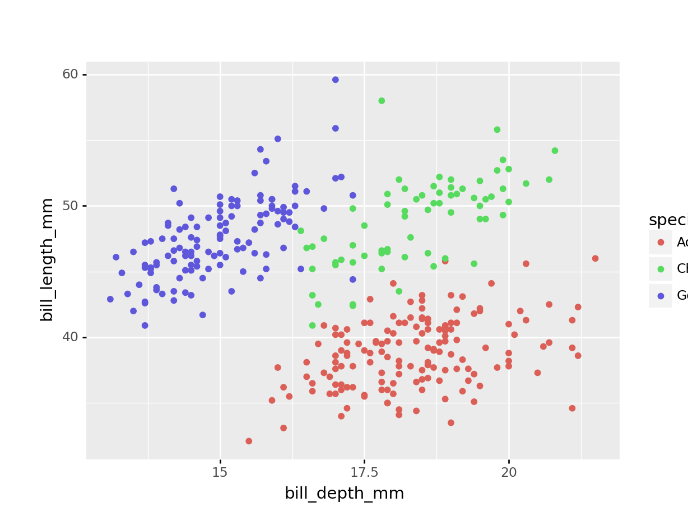
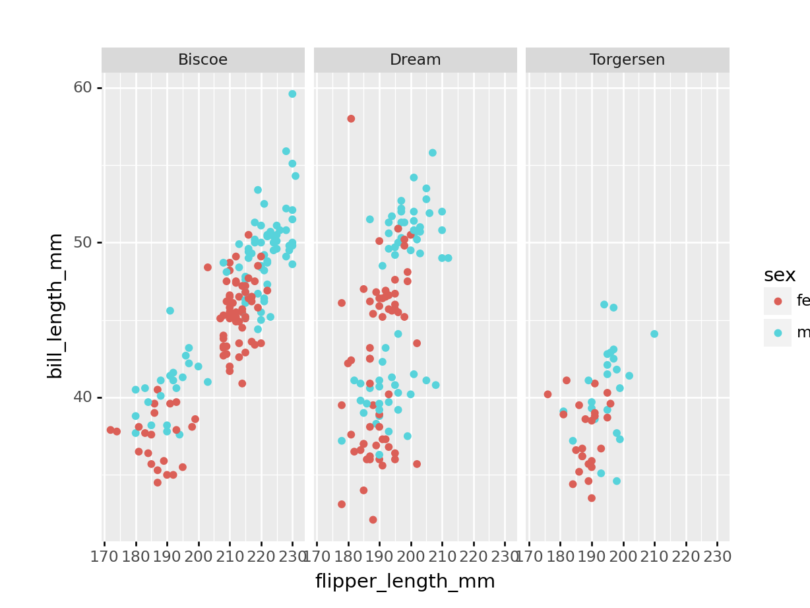
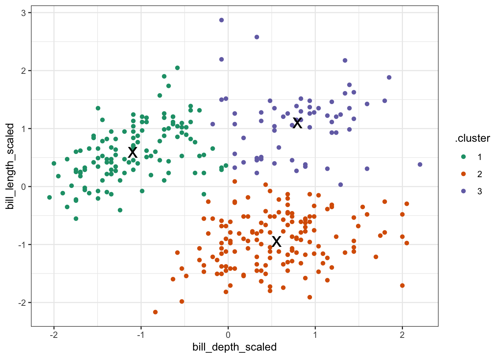
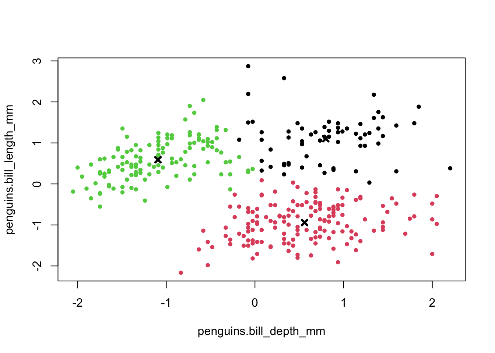
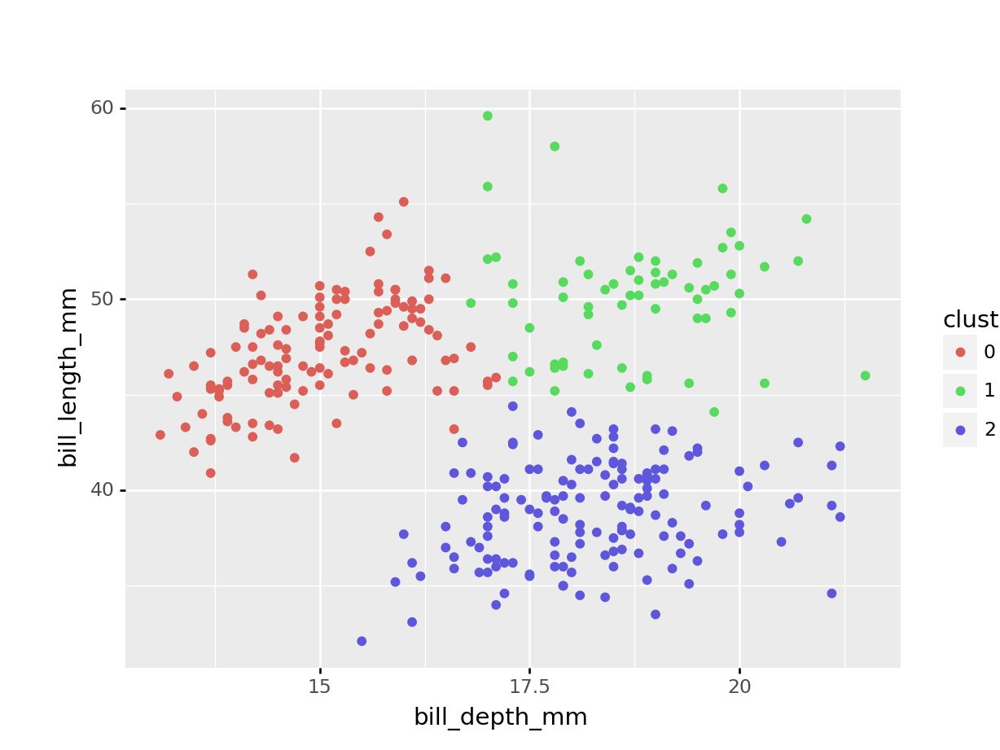
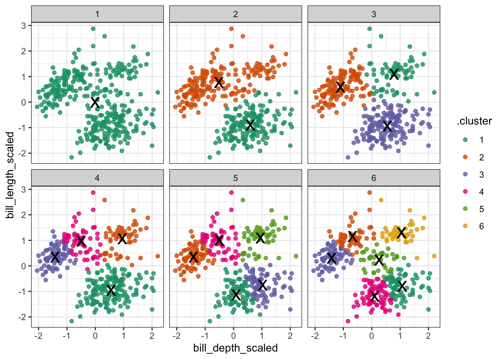
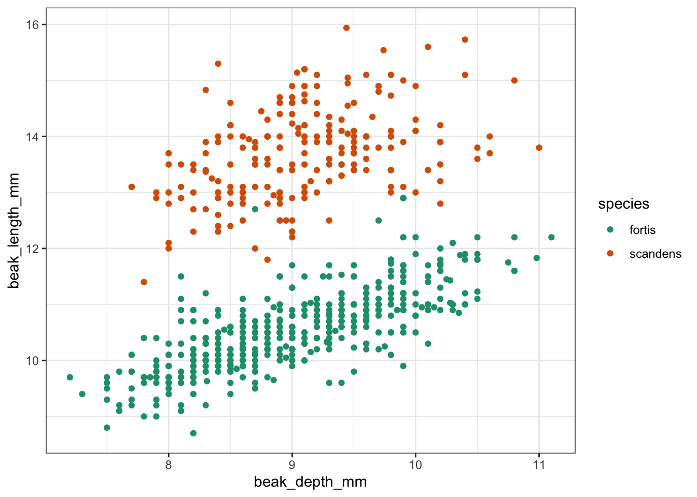
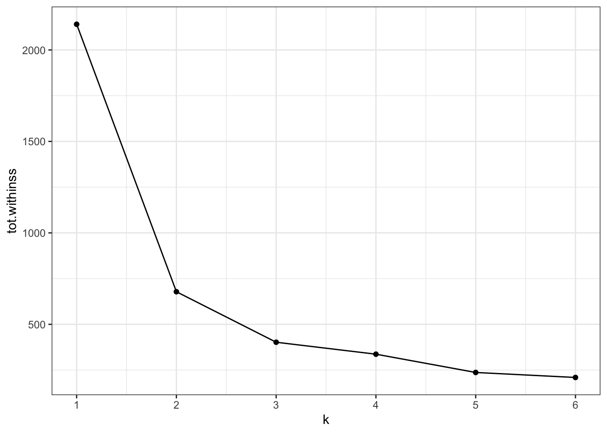

`<style>.panelset{--panel-tab-font-family: inherit;}</style>`{=html}

# K-means clustering {#kmeans}

## Objectives
:::objectives

* Understand how k-means clustering works
* Be able to perform k-means clustering
* Be able to optimise cluster number

:::

## Libraries and functions

::::: {.panelset}

::: {.panel}
[tidyverse]{.panel-name}

| Library| Description|
|:- |:- |
|`tidyverse`| A collection of R packages designed for data science |
|`broom`| Summarises key information about statistical objects in tidy tibbles |
|`palmerpenguins`| Contains data sets on penguins at the Palmer Station on Antarctica.|

:::

::: {.panel}
[base R]{.panel-name}

| Library| Description|
|:- |:- |
|`palmerpenguins`| Contains data sets on penguins at the Palmer Station on Antartica.|

:::

::: {.panel}
[Python]{.panel-name}

| Library| Description|
|:- |:- |
|`plotnine`| The Python equivalent of `ggplot2`.|
|`pandas`| A Python data analysis and manipulation tool.|


```python
from plotnine import *
import pandas as pd
from datar.all import *
```

```python
from pipda import options
from sklearn.cluster import KMeans
from sklearn.metrics import silhouette_score
from sklearn.preprocessing import StandardScaler

options.assume_all_piping = True
```

:::

:::::

## Workflow
K-means clustering is an iterative process. It follows the following steps:

1. Select the number of clusters to identify (e.g. K = 3)
2. Create centroids
3. Place centroids randomly in your data
4. Assign each data point to the closest centroid
5. Calculate the centroid of each new cluster
6. Repeat steps 4-5 until the clusters do not change

## Data
For the example, we'll be using the penguin data set.

::::: {.panelset}
::: {.panel}
[Penguins]{.panel-name}
The `penguins` data set comes from `palmerpenguins` package (for more information, see [the GitHub page](https://github.com/allisonhorst/palmerpenguins)).
:::

::: {.panel}
[Darwin's finches]{.panel-name}
The `finches` dataset has been adapted from the [accompanying website](https://doi.org/10.5061/dryad.g6g3h) to _40 years of evolution. Darwin's finches on Daphne Major Island_ by Peter R. Grant and Rosemary B. Grant.

A really interesting lecture on the findings by the Grants can be found [here](https://carnegiescience.edu/news/multimedia/40-years-evolution-darwins-finches) (1h10min).


```r
# load the data
finches <- read_csv("data/finch_beaks.csv")
```
:::
:::::

## Visualise the data
First of all, let's have a look at the data. It is always a good idea to get a sense of how your data.

::::: {.panelset}
::: {.panel}
[tidyverse]{.panel-name}
First, we load and inspect the data:

```r
# attach the data
data(package = 'palmerpenguins')

# inspect the data
penguins
```

```
## # A tibble: 344 × 8
##    species island    bill_length_mm bill_depth_mm flipper_length_mm body_mass_g
##    <fct>   <fct>              <dbl>         <dbl>             <int>       <int>
##  1 Adelie  Torgersen           39.1          18.7               181        3750
##  2 Adelie  Torgersen           39.5          17.4               186        3800
##  3 Adelie  Torgersen           40.3          18                 195        3250
##  4 Adelie  Torgersen           NA            NA                  NA          NA
##  5 Adelie  Torgersen           36.7          19.3               193        3450
##  6 Adelie  Torgersen           39.3          20.6               190        3650
##  7 Adelie  Torgersen           38.9          17.8               181        3625
##  8 Adelie  Torgersen           39.2          19.6               195        4675
##  9 Adelie  Torgersen           34.1          18.1               193        3475
## 10 Adelie  Torgersen           42            20.2               190        4250
## # … with 334 more rows, and 2 more variables: sex <fct>, year <int>
```

Next, we plot the data:

```r
ggplot(penguins, aes(x = bill_depth_mm,
                     y = bill_length_mm,
                     colour = species)) +
  geom_point()
```


:::

::: {.panel}
[base R]{.panel-name}
First, we load and inspect the data:

```r
# attach the data
data(package = 'palmerpenguins')

# inspect the data
head(penguins)
```

```
## # A tibble: 6 × 8
##   species island bill_length_mm bill_depth_mm flipper_length_… body_mass_g sex  
##   <fct>   <fct>           <dbl>         <dbl>            <int>       <int> <fct>
## 1 Adelie  Torge…           39.1          18.7              181        3750 male 
## 2 Adelie  Torge…           39.5          17.4              186        3800 fema…
## 3 Adelie  Torge…           40.3          18                195        3250 fema…
## 4 Adelie  Torge…           NA            NA                 NA          NA <NA> 
## 5 Adelie  Torge…           36.7          19.3              193        3450 fema…
## 6 Adelie  Torge…           39.3          20.6              190        3650 male 
## # … with 1 more variable: year <int>
```

Next, we plot the data:

```r
plot(penguins$bill_depth_mm,      # scatter plot
     penguins$bill_length_mm,
     pch = 20,
     col = penguins$species)      # colour by species

legend("bottomright",             # legend
       legend = levels(penguins$species),
       pch = 20,
       col = factor(levels(penguins$species)))
```


:::

::: {.panel}
[Python]{.panel-name}
The `palmerpenguins` package is not available in Python, so I've provided the data separately. To load the data into Python we do the following:

```python
# load the data
penguins = pd.read_csv('data/penguins.csv')

# inspect the data
penguins.head()
```

```
##    species     island  bill_length_mm  ...  body_mass_g      sex    year
##   <object>   <object>       <float64>  ...    <float64> <object> <int64>
## 0   Adelie  Torgersen            39.1  ...       3750.0     male    2007
## 1   Adelie  Torgersen            39.5  ...       3800.0   female    2007
## 2   Adelie  Torgersen            40.3  ...       3250.0   female    2007
## 3   Adelie  Torgersen             NaN  ...          NaN      NaN    2007
## 4   Adelie  Torgersen            36.7            3450.0   female    2007
## 
## [5 rows x 8 columns]
```

Next, we plot the data:

```python
(
  ggplot(penguins,
    aes(x = 'bill_depth_mm',
        y = 'bill_length_mm',
        colour = 'species'))
  + geom_point()
)
```


:::

:::::

So we have different types of penguins, from different islands. Bill and flipper measurements were taken, and the penguins' weight plus sex was recorded.

As an example, we also have a look at bill depth versus bill length.

We can already see that the data appear to cluster quite closely by species. A great example to illustrate K-means clustering (you'd almost think I chose the example on purpose!)

## Exercise - Flipper and bill length

:::exercise ::::::

For this exercise I'd like you to create a scatter plot of the flipper length against the bill length. We'll be using colour to separate female/male data. Lastly, we're creating individual panels for each island.

Most of the code is given below and I would like you to replace the `<FIXME>` parts with the required code.

Have a think about how many clusters you would try and divide these data in.

::::: {.panelset}
::: {.panel}
[tidyverse]{.panel-name}


```r
penguins %>% 
  drop_na() %>%                     
  ggplot(aes(x = <FIXME>,
             y = bill_length_mm,
             colour = <FIXME>)) +
  geom_<FIXME>() +
  facet_wrap(facets = vars(<FIXME>))
```


:::

::: {.panel}
[base R]{.panel-name}
Things are bit more convoluted using base R, compared to tidyverse. That's because there is no faceting equivalent as such that you can implement directly.

What you could do is split the data by island and create a loop to plot for each island. I'm loathe to go through that here, so I'll just use `Biscoe` island as an example and I'm sure that you're able to adapt things accordingly for `Dream` and `Torgersen` islands!


```r
biscoe <- 
  penguins[penguins$island == '<FIXME>', ]

plot(biscoe$<FIXME>,
     biscoe$bill_length_mm,
     pch = 20,
     col = biscoe$<FIXME>)

legend("bottomright",
       legend = levels(biscoe$sex),
       pch = 20,
       col = factor(levels(biscoe$sex)))

title(main = "Biscoe")
```


:::

::: {.panel}
[Python]{.panel-name}

```python
(
  penguins >> \
  drop_na() >> \
  ggplot(aes(x = '<FIXME>',
             y = 'bill_length_mm',
             colour = '<FIXME>'))
         + geom_<FIXME>()
         + facet_wrap('<FIXME>')
)
```


:::
:::::

<details><summary>Answer</summary>

::::: {.panelset}

::: {.panel}
[tidyverse]{.panel-name}


```r
penguins %>% 
  drop_na() %>%                     
  ggplot(aes(x = flipper_length_mm,
             y = bill_length_mm,
             colour = sex)) +
  geom_point() +
  facet_wrap(facets = vars(island))
```
:::

::: {.panel}
[base R]{.panel-name}

```r
biscoe <- 
  penguins[penguins$island == 'Biscoe', ]

plot(biscoe$flipper_length_mm,
     biscoe$bill_length_mm,
     pch = 20,
     col = biscoe$sex)

legend("bottomright",
       legend = levels(biscoe$sex),
       pch = 20,
       col = factor(levels(biscoe$sex)))

title(main = 'Biscoe')
```
:::

::: {.panel}
[Python]{.panel-name}


```python
(
  penguins >> \
  drop_na() >> \
  ggplot(aes(x = 'flipper_length_mm',
             y = 'bill_length_mm',
             colour = 'sex'))
         + geom_point()
         + facet_wrap('island')
)
```

:::
:::::

</details>

::::::::::::::::::

## Clustering

Next, we'll do the actual clustering.

::::: {.panelset}

::: {.panel}
[tidyverse]{.panel-name}
To do the clustering, we'll be using the `kmeans()` function. This function requires numeric data as its input. We are also scaling the data. Although it is not required in this case, because both variables have the same unit (millimetres) it is good practice. In other scenarios it could be that there are different units that are being compared, which could affect the clustering.


```r
points <-
  penguins %>% 
  select(bill_depth_mm,          # select data
         bill_length_mm) %>% 
  drop_na() %>%                  # remove missing values
  scale() %>%                    # scale the data
  as_tibble() %>% 
  rename(bill_depth_scaled = bill_depth_mm,
         bill_length_scaled = bill_length_mm)


kclust <-
  kmeans(points,                 # perform k-means clustering
         centers = 3)            # using 3 centers

summary(kclust)                  # summarise output
```

```
##              Length Class  Mode   
## cluster      342    -none- numeric
## centers        6    -none- numeric
## totss          1    -none- numeric
## withinss       3    -none- numeric
## tot.withinss   1    -none- numeric
## betweenss      1    -none- numeric
## size           3    -none- numeric
## iter           1    -none- numeric
## ifault         1    -none- numeric
```

Note that the output is a list of vectors, with differing lengths. That's because they contain different types of information:

* `cluster` contains information about each point
* `centers`, `withinss`, and `size` contain information about each cluster
* `totss`, `tot.withinss`, `betweenss`, and `iter` contain information about the full clustering
:::

::: {.panel}
[base R]{.panel-name}
To do the clustering, we'll be using the `kmeans()` function. This function requires numeric data as its input. We are also scaling the data. Although it is not required in this case, because both variables have the same unit (millimetres) it is good practice. In other scenarios it could be that there are different units that are being compared, which could affect the clustering.


```r
points_r <-
  data.frame(
    penguins$bill_depth_mm,      # get the numeric data
    penguins$bill_length_mm) |>  # use base R pipe!
  na.omit() |>                   # remove missing data
  scale()                        # scale the data

# and rename the columns to avoid confusion
names(points_r)[1] <- 'bill_depth_scaled'
names(points_r)[2] <- 'bill_length_scaled'

kclusts_r <-
  kmeans(points_r,               # perform k-means clustering
         centers = 3)            # using 3 centers

summary(kclusts_r)                # summarise output
```

```
##              Length Class  Mode   
## cluster      342    -none- numeric
## centers        6    -none- numeric
## totss          1    -none- numeric
## withinss       3    -none- numeric
## tot.withinss   1    -none- numeric
## betweenss      1    -none- numeric
## size           3    -none- numeric
## iter           1    -none- numeric
## ifault         1    -none- numeric
```

Note that the output is a list of vectors, with differing lengths. That's because they contain different types of information:

* `cluster` contains information about each point
* `centers`, `withinss`, and `size` contain information about each cluster
* `totss`, `tot.withinss`, `betweenss`, and `iter` contain information about the full clustering
:::

::: {.panel}
[Python]{.panel-name}
To do the clustering, we'll be using the `KMeans()` function. This function requires numeric data as its input. We are also scaling the data. Although it is not required in this case, because both variables have the same unit (millimetres) it is good practice. In other scenarios it could be that there are different units that are being compared, which could affect the clustering.


```python
scaler = StandardScaler()

points_py = \
penguins >> \
  drop_na() >> \
  select('bill_depth_mm', 'bill_length_mm')

points_py = scaler.fit_transform(points_py)

kmeans = KMeans(
init = 'random',
n_clusters = 3,
n_init = 10,
max_iter = 300,
random_state = 42
)

kmeans.fit(points_py)
```

```
## KMeans(init='random', n_clusters=3, random_state=42)
```

:::
:::::

## Visualise clusters
We can visualise the clusters that we calculated above.

::::: {.panelset}
::: {.panel}
[tidyverse]{.panel-name}
When we performed the clustering, the centers were calculated. These values give the (x, y) coordinates of the centroids.


```r
tidy_clust <- tidy(kclust) # get centroid coordinates

tidy_clust
```

```
## # A tibble: 3 × 5
##   bill_depth_scaled bill_length_scaled  size withinss cluster
##               <dbl>              <dbl> <int>    <dbl> <fct>  
## 1            -1.09               0.590   125     59.4 1      
## 2             0.799              1.10     64     39.0 2      
## 3             0.560             -0.943   153     88.0 3
```

:::note
The initial centroids get randomly placed in the data. This, combined with the iterative nature of the process, means that the values that you will see are going to be slightly different from the values here. That's normal!
:::

Next, we want to visualise to which data points belong to which cluster. We can do that as follows:


```r
kclust %>%                              # take clustering data
  augment(points) %>%                   # combine with original data
  ggplot(aes(x = bill_depth_scaled,     # plot the scaled data
             y = bill_length_scaled)) +
  geom_point(aes(colour = .cluster)) +  # colour by classification
  geom_point(data = tidy_clust,
             size = 7, shape = 'x')     # add the cluster centers
```


:::

::: {.panel}
[base R]{.panel-name}
When we performed the clustering, the centers were calculated. These values give the (x, y) coordinates of the centroids.


```r
kclusts_r$centers  # get centroid coordinates
```

```
##   penguins.bill_depth_mm penguins.bill_length_mm
## 1              0.5595723              -0.9431819
## 2             -1.0937700               0.5903143
## 3              0.7985421               1.1018368
```

:::note
The initial centroids get randomly placed in the data. This, combined with the iterative nature of the process, means that the values that you will see are going to be slightly different from the values here. That's normal!
:::

Next, we want to visualise to which data points belong to which cluster. We can do that as follows:


```r
plot(points_r,                # plot scaled data
     col = kclusts_r$cluster,  # colour by cluster
     pch = 20)

points(kclusts_r$centers,      # add cluster centers
       pch = 4,
       lwd = 3)
```


:::

:::{.panel}
[Python]{.panel-name}
When we performed the clustering, the centers were calculated. These values give the (x, y) coordinates of the centroids.


```python
# calculate the cluster centers
kclusts_py = kmeans.cluster_centers_

# convert to tibble and rename columns
# use base0_ = True because indices are 0-based
kclusts_py = \
tibble(kclusts_py) >> \
rename(bill_depth_scaled = 0,
       bill_length_scaled = 1, base0_ = True)

# and show the coordinates
kclusts_py
```

```
##    bill_depth_scaled  bill_length_scaled
##            <float64>           <float64>
## 0          -1.098055            0.586444
## 1           0.795036            1.088684
## 2           0.553935           -0.950240
```

:::note
The initial centroids get randomly placed in the data. This, combined with the iterative nature of the process, means that the values that you will see are going to be slightly different from the values here. That's normal!
:::

Next, we want to visualise to which data points belong to which cluster. We can do that as follows:


```python
# convert NumPy arrays to data frame
# use base0_ = True because indices are 0-based
points_py = \
tibble(points_py) >> \
rename(bill_depth_scaled = 0,
       bill_length_scaled = 1, base0_ = True)

# merge with original data
# add predicted clusters
penguins_clusters = \
penguins >> \
  drop_na() >> \
  bind_cols(points_py) >> \
  mutate(cluster = factor(kmeans.fit_predict(points_py)))
```


```python
(
ggplot(penguins_clusters,
       aes(x = 'bill_depth_mm',
           y = 'bill_length_mm',
           colour = 'cluster'))
         + geom_point()
)
```



:::
:::::

## Optimising cluster number
In the example we set the number of clusters to 3. This made sense, because the data already visually separated in roughly three groups - one for each species.

However, it might be that the cluster number to choose is a lot less obvious. In that case it would be helpful to explore clustering your data into a range of clusters.

In short, we determine which values of _k_ we want to explore and then loop through these values, repeating the workflow we looked at previously.

::::: {.panelset}
::: {.panel}
[tidyverse]{.panel-name}
Reiterating over a range of _k_ values is reasonably straightforward using tidyverse. Although we could write our own function to loop through these _k_ values, tidyverse has a series of `map()` functions that can do this for you. More information on them [here](https://purrr.tidyverse.org/reference/map.html).

In short, the `map()` function spits out a [list](https://www.w3schools.com/r/r_lists.asp) which contains the output. When we do this on our data, we can create a table that contains lists with all of the information that we need.

Here we calculate the following:

1. the `kclust` column contains a list with all the `kmeans()` output, for each value of _k_
2. the `tidied` column contains the information on a per-cluster basis
3. the `glanced` column contains single-row summary for each _k_ - we'll use the `tot.withinss` values a little bit later on
4. the `augmented` column contains the original data, augmented with the classification that was calculated by the `kmeans()` function


```r
kclusts <- 
  tibble(k = 1:6) %>%                         # check for k = 1 to 6
  mutate(
    kclust = map(k, ~kmeans(points, .x)),     # perform clustering for each k
    tidied = map(kclust, tidy),               # summary at per-cluster level
    glanced = map(kclust, glance),            # get single-row summary
    augmented = map(kclust, augment, points)  # add classification to data set
  )

kclusts
```

```
## # A tibble: 6 × 5
##       k kclust   tidied           glanced          augmented         
##   <int> <list>   <list>           <list>           <list>            
## 1     1 <kmeans> <tibble [1 × 5]> <tibble [1 × 4]> <tibble [342 × 3]>
## 2     2 <kmeans> <tibble [2 × 5]> <tibble [1 × 4]> <tibble [342 × 3]>
## 3     3 <kmeans> <tibble [3 × 5]> <tibble [1 × 4]> <tibble [342 × 3]>
## 4     4 <kmeans> <tibble [4 × 5]> <tibble [1 × 4]> <tibble [342 × 3]>
## 5     5 <kmeans> <tibble [5 × 5]> <tibble [1 × 4]> <tibble [342 × 3]>
## 6     6 <kmeans> <tibble [6 × 5]> <tibble [1 × 4]> <tibble [342 × 3]>
```

Lists can sometimes be a bit tricky to get your head around, so it's worthwhile exploring the output. RStudio is particularly useful for this, since you can just left-click on the object in your `Environment` panel and look.

The way I see lists in this context is as containers. We have one huge table `kclusts` that contains all of the information that we need. Each 'cell' in this table has a container with the relevant data. The `kclust` column is a list with `kmeans` objects (the output of our `kmeans()` for each of the _k_ values), whereas the other columns are lists of tibbles (because the `tidy()`, `glance()` and `augment()` functions output a tibble with the information for each value of _k_).

For us to use the data in the lists, it makes sense to extract them on a column-by-column basis. We're ignoring the `kclust` column, because we don't need the actual `kmeans()` output any more.

To extract the data from the lists we use the `unnest()` function.


```r
clusters <- 
  kclusts %>%
  unnest(cols = c(tidied))

assignments <- 
  kclusts %>% 
  unnest(cols = c(augmented))

clusterings <- 
  kclusts %>%
  unnest(cols = c(glanced))
```

Next, we can visualise some of the data. We'll start by plotting the scaled data and colouring the data points based on the final cluster it has been assigned to by the `kmeans()` function.

The (augmented) data are in `assignments`. Have a look at the structure of the table.

We facet the data by _k_, so we get a single panel for each value of _k_.

We also add the calculated cluster centres, which are stored in `clusters`.


```r
ggplot(assignments,
       aes(x = bill_depth_scaled,     # plot data
           y = bill_length_scaled)) +  
  geom_point(aes(color = .cluster),   # colour by cluster
             alpha = 0.8) +           # add transparency
  facet_wrap(~ k) +                   # facet for each k
  geom_point(data = clusters,         # add centers
             size = 7,
             shape = "x")
```



Looking at this plot shows what we already knew (if only things were this easy all the time!): three clusters is a pretty good choice for these data. Remember that you're looking for clusters that are distinct, _i.e._ are separated from one another. For example, using `k = 4` gives you four nice groups, but two of them are directly adjacent, suggesting that they would do equally well in a single cluster.
:::
:::::

### Elbow plot
Visualising the data like this can be helpful but at the same time it can also be a bit subjective (hoorah!). To find another subjective way of interpreting these clusters (remember, statistics isn't this YES/NO magic mushroom and we should be comfortable wandering around in the murky grey areas of statistics by now), we can plot the total within-cluster variation for each value of `k`.

Intuitively, if you keep adding clusters then the total amount of variation that can be explained by these clusters will increase. The most extreme case would be where each data point is its own cluster and we can then explain all of the variation in the data.

Of course that is not a very sensible approach - hence us balancing the number of clusters against how much variation they can capture.

A practical approach to this is creating an "elbow" plot where the cumulative amount of variation explained is plotted against the number of clusters.

::::: {.panelset}

::: {.panel}
[tidyverse]{.panel-name}
The output of the `kmeans()` function includes `tot.withinss` - this is the total within-cluster sum of squares.


```r
ggplot(clusterings,
       aes(x = k,                # for each k plot...
           y = tot.withinss)) +  # total within variance
  geom_line() +
  geom_point() +
  scale_x_continuous(
    breaks = seq(1, 6, 1))       # set the x-axis breaks
```


:::
:::::

We can see that the total within-cluster sum of squares decreases as the number of clusters increases. We can also see that from `k = 3` onwards the slope of the line becomes much shallower. This "elbow" or bending point is a useful gauge to find the optimum number of clusters.

From the exploration we can see that three clusters are optimal in this scenario.

## Exercise
:::exercise
Practice running through the clustering workflow using the `finches` dataset. Try doing the following:

1. Read in the data
2. Explore and visualise the data
3. Perform the clustering with `k = 2`
4. Find out if using `k = 2` is a reasonable choice
5. Try and draw some conclusions

<details><summary>Answer</summary>
::::: {.panelset}

::: {.panel}
[tidyverse]{.panel-name}

#### Load the data {.unnumbered}

```r
finches <- read_csv("data/finch_beaks.csv")
```


```r
head(finches)
```

```
## # A tibble: 6 × 5
##    band species beak_length_mm beak_depth_mm  year
##   <dbl> <chr>            <dbl>         <dbl> <dbl>
## 1     2 fortis             9.4           8    1975
## 2     9 fortis             9.2           8.3  1975
## 3    12 fortis             9.5           7.5  1975
## 4    15 fortis             9.5           8    1975
## 5   305 fortis            11.5           9.9  1975
## 6   307 fortis            11.1           8.6  1975
```

#### Visualise the data {.unnumbered}
Let's have a look at the data.


```r
ggplot(finches, aes(x = beak_depth_mm,
                     y = beak_length_mm,
                     colour = species)) +
  geom_point()
```



#### Clustering {.unnumbered}
Next, we perform the clustering.


```r
points <-
  finches %>% 
  select(beak_depth_mm,         # select data
         beak_length_mm) %>% 
  drop_na()                     # remove missing values

kclust <-
  kmeans(points,                 # perform k-means clustering
         centers = 2)            # using 2 centers

summary(kclust)                  # summarise output
```

```
##              Length Class  Mode   
## cluster      651    -none- numeric
## centers        4    -none- numeric
## totss          1    -none- numeric
## withinss       2    -none- numeric
## tot.withinss   1    -none- numeric
## betweenss      1    -none- numeric
## size           2    -none- numeric
## iter           1    -none- numeric
## ifault         1    -none- numeric
```


```r
tidy_clust <- tidy(kclust) # get centroid coordinates

tidy_clust
```

```
## # A tibble: 2 × 5
##   beak_depth_mm beak_length_mm  size withinss cluster
##           <dbl>          <dbl> <int>    <dbl> <fct>  
## 1          9.16           13.7   220     237. 1      
## 2          8.98           10.5   431     442. 2
```

#### Visualise the clusters {.unnumbered}

```r
kclust %>%                              # take clustering data
  augment(points) %>%                   # combine with original data
  ggplot(aes(x = beak_depth_mm,         # plot the original data
             y = beak_length_mm)) +
  geom_point(aes(colour = .cluster)) +  # colour by classification
  geom_point(data = tidy_clust,
             size = 7, shape = 'x')     # add the cluster centers
```


#### Optimise clusters {.unnumbered}
It looks like two clusters is a reasonable choice. But let's explore this a bit more.

```r
kclusts <- 
  tibble(k = 1:6) %>%                         # check for k = 1 to 6
  mutate(
    kclust = map(k, ~kmeans(points, .x)),     # perform clustering for each k
    tidied = map(kclust, tidy),               # summary at per-cluster level
    glanced = map(kclust, glance),            # get single-row summary
    augmented = map(kclust, augment, points)  # add classification to data set
  )
```

Extract the relevant data.

```r
clusters <- 
  kclusts %>%
  unnest(cols = c(tidied))

assignments <- 
  kclusts %>% 
  unnest(cols = c(augmented))

clusterings <- 
  kclusts %>%
  unnest(cols = c(glanced))
```

Visualise the result.

```r
ggplot(assignments,
       aes(x = beak_depth_mm,        # plot data
           y = beak_length_mm)) +  
  geom_point(aes(color = .cluster),  # colour by cluster
             alpha = 0.8) +          # add transparency
  facet_wrap(~ k) +                  # facet for each k
  geom_point(data = clusters,        # add centers
             size = 7,
             shape = 'x')
```


Create an elbow plot to have a closer look.

```r
ggplot(clusterings,
       aes(x = k,                # for each k plot...
           y = tot.withinss)) +  # total within variance
  geom_line() +
  geom_point() +
  scale_x_continuous(
    breaks = seq(1, 6, 1))       # set the x-axis breaks
```



#### Conclusions {.unnumbered}
Our initial clustering was done using two clusters, basically capturing the two different finch species.

Redoing the analysis with different numbers of clusters seems to reasonably support that decision. The elbow plot suggests that `k = 3` would not be such a terrible idea either.

#### Food for thought {.unnumbered}
In the example above we used data that were collected at two different time points: 1975 and 2012.

In the analysis we've kept these data together. However, the original premises of these data was to see if there is any indication of evolution going on in these species of finches. Think about how you would approach this question!
:::
:::::
</details>
:::

## Key points

:::keypoints

* k-means clustering partitions data into clusters
* the `k` defines the number of clusters
* cluster centers or centroids get assigned randomly
* each data point gets assigned to the closest centroid
* the centroid of the new clusters gets calculated and the process of assignment and recalculation repeats until the cluster do no longer change
* the optimal number of clusters can be determined with an 'elbow' plot

:::
