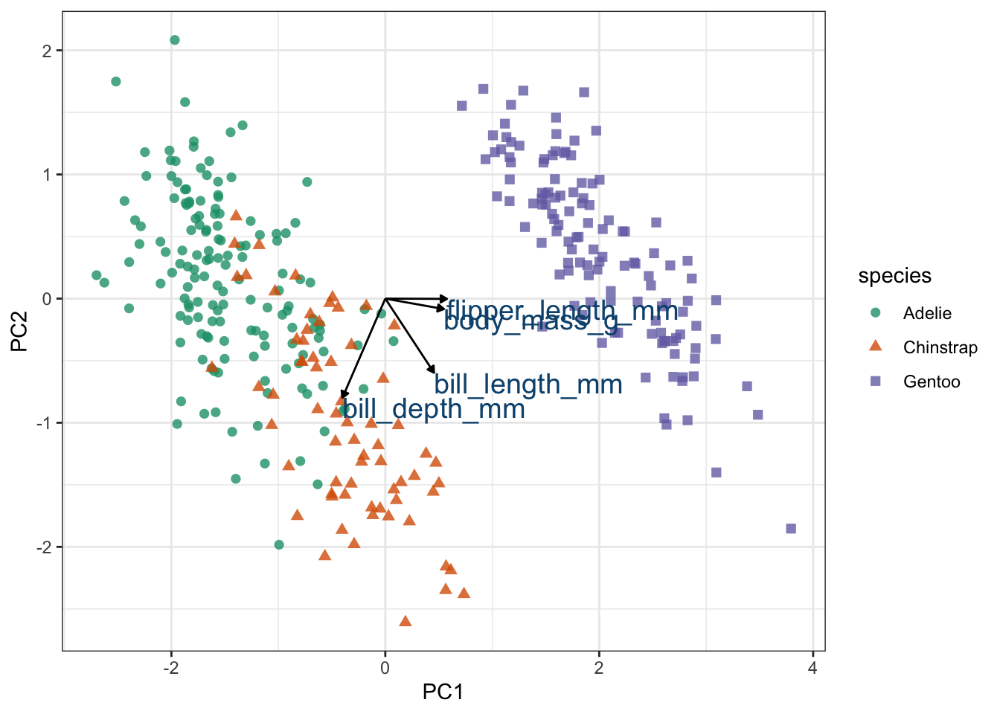
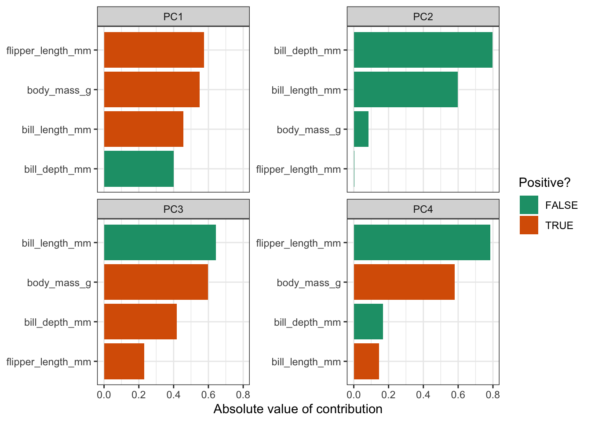

`<style>.panelset{--panel-tab-font-family: inherit;}</style>`{=html}


# Principal component analysis (PCA)

## Objectives
:::objectives
**Questions**

- How do I...
- What do I...

**Objectives**

- Be able to...
- Use...
:::

## Purpose and aim
This is a statistical technique for reducing the dimensionality of a data set. The technique aims to find a new set of variables for describing the data. These new variables are made from a weighted sum of the old variables. The weighting is chosen so that the new variables can be ranked in terms of importance in that the first new variable is chosen to account for as much variation in the data as possible. Then the second new variable is chosen to account for as much of the remaining variation in the data as possible, and so on until there are as many new variables as old variables.

## Libraries and functions

::::: {.panelset}

::: {.panel}
[tidyverse]{.panel-name}

| Library| Description|
|:- |:- |
|`tidyverse`| A collection of R packages designed for data science |
|`tidymodels`| A collection of packages for modelling and machine learning using tidyverse principles |
|`broom`| Summarises key information about statistical objects in tidy tibbles |
|`corrr`| A package for exploring correlations in R |
|`tidytext`| Makes text tidying easy

:::
:::::

## Data
First we need some data! To liven things up a bit, we'll be using data from the `palmerpenguins` package. This package has a whole bunch of data on penguins. What's not to love?

::::: {.panelset}
::: {.panel}
[Penguins]{.panel-name}
The `penguins` data set comes from `palmerpenguins` package (for more information, see [the GitHub page](https://github.com/allisonhorst/palmerpenguins)).
:::
:::::

## Visualise the data
First of all, let's have a look at the data. It is always a good idea to get a sense of how your data.

::::: {.panelset}
::: {.panel}
[tidyverse]{.panel-name}
First, we load and inspect the data:

```r
# attach the data
data(package = 'palmerpenguins')

# inspect the data
penguins
```

```
## # A tibble: 344 × 8
##    species island    bill_length_mm bill_depth_mm flipper_length_mm body_mass_g
##    <fct>   <fct>              <dbl>         <dbl>             <int>       <int>
##  1 Adelie  Torgersen           39.1          18.7               181        3750
##  2 Adelie  Torgersen           39.5          17.4               186        3800
##  3 Adelie  Torgersen           40.3          18                 195        3250
##  4 Adelie  Torgersen           NA            NA                  NA          NA
##  5 Adelie  Torgersen           36.7          19.3               193        3450
##  6 Adelie  Torgersen           39.3          20.6               190        3650
##  7 Adelie  Torgersen           38.9          17.8               181        3625
##  8 Adelie  Torgersen           39.2          19.6               195        4675
##  9 Adelie  Torgersen           34.1          18.1               193        3475
## 10 Adelie  Torgersen           42            20.2               190        4250
## # … with 334 more rows, and 2 more variables: sex <fct>, year <int>
```
:::
:::::


```r
library(corrr)

penguins_corr <- penguins %>%
  select(where(is.numeric)) %>%
  correlate() %>%
  rearrange()
```

```
## 
## Correlation method: 'pearson'
## Missing treated using: 'pairwise.complete.obs'
```

```r
penguins_corr
```

```
## # A tibble: 5 × 6
##   term         flipper_length_… body_mass_g bill_length_mm    year bill_depth_mm
##   <chr>                   <dbl>       <dbl>          <dbl>   <dbl>         <dbl>
## 1 flipper_len…           NA          0.871          0.656   0.170        -0.584 
## 2 body_mass_g             0.871     NA              0.595   0.0422       -0.472 
## 3 bill_length…            0.656      0.595         NA       0.0545       -0.235 
## 4 year                    0.170      0.0422         0.0545 NA            -0.0604
## 5 bill_depth_…           -0.584     -0.472         -0.235  -0.0604       NA
```

Before we perform the PCA, we'll use a few `recipe()` pre-processing steps:

1. remove any NA values
2. centre all predictors
3. scale all predictors


```r
penguin_recipe <-
  recipe(~., data = penguins) %>% 
  update_role(species, island, sex, year, new_role = "id") %>% 
  step_naomit(all_predictors()) %>% 
  step_normalize(all_predictors()) %>%
  step_pca(all_predictors(), id = "pca") %>% 
  prep()

penguin_pca <- 
  penguin_recipe %>% 
  tidy(id = "pca") 

penguin_pca
```

```
## # A tibble: 16 × 4
##    terms                value component id   
##    <chr>                <dbl> <chr>     <chr>
##  1 bill_length_mm     0.455   PC1       pca  
##  2 bill_depth_mm     -0.400   PC1       pca  
##  3 flipper_length_mm  0.576   PC1       pca  
##  4 body_mass_g        0.548   PC1       pca  
##  5 bill_length_mm    -0.597   PC2       pca  
##  6 bill_depth_mm     -0.798   PC2       pca  
##  7 flipper_length_mm -0.00228 PC2       pca  
##  8 body_mass_g       -0.0844  PC2       pca  
##  9 bill_length_mm    -0.644   PC3       pca  
## 10 bill_depth_mm      0.418   PC3       pca  
## 11 flipper_length_mm  0.232   PC3       pca  
## 12 body_mass_g        0.597   PC3       pca  
## 13 bill_length_mm     0.146   PC4       pca  
## 14 bill_depth_mm     -0.168   PC4       pca  
## 15 flipper_length_mm -0.784   PC4       pca  
## 16 body_mass_g        0.580   PC4       pca
```


```r
penguin_recipe %>% 
  tidy(id = "pca", type = "variance") %>% 
  dplyr::filter(terms == "percent variance") %>% 
  ggplot(aes(x = component, y = value)) + 
  geom_col() + 
  xlim(c(0, 5)) + 
  ylab("% of total variance")
```


```r
# get pca loadings into wider format
pca_wider <- penguin_pca %>% 
  tidyr::pivot_wider(names_from = component, id_cols = terms)

# define arrow style
arrow_style <- arrow(length = unit(.05, "inches"),
                     type = "closed")


pca_plot <-
  juice(penguin_recipe) %>%
  ggplot(aes(PC1, PC2)) +
  geom_point(aes(color = species, shape = species), 
             alpha = 0.8, 
             size = 2) +
  scale_colour_manual(values = c("darkorange","purple","cyan4")) 

pca_plot +
  geom_segment(data = pca_wider,
               aes(xend = PC1, yend = PC2), 
               x = 0, 
               y = 0, 
               arrow = arrow_style) + 
  geom_text(data = pca_wider,
            aes(x = PC1, y = PC2, label = terms), 
            hjust = 0, 
            vjust = 1,
            size = 5, 
            color = '#0A537D') 
```




```r
penguin_pca %>%
  mutate(terms = reorder_within(terms, 
                                abs(value), 
                                component)) %>%
  ggplot(aes(abs(value), terms, fill = value > 0)) +
  geom_col() +
  facet_wrap(~component, scales = "free_y") +
  tidytext::scale_y_reordered() +
  scale_fill_manual(values = c("#b6dfe2", "#0A537D")) +
  labs(
    x = "Absolute value of contribution",
    y = NULL, fill = "Positive?"
  ) 
```



## Exercise

:::exercise ::::::

Exercise

::::: {.panelset}
::: {.panel}
[tidyverse]{.panel-name}

question

:::
:::::

<details><summary>Answer</summary>

::::: {.panelset}

::: {.panel}
[tidyverse]{.panel-name}

answer

:::
:::::

</details>

::::::::::::::::::

## Key points

:::keypoints
- Point 1
- Point 2
- Point 3
:::
