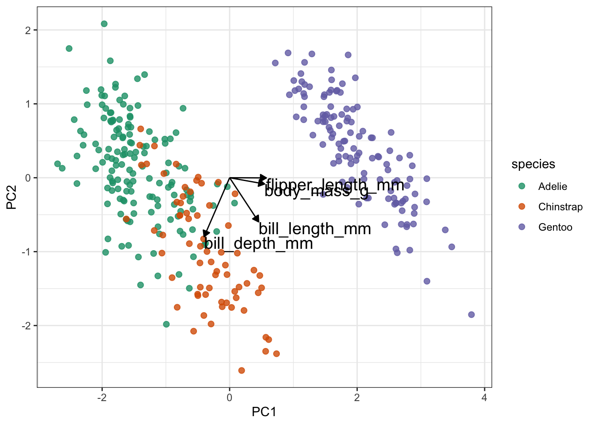
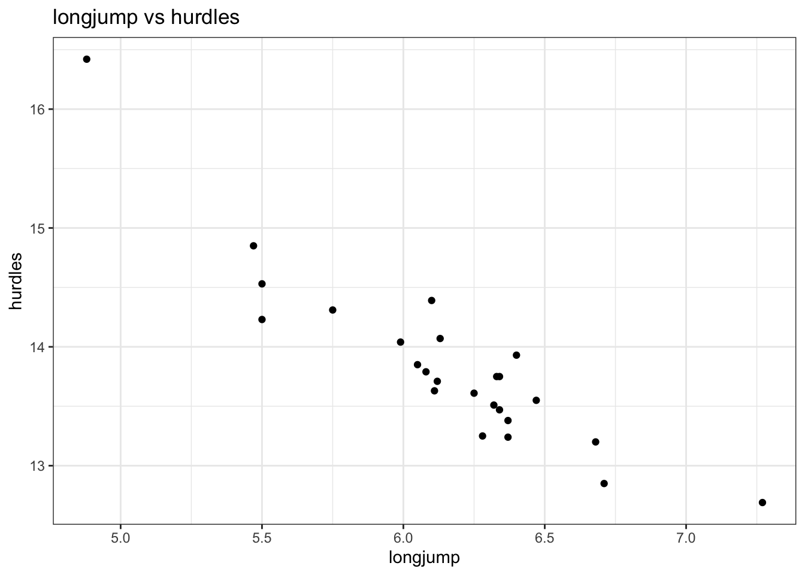
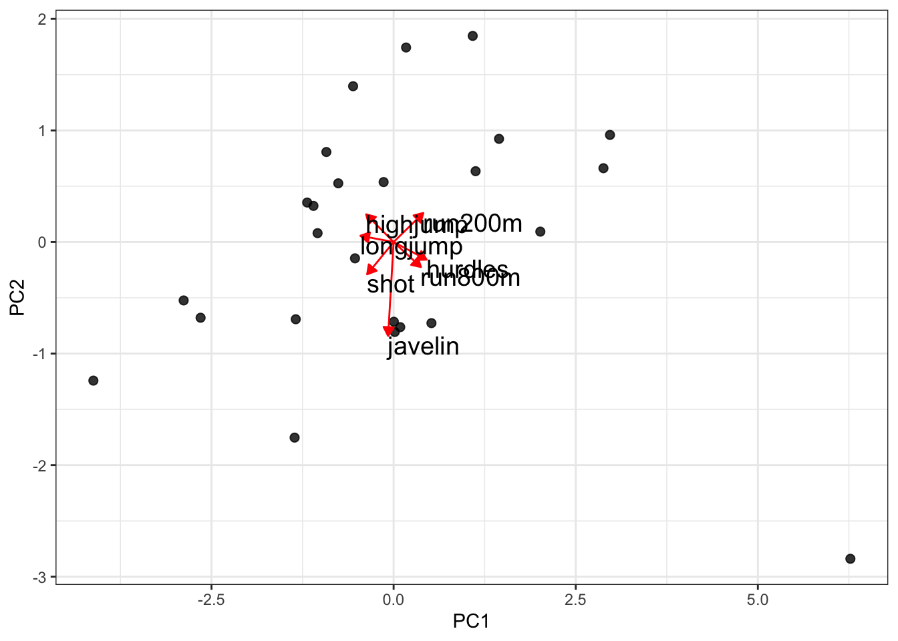

`<style>.panelset{--panel-tab-font-family: inherit;}</style>`{=html}

# (PART) Unsupervised learning {.unnumbered}

# Principal component analysis (PCA)

## Objectives
:::objectives

- Understand when PCAs can be useful
- Be able to perform a PCA
- Learn how to plot and interpret a screeplot
- Plot and interpret the loadings for each PCA
:::

## Purpose and aim
This is a statistical technique for reducing the dimensionality of a data set. The technique aims to find a new set of variables for describing the data. These new variables are made from a weighted sum of the old variables. The weighting is chosen so that the new variables can be ranked in terms of importance in that the first new variable is chosen to account for as much variation in the data as possible. Then the second new variable is chosen to account for as much of the remaining variation in the data as possible, and so on until there are as many new variables as old variables.

## Libraries and functions

::::: {.panelset}

::: {.panel}
[tidyverse]{.panel-name}

| Library| Description|
|:- |:- |
|`tidyverse`| A collection of R packages designed for data science |
|`tidymodels`| A collection of packages for modelling and machine learning using tidyverse principles |
|`palmerpenguins`| Contains data sets on penguins at the Palmer Station on Antartica.|
|`broom`| Summarises key information about statistical objects in tidy tibbles |
|`corrr`| A package for exploring correlations in R |
|`tidytext`| Makes text tidying easy

:::
:::::

## Data
First we need some data! To liven things up a bit, we'll be using data from the `palmerpenguins` package. This package has a whole bunch of data on penguins. What's not to love?

::::: {.panelset}
::: {.panel}
[Penguins]{.panel-name}
The `penguins` data set comes from `palmerpenguins` package (for more information, see [the GitHub page](https://github.com/allisonhorst/palmerpenguins)).
:::
:::::

## Visualise the data
First of all, let's have a look at the data. It is always a good idea to get a sense of how your data.

::::: {.panelset}
::: {.panel}
[tidyverse]{.panel-name}
First, we load and inspect the data:

```r
# attach the data
data(package = 'palmerpenguins')

# inspect the data
penguins
```

```
## # A tibble: 344 × 8
##    species island    bill_length_mm bill_depth_mm flipper_length_mm body_mass_g
##    <fct>   <fct>              <dbl>         <dbl>             <int>       <int>
##  1 Adelie  Torgersen           39.1          18.7               181        3750
##  2 Adelie  Torgersen           39.5          17.4               186        3800
##  3 Adelie  Torgersen           40.3          18                 195        3250
##  4 Adelie  Torgersen           NA            NA                  NA          NA
##  5 Adelie  Torgersen           36.7          19.3               193        3450
##  6 Adelie  Torgersen           39.3          20.6               190        3650
##  7 Adelie  Torgersen           38.9          17.8               181        3625
##  8 Adelie  Torgersen           39.2          19.6               195        4675
##  9 Adelie  Torgersen           34.1          18.1               193        3475
## 10 Adelie  Torgersen           42            20.2               190        4250
## # … with 334 more rows, and 2 more variables: sex <fct>, year <int>
```
:::
:::::

We can see that there are different kinds of variables, both factors and numerical. Also, there appear to be some missing data in the data set, so we probably have to deal with that.

Lastly, we should be careful with the `year` column: it is recognised as a numerical column (because it contains numbers), but we should view it as a factor, since the years have a categorical meaning.

To get a better sense of our data we could plot all the numerical variables against each other, to see if there is any possible correlation between them. However, there are quite a few of them, so it might be easier to just create a correlation matrix.

::::: {.panelset}

::: {.panel}
[tidyverse]{.panel-name}
First, we load the `corrr` package, which allows us to plot a correlation matrix using the `tidyverse` syntax:


```r
library(corrr)

penguins_corr <- penguins %>%
  select(where(is.numeric)) %>%  # select the numerical columns
  correlate() %>%                # calculate the correlations
  rearrange()                    # arrange highly correlated variables together
```

```
## 
## Correlation method: 'pearson'
## Missing treated using: 'pairwise.complete.obs'
```

```r
penguins_corr
```

```
## # A tibble: 5 × 6
##   term         flipper_length_… body_mass_g bill_length_mm    year bill_depth_mm
##   <chr>                   <dbl>       <dbl>          <dbl>   <dbl>         <dbl>
## 1 flipper_len…           NA          0.871          0.656   0.170        -0.584 
## 2 body_mass_g             0.871     NA              0.595   0.0422       -0.472 
## 3 bill_length…            0.656      0.595         NA       0.0545       -0.235 
## 4 year                    0.170      0.0422         0.0545 NA            -0.0604
## 5 bill_depth_…           -0.584     -0.472         -0.235  -0.0604       NA
```

We get a message (not an error) that the correlation method used is `pearson`, which is the default. We also get a message about how the missing values are treated, with only complete pairwise comparisons made.
:::
:::::

We can see that there is, for example, a strong positive correlation between `flipper_length_mm` and `body_mass_g`. Other variable combinations seem reasonably well-correlated, such as `flipper_length_mm` and `bill_length_mm` (positive) or `flipper_length_mm` and `bill_depth_mm` (negative).

When there are so many different variables that appear to be correlated or, if you just have lots of variables in your data and you don't know where to look, then it can be useful to reduce the number of variables. We can do this with dimension reduction methods, of which Principal Component Analysis (PCA) is one.

Basically, a PCA replaces your original variables with new ones: the principal components. These principal components consist of parts of your original variables.

You could compare this with a smoothy consisting of, let's say, 80% orange, 10% strawberry and 10% banana (no kale).

Similarly, our new principal component could consist of 80% `flipper_length_mm`, 10% `body_mass_g` and 10% `bill_depth_mm` (still no kale).

## Performing the PCA

::::: {.panelset}

::: {.panel}
[tidyverse]{.panel-name}
Before we perform the PCA, we'll use a few `recipe()` pre-processing steps:

1. remove any NA values
2. centre all predictors
3. scale all predictors


```r
penguin_recipe <-
  # take all variables
  recipe(~ ., data = penguins) %>% 
  # specify the ID columns (non-numerical)
  update_role(species, island, sex, year, new_role = "id") %>% 
  # remove missing values
  step_naomit(all_predictors()) %>% 
  # scale the data
  step_normalize(all_predictors()) %>%
  # perform the PCA
  step_pca(all_predictors(), id = "pca") %>% 
  # prepares the recipe by estimating the required parameters
  prep()

penguin_pca <- 
  penguin_recipe %>% 
  tidy(id = "pca") 

penguin_pca
```

```
## # A tibble: 16 × 4
##    terms                value component id   
##    <chr>                <dbl> <chr>     <chr>
##  1 bill_length_mm     0.455   PC1       pca  
##  2 bill_depth_mm     -0.400   PC1       pca  
##  3 flipper_length_mm  0.576   PC1       pca  
##  4 body_mass_g        0.548   PC1       pca  
##  5 bill_length_mm    -0.597   PC2       pca  
##  6 bill_depth_mm     -0.798   PC2       pca  
##  7 flipper_length_mm -0.00228 PC2       pca  
##  8 body_mass_g       -0.0844  PC2       pca  
##  9 bill_length_mm    -0.644   PC3       pca  
## 10 bill_depth_mm      0.418   PC3       pca  
## 11 flipper_length_mm  0.232   PC3       pca  
## 12 body_mass_g        0.597   PC3       pca  
## 13 bill_length_mm     0.146   PC4       pca  
## 14 bill_depth_mm     -0.168   PC4       pca  
## 15 flipper_length_mm -0.784   PC4       pca  
## 16 body_mass_g        0.580   PC4       pca
```
:::
:::::

## Visualising PCs
Now that we've performed our PCA, we can have a bit of a closer look. A useful way of looking at how much your PCs (principal components) are contributing to the amount of variance that is being explained is to create a _screeplot_. Basically, this plots the percentage of explained variance for each PC.

::::: {.panelset}

::: {.panel}
[tidyverse]{.panel-name}
We can extract the relevant data directly from the `penguin_recipe` object:

```r
penguin_recipe %>% 
  tidy(id = "pca", type = "variance") %>% 
  filter(terms == "percent variance") %>% 
  ggplot(aes(x = component, y = value)) + 
  geom_col() + 
  xlim(c(0, 5)) +
  ylab("% of total variance")
```


:::
:::::

By definition, the first principal component (PC1) will always explain the largest amount of variation. In this case, PC1 explains almost 70% of our variance!

That's pretty good going, since it means that instead of having to look at four variables, we could look at just one but still capture 70% of the variance in our data. The number of variables in our data set is very manageable, so we probably wouldn't do this. However, if you have a data set with hundreds of variables, then seeing if they can be described well by using PCs is a very useful thing to do.

## Loadings
Let's think back to our smoothy metaphor. Remember how the smoothy was made up of various fruits - just like our PCs are made up of parts of our original variables.

Let's, for the sake of illustrating this, assume the following for PC1:

| parts| variable|
|:- |:- |
| 4 | `flipper_length_mm` |
| 1 | `body_mass_g` |

Each PC has something called an **eigenvector**, which in simplest terms is a line with a certain direction and length.

If we want to calculate the length of the eigenvector for PC1, we can employ Pythagoras (well, not directly, just his legacy). This gives:

$eigenvector \, PC1 = \sqrt{4^2 + 1^2} = 4.12$

The **loading scores** for PC1 are the "parts" scaled for this length, _i.e._:

| scaled parts| variable|
|:- |:- |
| 4 / 4.12 = 0.97 | `flipper_length_mm` |
| 1 / 4.12 = 0.24 | `body_mass_g` |

What we can do with these values is plot the loadings for each of the original variables. For example, if we plotted PC1 against PC2, and wanted to see how much the original variables contribute to each principal component, we would do the following:

::::: {.panelset}

::: {.panel}
[tidyverse]{.panel-name}
The loadings are encoded in the `value` column of the pca object (`penguin_pca`). To plot this, we need the data in a "wide" format:

```r
# get pca loadings into wider format
pca_wider <- penguin_pca %>% 
  pivot_wider(names_from = component, id_cols = terms)

pca_wider
```

```
## # A tibble: 4 × 5
##   terms                PC1      PC2    PC3    PC4
##   <chr>              <dbl>    <dbl>  <dbl>  <dbl>
## 1 bill_length_mm     0.455 -0.597   -0.644  0.146
## 2 bill_depth_mm     -0.400 -0.798    0.418 -0.168
## 3 flipper_length_mm  0.576 -0.00228  0.232 -0.784
## 4 body_mass_g        0.548 -0.0844   0.597  0.580
```

We can see that there are four terms (our original variables) and four PCs. This makes sense, because the maximum number of principal components cannot exceed the number of original variables.

We need to do a bit more data gymnastics, with defining an arrow style (vectors are represented using arrows), plotting the PCs, and plotting the loadings.

Arrow:

```r
# define arrow style
arrow_style <- arrow(length = unit(2, "mm"),
                     type = "closed")
```

To plot PC1 vs PC2, we need to extract the relevant data. All of the PCA-related data is stored in the `penguin_recipe` object. Since the people who developed `tidymodels` are quite fond of verbs (I'm really more of an adjective kind-of-guy myself...) they invented the `bake()` function.

The logic is: you follow a `recipe()` and then you `bake()` it. Yes, I know.

Anyways, we use this to get the data from our `penguin_recipe`, telling the function that it shouldn't expect any new data (the function is also used in model testing, where data is split in a training and test data set).


```r
bake(penguin_recipe, new_data = NULL)
```

```
## # A tibble: 342 × 8
##    species island    sex     year    PC1      PC2     PC3     PC4
##    <fct>   <fct>     <fct>  <int>  <dbl>    <dbl>   <dbl>   <dbl>
##  1 Adelie  Torgersen male    2007 -1.84  -0.0476   0.232   0.523 
##  2 Adelie  Torgersen female  2007 -1.30   0.428    0.0295  0.402 
##  3 Adelie  Torgersen female  2007 -1.37   0.154   -0.198  -0.527 
##  4 Adelie  Torgersen female  2007 -1.88   0.00205  0.618  -0.478 
##  5 Adelie  Torgersen male    2007 -1.91  -0.828    0.686  -0.207 
##  6 Adelie  Torgersen female  2007 -1.76   0.351   -0.0276  0.504 
##  7 Adelie  Torgersen male    2007 -0.809 -0.522    1.33    0.338 
##  8 Adelie  Torgersen <NA>    2007 -1.83   0.769    0.689  -0.427 
##  9 Adelie  Torgersen <NA>    2007 -1.19  -1.02     0.729   0.333 
## 10 Adelie  Torgersen <NA>    2007 -1.73   0.787   -0.205   0.0205
## # … with 332 more rows
```

It spits out the original table, but with the PC values instead of the original variables. We can then use that information to plot the PCs, focussing here on PC1 vs PC2:


```r
pca_plot <-
  bake(penguin_recipe, new_data = NULL) %>%
  ggplot(aes(PC1, PC2)) +
  geom_point(aes(colour = species), # colour the data
             alpha = 0.8,           # add transparency
             size = 2)              # make the data points bigger

pca_plot
```


Lastly (finally), we take this plot and add the loading data on top of it:


```r
pca_plot +
  # define the vector
  geom_segment(data = pca_wider,
               aes(xend = PC1, yend = PC2), 
               x = 0, 
               y = 0, 
               arrow = arrow_style) + 
  # add the text labels
  geom_text(data = pca_wider,
            aes(x = PC1, y = PC2, label = terms), 
            hjust = 0, 
            vjust = 1,
            size = 5) 
```


:::
:::::

Slightly annoyingly, this can cause some overlap in the labels. Also, if there are many different variables than this, it'll become rather tricky to interpret because there will be a web of vectors.

But here things look pretty OK still. One thing that is immediately obvious from these data is that the Gentoo penguins PCs are quite distinct from the Adelie and Chinstrap penguins.

From a PC-perspective, the `flipper_length_mm` and `body_mass_g` variables make up most of PC1, since the vectors are almost horizontal.

In contrast, `bill_length_mm` and `bill_depth_mm` contribute a lot to PC2. They also contribute positively (`bill_length_mm`) and negatively (`bill_depth_mm`) to PC1.

As mentioned, the vectors can become a bit messy in terms of visualisation. So it can be useful to represent the loadings differently. Note that, at this point, I'm not aware of a method that allows you to do this reasonably straightforward in anything other than R's tidyverse.

::::: {.panelset}

::: {.panel}
[tidyverse]{.panel-name}
For the following to work, we need to load the `tidytext` libary. You can do this as follows:


```r
library(tidytext)
```


```r
penguin_pca %>%
  mutate(terms = reorder_within(terms, 
                                abs(value), 
                                component)) %>%
  ggplot(aes(abs(value), terms, fill = value > 0)) +
  geom_col() +
  facet_wrap(~ component, scales = "free_y") +
  tidytext::scale_y_reordered() +
  labs(
    x = "Absolute value of contribution",
    y = NULL, fill = "Positive?"
  ) 
```


This gives us the loadings for each variable, facetted by principal component. The reason that we're plotting the _absolute_ values, is so that we can compare positive and negative contributions. For each PC the absolute loadings are sorted in descending order. To distinguish between positive and negative loadings we use colours.

:::note
It is important to keep the amount of variance explained by each PC in mind. For example, PC3 only explains around 9% of the variance. So although bill length and body mass contribute substantially to PC3, the contribution of PC3 itself remains small.
:::

:::
:::::

## Exercise: Heptathlon

:::exercise ::::::

First of all, heptathlon is an actual word. Seven sports events in one go! This is an old data set that keeps track of the scores/times of 25 athletes in a heptathlon event. I can't remember when the data were collected, but the main reason that I've kept it is to show how fleeting the concept of 'country' is. A good proportion of the countries no longer exist...

Let's not get too philosophical but see what we can do with this data set. I would like you to do the following:

1. load the data
2. create a correlation matrix and visualise the most highly correlated pair
3. perform a PCA
4. create a screeplot and see how many PCs would be best
5. calculate the loadings for PC1 and PC2 and visualise them

<details><summary>Answer</summary>

::::: {.panelset}

::: {.panel}
[tidyverse]{.panel-name}

### Load the data
1. load the data

```r
hept <- read_csv("data/heptathlon.csv")

hept
```

```
## # A tibble: 25 × 8
##    athlete             hurdles highjump  shot run200m longjump javelin run800m
##    <chr>                 <dbl>    <dbl> <dbl>   <dbl>    <dbl>   <dbl>   <dbl>
##  1 Joyner-Kersee (USA)    12.7     1.86  15.8    22.6     7.27    45.7    129.
##  2 John (GDR)             12.8     1.8   16.2    23.6     6.71    42.6    126.
##  3 Behmer (GDR)           13.2     1.83  14.2    23.1     6.68    44.5    124.
##  4 Sablovskaite (URS)     13.6     1.8   15.2    23.9     6.25    42.8    132.
##  5 Choubenkova (URS)      13.5     1.74  14.8    23.9     6.32    47.5    128.
##  6 Schulz (GDR)           13.8     1.83  13.5    24.6     6.33    42.8    126.
##  7 Fleming (AUS)          13.4     1.8   12.9    23.6     6.37    40.3    133.
##  8 Greiner (USA)          13.6     1.8   14.1    24.5     6.47    38      134.
##  9 Lajbnerova (CZE)       13.6     1.83  14.3    24.9     6.11    42.2    136.
## 10 Bouraga (URS)          13.2     1.77  12.6    23.6     6.28    39.1    135.
## # … with 15 more rows
```

Note how many country codes have changed (URS, GDR, FRG!). Also, humbug, HOL or 'Holland' is not a country, The Netherlands is!. Have a search and see how the world is constantly changing...

### Correlations
2. create a correlation matrix and visualise the most highly correlated pair

```r
hept_corr <- hept %>%
  select(where(is.numeric)) %>%  # select the numerical columns
  correlate() %>%                # calculate the correlations
  rearrange()                    # arrange highly correlated variables together
```

```
## 
## Correlation method: 'pearson'
## Missing treated using: 'pairwise.complete.obs'
```

```r
hept_corr
```

```
## # A tibble: 7 × 8
##   term      hurdles run200m run800m  javelin   shot highjump longjump
##   <chr>       <dbl>   <dbl>   <dbl>    <dbl>  <dbl>    <dbl>    <dbl>
## 1 hurdles  NA         0.774  0.779  -0.00776 -0.651 -0.811    -0.912 
## 2 run200m   0.774    NA      0.617  -0.333   -0.683 -0.488    -0.817 
## 3 run800m   0.779     0.617 NA       0.0200  -0.420 -0.591    -0.700 
## 4 javelin  -0.00776  -0.333  0.0200 NA        0.269  0.00215   0.0671
## 5 shot     -0.651    -0.683 -0.420   0.269   NA      0.441     0.743 
## 6 highjump -0.811    -0.488 -0.591   0.00215  0.441 NA         0.782 
## 7 longjump -0.912    -0.817 -0.700   0.0671   0.743  0.782    NA
```

Looking at the correlation matrix, the most highly correlated pair is `longjump` and `hurdles` (-0.91). We could (and should) do this programmatically, but it's a small matrix and life is short.


```r
ggplot(data = hept,
       aes(x = longjump,
           y = hurdles)) +
  geom_point() +
  labs(title = "longjump vs hurdles")
```



So it seems that the better you are at the long jump, the faster (and thus better) you are at the hurdles. I guess that makes sense and it would be interesting to have some data on leg length to see if there is some correlation there...

### PCA
3. perform a PCA

```r
hept_recipe <-
  # take all variables
  recipe(~ ., data = hept) %>% 
  # specify the ID columns (non-numerical)
  update_role(athlete, new_role = "id") %>% 
  # remove missing values
  step_naomit(all_predictors()) %>% 
  # scale the data
  step_normalize(all_predictors()) %>%
  # perform the PCA
  step_pca(all_predictors(), id = "pca") %>% 
  # prepares the recipe by estimating the required parameters
  prep()

hept_pca <- 
  hept_recipe %>% 
  tidy(id = "pca") 

hept_pca
```

```
## # A tibble: 49 × 4
##    terms      value component id   
##    <chr>      <dbl> <chr>     <chr>
##  1 hurdles   0.453  PC1       pca  
##  2 highjump -0.377  PC1       pca  
##  3 shot     -0.363  PC1       pca  
##  4 run200m   0.408  PC1       pca  
##  5 longjump -0.456  PC1       pca  
##  6 javelin  -0.0754 PC1       pca  
##  7 run800m   0.375  PC1       pca  
##  8 hurdles  -0.158  PC2       pca  
##  9 highjump  0.248  PC2       pca  
## 10 shot     -0.289  PC2       pca  
## # … with 39 more rows
```

### Screeplot
4. create a screeplot and see how many PCs would be best

```r
hept_recipe %>% 
  tidy(id = "pca", type = "variance") %>% 
  filter(terms == "percent variance") %>% 
  ggplot(aes(x = component, y = value)) + 
  geom_col() + 
  ylab("% of total variance")
```


It's clear that PC1 explains a heck of a lot of the variance in our data (around 65%). PC2 then explains a bit more, just under 20%. So these two PCs combined explain about 85% of the variance in our data, which is pretty good.

Things get a bit less clear as we go "up" in the PCs: PC3 and PC4 explain roughly the same amount of variance, so if we'd include PC3 then we should also include PC4. However, since they only explain around 8% of the variance they do not contribute much, so we leave it at PC1 and PC2.

### Loadings
5. calculate the loadings for PC1 and PC2 and visualise them

With 7 original variables, plotting PC1 and PC2 with their loadings would be a bit unclear. So in this case we'll just create a bar chart for each PC and the absolute contributions of each original variable.


```r
hept_pca %>%
  filter(component %in% c("PC1", "PC2")) %>% 
  mutate(terms = reorder_within(terms, 
                                abs(value), 
                                component)) %>%
  ggplot(aes(abs(value), terms, fill = value > 0)) +
  geom_col() +
  facet_wrap(~ component, scales = "free_y") +
  tidytext::scale_y_reordered() +
  labs(
    x = "Absolute value of contribution",
    y = NULL, fill = "Positive?"
  ) 
```


Just to illustrate that this is much more informative than drawing vectors:


```r
# get pca loadings into wider format
pca_wider <- hept_pca %>% 
  pivot_wider(names_from = component, id_cols = terms)

pca_plot <-
  bake(hept_recipe, new_data = NULL) %>%
  ggplot(aes(PC1, PC2)) +
  geom_point(alpha = 0.8, # add transparency
             size = 2)    # make the data points bigger

# define arrow style
arrow_style <- arrow(length = unit(2, "mm"),
                     type = "closed")

pca_plot +
  # define the vector
  geom_segment(data = pca_wider,
               aes(xend = PC1, yend = PC2), 
               x = 0, 
               y = 0, 
               arrow = arrow_style,
               colour = "red") + 
  # add the text labels
  geom_text(data = pca_wider,
            aes(x = PC1, y = PC2, label = terms), 
            hjust = 0, 
            vjust = 1,
            size = 5) 
```



Told ya.
:::
:::::

### Conclusion
Well, what can we conclude here? First of all, it's worth noting that there are only 25 observations and 7 variables, so that limits our analysis a bit.

We can see that PC1 (particularly when combined with PC2) is able to explain quite a big chunk of the variance in our data. However, we should keep in mind that each observation is an individual athlete. So ideally we would want to plot the names of the athletes on the PC1 vs PC2 plot and see how their individual performances in the 7 events compare.

That, is for another day.
</details>

::::::::::::::::::

## Key points

:::keypoints

- PCA allows you to reduce a large number of variables into fewer principal components 
- Each PC is made up of a combination of the original variables and captures as much of the variance within the data as possible
- The loadings tell you how much each original variable contributes to each PC
- A screeplot is a graphical representation of the amount of variance explained by each PC
:::
