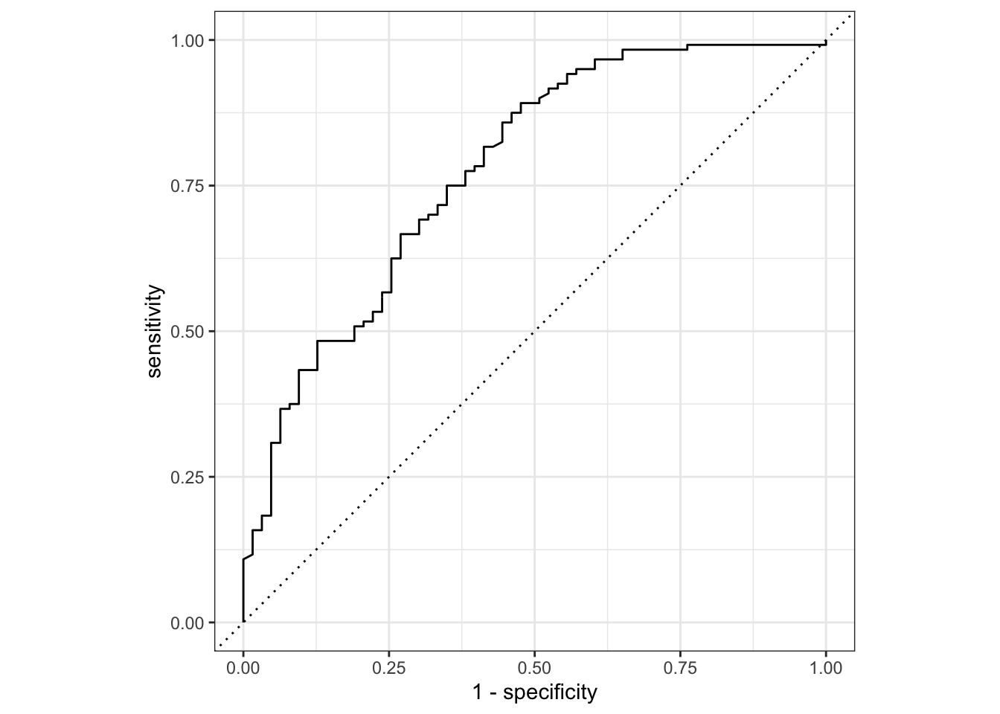

```
## Registered S3 method overwritten by 'tune':
##   method                   from   
##   required_pkgs.model_spec parsnip
```

```
## ── Attaching packages ────────────────────────────────────── tidymodels 0.1.4 ──
```

```
## ✓ dials        0.1.0     ✓ rsample      0.1.1
## ✓ infer        1.0.0     ✓ tune         0.1.6
## ✓ modeldata    0.1.1     ✓ workflows    0.2.4
## ✓ parsnip      0.1.7     ✓ workflowsets 0.1.0
## ✓ recipes      0.2.0     ✓ yardstick    0.0.9
```

```
## ── Conflicts ───────────────────────────────────────── tidymodels_conflicts() ──
## x scales::discard() masks purrr::discard()
## x dplyr::filter()   masks stats::filter()
## x recipes::fixed()  masks stringr::fixed()
## x dplyr::lag()      masks stats::lag()
## x yardstick::spec() masks readr::spec()
## x recipes::step()   masks stats::step()
## • Use tidymodels_prefer() to resolve common conflicts.
```

```
## Warning: 'xaringanExtra::style_panelset' is deprecated.
## Use 'style_panelset_tabs' instead.
## See help("Deprecated")
```

`<style>.panelset{--panel-tab-font-family: inherit;}</style>`{=html}

# Logistic Models – Binary Response

## Objectives
:::objectives
**Questions**

- 

**Objectives**

- 
:::

## Libraries and functions

::::: {.panelset}

::: {.panel}
[tidyverse]{.panel-name}

| Library| Description|
|:- |:- |
|`tidyverse`| A collection of R packages designed for data science |
|`tidymodels`| A collection of packages for modelling and machine learning using tidyverse principles |

:::
:::::

## Datasets

::::: {.panelset}
::: {.panel}
[Diabetes]{.panel-name}

The example in this section uses the following data set:

`data/diabetes.csv`

This is a data set comprising 768 observations of three variables (one dependent and two predictor variables). This records the results of a diabetes test_result as a binary variable (1 is a positive result, 0 is a negative result), along with the result of a glucose test and the diastolic blood pressure for each of 767 women. The variables are called `test_result`, `glucose` and `diastolic`.
:::
:::::

## Visualise the data
First we load the data, then we visualise it. If needed, load the tidyverse package using:

::::: {.panelset}
::: {.panel}
[tidyverse]{.panel-name}
First, we load and inspect the data:


```r
diabetes <- read_csv("data/diabetes.csv")
```

Looking at the data, we can see that the `test_result` column contains zeros and ones. These are test result outcomes and not actually numeric representations.

This will cause problems later, so we need to tell R to see these values as factors.


```r
diabetes <- diabetes %>% 
  mutate(test_result = as_factor(test_result))
```

We can plot the data:


```r
diabetes %>% 
  ggplot(aes(x = test_result, y = glucose)) +
  geom_boxplot()
```


It looks as though the variable glucose may have an effect on the results of the diabetes test since the positive test results seem to be slightly higher than the negative test results.

We can visualise that differently by plotting all the data points as a classic binary response plot:


```r
diabetes %>% 
  ggplot(aes(x = glucose, y = test_result)) +
  geom_point()
```


:::
:::::

## Construct the model
There are different ways to construct a logistic model in either R or Python.

::::: {.panelset}

::: {.panel}
[tidyverse]{.panel-name}

In tidyverse we have access to a very useful package: `parsnip`, which is part of the `tidymodels` package. The advantage of using `parsnip` is that the code syntax will stay the same as you do different kind of model comparisons. So, the learning curve might be a bit steeper to start with, but this will pay dividend in the long-term (just like when you started using R!).

First, we need to load `tidymodels` (install it first, if needed):


```r
# install.packages("tidymodels")
library(tidymodels)
```

Next, we can create the model:


```r
glm_diabetes <- logistic_reg() %>% 
  set_engine("glm") %>% 
  fit(test_result ~ glucose, data = diabetes)
```

When we summarise the output of the model, we get the following information:


```r
summary(glm_diabetes)
```

```
##         Length Class        Mode     
## lvl      2     -none-       character
## spec     6     logistic_reg list     
## fit     30     glm          list     
## preproc  1     -none-       list     
## elapsed  5     proc_time    numeric
```

This does not look very informative. What we get is actually a _list_ of objects that contain all kinds of information.

We can get more insight into the model parameters with the following:


```r
glm_diabetes %>%
  extract_fit_engine() %>% 
  glance()
```

```
## # A tibble: 1 × 8
##   null.deviance df.null logLik   AIC   BIC deviance df.residual  nobs
##           <dbl>   <int>  <dbl> <dbl> <dbl>    <dbl>       <int> <int>
## 1          937.     727  -376.  756.  765.     752.         726   728
```
:::

::: {.panel}
[base R]{.panel-name}
In base R we use the `glm()` function, which works in a very similar way as the `lm()` function.

We define the model as follows:


```r
glm_diabetes_r <- glm(test_result ~ glucose,
                      data = diabetes,
                      family = binomial)
```
:::note
If you forget to include the family argument then the glm function just performs an ordinary linear model fit (same as the lm function)
:::

Next, we can summarise the model with:


```r
summary(glm_diabetes_r)
```

```
## 
## Call:
## glm(formula = test_result ~ glucose, family = binomial, data = diabetes)
## 
## Deviance Residuals: 
##     Min       1Q   Median       3Q      Max  
## -2.1353  -0.7819  -0.5189   0.8269   2.2832  
## 
## Coefficients:
##              Estimate Std. Error z value Pr(>|z|)    
## (Intercept) -5.611732   0.442289  -12.69   <2e-16 ***
## glucose      0.039510   0.003398   11.63   <2e-16 ***
## ---
## Signif. codes:  0 '***' 0.001 '**' 0.01 '*' 0.05 '.' 0.1 ' ' 1
## 
## (Dispersion parameter for binomial family taken to be 1)
## 
##     Null deviance: 936.6  on 727  degrees of freedom
## Residual deviance: 752.2  on 726  degrees of freedom
## AIC: 756.2
## 
## Number of Fisher Scoring iterations: 4
```

There’s a lot to unpack here so take a deep breath (or make sure you have a coffee) before continuing...

* The first lines just confirm which model we’ve been fitting (trust me, this can be useful when you’re in the middle of a load of analysis and you’ve lost track of what the hell is going on!)

* The next block is called `Deviance Residuals`. This isn’t particularly useful, but just so you know: for linear models the residuals were calculated for each data point and then squared and added up to get the SS (sum of squares), which is used to fit the model. For generalised linear models we don’t use SS to fit the model and instead we use an entirely different method called maximum likelihood. This fitting procedure generates a different quantity, called Deviance, which is the analogue of SS. A deviance of zero indicates the best model we could hope for and bigger values indicate a model that doesn’t fit quite as well. The deviance residuals are then values associated with each data point, that when squared and summed give the deviance for the model (an exact analogy to normal residuals). You’re unlikely to ever need to know this, but I had some time on my hands and decided to share this little nugget with you 😉.

* The `Coefficients` block is next. The main numbers to extract from the output are the two numbers underneath `Estimate.Std`: we have `(Intercept) -5.611732` and `glucose 0.039510`.These are the coefficients of the logistic model equation and need to be placed in the correct equation if we want to be able to calculate the probability of having a positive diabetes test result for a given glucose level.

\begin{equation}
P(positive \ test_result) = \frac{1}{1 + {e}^{-(-5.61 +  0.040 \cdot glucose)}}
\end{equation}

* The p values (`Pr(>|z|`) at the end of each coefficient row merely show whether that particular coefficient is significantly different from zero. This is similar to the p-values obtained in the summary output of a linear model, and as before, for continuous predictors these p-values can be used as a rough guide as to whether that predictor is important (so in this case glucose appears to be significant). However, these p-values aren’t great when we have multiple predictor variables, or when we have categorical predictors with multiple levels (since the output will give us a p-value for each level rather than for the predictor as a whole).

* The next line tells us that the dispersion parameter was assumed to be 1 for this binomial model. Dispersion is a property that says whether the data were more or less spread out around the logistic curve than we would expect. A dispersion parameter of 1 says that the data are spread out exactly as we would expect. Greater than 1 is called over-dispersion and less than 1 is called under-dispersion. Here this line is saying that when we fitted this model, we were assuming that the dispersion of the data was exactly 1. For binary data, like we have here, the data cannot be over- or under-dispersed but this is something that we’ll need to check for other sorts of generalised linear models.

* The last three lines relate to quantities called deviance and AIC (Akaike Information Criterion).
    * As we said just above, the deviance values are the equivalent of Sums of Squares values in linear models (and are a product of the technique used to fit the curve to the data). They can be used as a metric of goodness of fit for the model, with a deviance of 0 indicating a perfect fitting model. The deviance for the null model (i.e. the model without any predictors, basically saying that the probability of getting a positive diabetes score is constant and doesn’t depend on glucose level) is given by the first line and the deviance for the actual model is given by the residual deviance line. We will see how we can use the deviance to do two things.
      1. to check of whether the model is actually any good (i.e. does it in any way look like it’s close to the data). This is akin to what we were doing with R2 values in linear models.
      2.	to check if the model we’ve specified is better than the null model.
    It’s important to realise that these two things can be independent of each other; we can have a model that is significantly better than a null model whilst still being rubbish overall (the null model will have been even more rubbish in comparison), and we can have a model that is brilliant yet still not be better than the null model (in this case the null model was already brilliant).
* As we found in the previous practical the AIC value is meaningless by itself, but it will allow us to compare this model to another model with different terms (with the model with the smaller AIC value being the better fitting model).

:::
:::::

## Using the model to make predictions
What if we got some new glucose level data and we wanted to predict if people might have diabetes or not?

We could use the existing model and feed it the some data:

::::: {.panelset}
::: {.panel}
[tidyverse]{.panel-name}


```r
# create a dummy data set using some hypothetical glucose measurements
diabetes_newdata <- tibble(glucose = c(188, 122, 83, 76, 144))

# predict if the patients have diabetes or not
predict(glm_diabetes, new_data = diabetes_newdata)
```

```
## # A tibble: 5 × 1
##   .pred_class
##   <fct>      
## 1 1          
## 2 0          
## 3 0          
## 4 0          
## 5 1
```

Although you are able to get the predicted outcomes, I would like to stress that this is not the point of running the model. It is important to realise that the model (as with all statistical models) creates a predicted outcome based on certain _probabilities_. It is therefore much more informative to look at how probable these predicted outcomes are. We can do that as follows:


```r
diabetes_newdata %>% 
  select(glucose) %>% 
  bind_cols(predict(glm_diabetes, diabetes_newdata)) %>% 
  # add the probabilities for both outcomes
  bind_cols(predict(glm_diabetes, diabetes_newdata, type = "prob")) 
```

```
## # A tibble: 5 × 4
##   glucose .pred_class .pred_0 .pred_1
##     <dbl> <fct>         <dbl>   <dbl>
## 1     188 1             0.140  0.860 
## 2     122 0             0.688  0.312 
## 3      83 0             0.912  0.0885
## 4      76 0             0.931  0.0686
## 5     144 1             0.481  0.519
```

So here we see that the predicted outcomes, as encoded in `.pred_class` remain the same, but there are now two new columns present: `.pred_0` and `.pred_1`. These give you the probability that the outcome is `0` or `1`. For the first value this means that there is a 14% chance that the diabetes test will return a negative result and around 86% chance that it will return a positive result.
:::
:::::

## Model evaluation
So far we've constructed the logistic model and fed it some new data to make predictions to the possible outcome of a diabetes test, depending on the glucose level of a given patient. This gave us some diabetes test predictions but, more importantly, the probabilities of whether the test could come back negative (0) or positive (1).

The question we'd like to ask ourselves at this point: how reliable is the model?

To explore this, we need to take a step back.

::::: {.panelset}

::: {.panel}
[tidyverse]{.panel-name}

### Split the data
When we created the model, we used _all_ of the data. However, a good way of assessing a model fit is to actually split the data into two:

1. a **training data set** that you use to fit your model
2. a **test data set** to validate your model and measure model performance

Before we split the data, let's have a closer look at the data set. If we count how many diabetes test results are negative (0) and positive (1), we see that these counts are not evenly split.


```r
diabetes %>% 
  count(test_result) %>% 
  mutate(prop = n/sum(n))
```

```
## # A tibble: 2 × 3
##   test_result     n  prop
##   <fct>       <int> <dbl>
## 1 0             478 0.657
## 2 1             250 0.343
```

This can have some consequences if we start splitting our data into a training and test set. By splitting the data into two parts - where most of the data goes into your training set - you have data left afterwards that you can use to test how good the predictions of your model are. However, we need to make sure that the _proportion_ of negative and positive diabetes test outcomes remains roughly the same.

The `rsample` package has a couple of useful functions that allow us to do just that and we can use the `strata` argument to keep these proportions more or less the same.


```r
# Use 75% of the data to create the training data set
data_split <- initial_split(diabetes, strata = test_result)

# Create data frames for the two sets:
train_data <- training(data_split)
test_data  <- testing(data_split)
```

We can check what the `initial_split()` function as done:


```r
# proportion of data allocated to the training set
nrow(train_data) / nrow(diabetes)
```

```
## [1] 0.7486264
```

```r
# proportion of diabetes test results for the training and test data sets
train_data %>% 
  count(test_result) %>% 
  mutate(prop = n/sum(n))
```

```
## # A tibble: 2 × 3
##   test_result     n  prop
##   <fct>       <int> <dbl>
## 1 0             358 0.657
## 2 1             187 0.343
```

```r
test_data %>% 
  count(test_result) %>% 
  mutate(prop = n/sum(n))
```

```
## # A tibble: 2 × 3
##   test_result     n  prop
##   <fct>       <int> <dbl>
## 1 0             120 0.656
## 2 1              63 0.344
```

### Create a recipe

```r
# Create a recipe
diabetes_rec <- 
  recipe(test_result ~ ., data = train_data)

# Look at the recipe summary
summary(diabetes_rec)
```

```
## # A tibble: 3 × 4
##   variable    type    role      source  
##   <chr>       <chr>   <chr>     <chr>   
## 1 glucose     numeric predictor original
## 2 diastolic   numeric predictor original
## 3 test_result nominal outcome   original
```

### Build a model specification

```r
diabetes_mod <- 
  logistic_reg() %>% 
  set_engine("glm")
```

### Use recipe as we train and test our model

```r
diabetes_wflow <- 
  workflow() %>% 
  add_model(diabetes_mod) %>% 
  add_recipe(diabetes_rec)

diabetes_wflow
```

```
## ══ Workflow ════════════════════════════════════════════════════════════════════
## Preprocessor: Recipe
## Model: logistic_reg()
## 
## ── Preprocessor ────────────────────────────────────────────────────────────────
## 0 Recipe Steps
## 
## ── Model ───────────────────────────────────────────────────────────────────────
## Logistic Regression Model Specification (classification)
## 
## Computational engine: glm
```

Although it seems a bit of overkill, we now have a single function that can we can use to prepare the recipe and train the model from the resulting predictors:


```r
diabetes_fit <- 
  diabetes_wflow %>% 
  fit(data = train_data)
```

This creates an object called `diabetes_fit`, which contains the final recipe and fitted model objects. We can extract the model and recipe objects with several helper functions:


```r
diabetes_fit %>% 
  extract_fit_parsnip() %>% 
  tidy()
```

```
## # A tibble: 3 × 5
##   term        estimate std.error statistic  p.value
##   <chr>          <dbl>     <dbl>     <dbl>    <dbl>
## 1 (Intercept)  -6.48     0.758       -8.55 1.21e-17
## 2 glucose       0.0395   0.00407      9.71 2.64e-22
## 3 diastolic     0.0127   0.00868      1.46 1.44e- 1
```

### Use trained workflow for predictions
So far, we have done the following:

1. Built the model (`diabetes_mod`),
2. Created a pre-processing recipe (`diabetes_rec`),
3. Combined the model and recipe into a workflow (`diabetes_wflow`)
4. Trained our workflow using the `fit()` function (`diabetes_fit`)

The results we generated above do not differ much from the values we obtained with the entire data set. However, these are based on 3/4 of the data (our training data set). Because of this, we still have our test data set available to apply this workflow to data the model has not yet seen.


```r
diabetes_aug <- 
augment(diabetes_fit, test_data)

diabetes_aug
```

```
## # A tibble: 183 × 6
##    glucose diastolic test_result .pred_class .pred_0 .pred_1
##      <dbl>     <dbl> <fct>       <fct>         <dbl>   <dbl>
##  1     116        74 0           0             0.724   0.276
##  2     197        70 1           1             0.101   0.899
##  3     168        74 1           1             0.251   0.749
##  4     139        80 0           1             0.494   0.506
##  5     189        60 1           1             0.149   0.851
##  6     166        72 1           1             0.271   0.729
##  7      99        84 0           0             0.819   0.181
##  8     125        70 1           0             0.659   0.341
##  9      97        66 0           0             0.860   0.140
## 10     145        82 0           1             0.429   0.571
## # … with 173 more rows
```

### Evaluate the model
We can now evaluate the model. One way of doing this is by using the area under the ROC curve as a metric.


```r
diabetes_aug %>% 
  roc_curve(truth = test_result, .pred_0) %>% 
  autoplot()
```



```r
diabetes_aug %>% 
  filter(test_result == .pred_class) %>% 
  count(test_result) %>% 
  mutate(prop = n/sum(n))
```

```
## # A tibble: 2 × 3
##   test_result     n  prop
##   <fct>       <int> <dbl>
## 1 0              97 0.724
## 2 1              37 0.276
```

```r
diabetes_aug %>% 
  count(test_result) %>% 
  mutate(prop = n/sum(n))
```

```
## # A tibble: 2 × 3
##   test_result     n  prop
##   <fct>       <int> <dbl>
## 1 0             120 0.656
## 2 1              63 0.344
```


```r
diabetes_aug %>% 
  roc_auc(truth = test_result, .pred_0)
```

```
## # A tibble: 1 × 3
##   .metric .estimator .estimate
##   <chr>   <chr>          <dbl>
## 1 roc_auc binary         0.777
```


:::
:::::

## Exercise
:::exercise
We can add exercises

<details><summary>Answer</summary>
With answers
</details>
:::

## Key points

:::keypoints
Adding key points
:::
