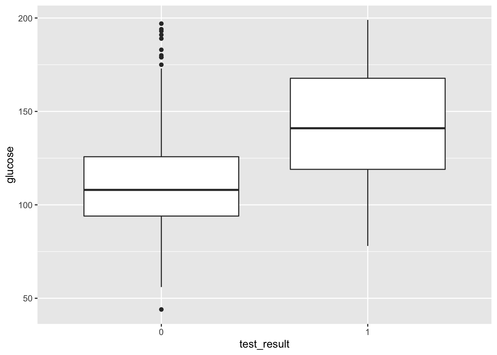
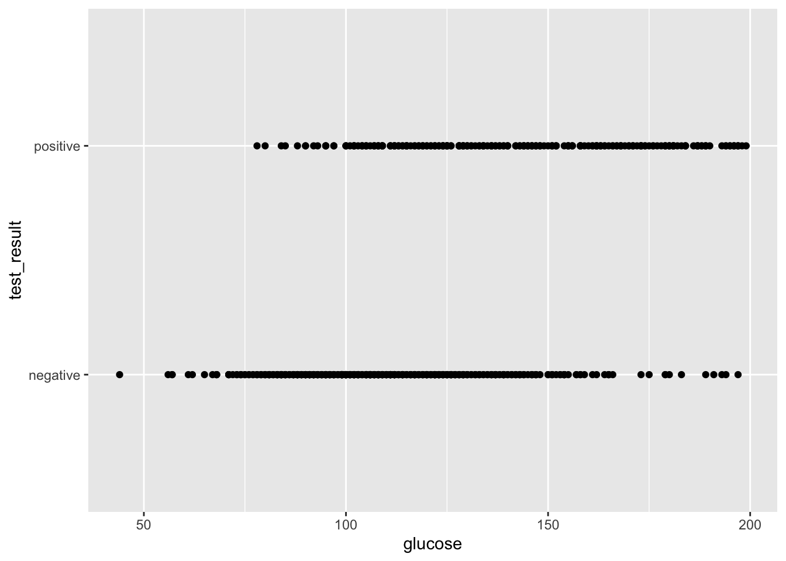
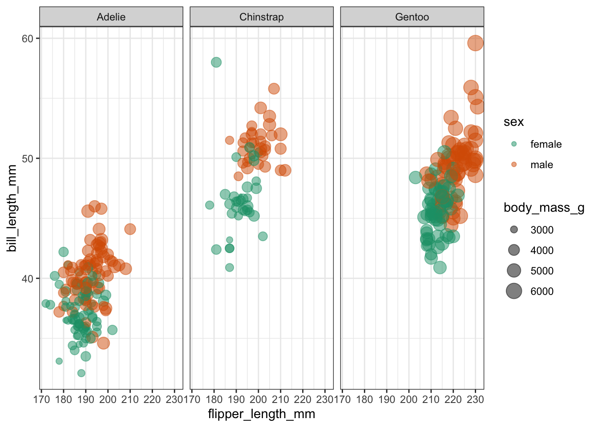
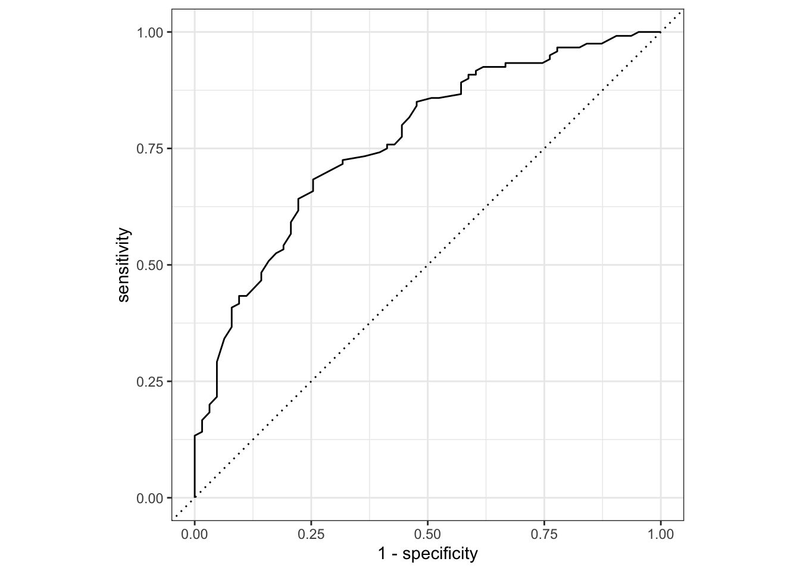
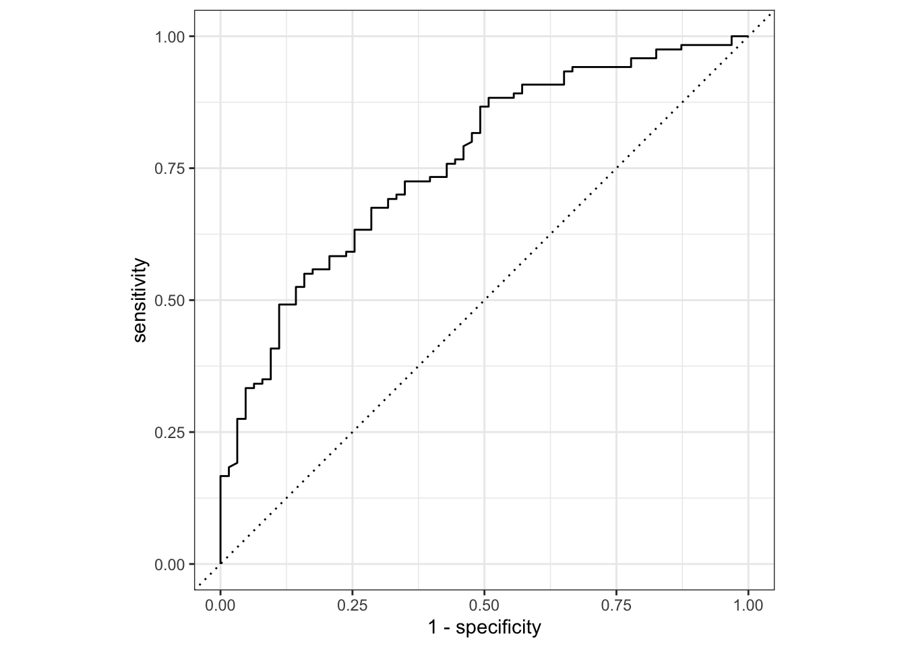

`<style>.panelset{--panel-tab-font-family: inherit;}</style>`{=html}

# Logistic Models – Binary Response

## Objectives
:::objectives
**Questions**

- How do we analyse data with a binary outcome?
- Can we test if our model is any good?

**Objectives**

- Be able to perform a logistic regression with a binary outcome
- Predict outcomes of new data, based on a defined model
- Evaluate model reliability by using training and test data sets

:::

## Libraries and functions

::::: {.panelset}

::: {.panel}
[tidyverse]{.panel-name}

| Library| Description|
|:- |:- |
|`tidyverse`| A collection of R packages designed for data science |
|`tidymodels`| A collection of packages for modelling and machine learning using tidyverse principles |

:::
:::::

## Datasets

::::: {.panelset}
::: {.panel}
[Diabetes]{.panel-name}

The example in this section uses the following data set:

`data/diabetes.csv`

This is a data set comprising 768 observations of three variables (one dependent and two predictor variables). This records the results of a diabetes test result as a binary variable (1 is a positive result, 0 is a negative result), along with the result of a glucose test and the diastolic blood pressure for each of 767 women. The variables are called `test_result`, `glucose` and `diastolic`.
:::
:::::

## Visualise the data
First we load the data, then we visualise it. If needed, load the tidyverse package using:

::::: {.panelset}
::: {.panel}
[tidyverse]{.panel-name}
First, we load and inspect the data:


```r
diabetes <- read_csv("data/diabetes.csv")
```

Looking at the data, we can see that the `test_result` column contains zeros and ones. These are test result outcomes and not actually numeric representations.

This will cause problems later, so we need to tell R to see these values as factors. For good measure we'll also improve the information in `test_result` by classifying it as 'negative' (0) or 'positive' (1).


```r
diabetes <- 
diabetes %>% 
  # replace 0 with 'negative' and 1 with 'positive'
  mutate(test_result = case_when(test_result == 0 ~ "negative",
                                 TRUE ~ "positive")) %>% 
  # convert character columns to factor
  mutate_if(is.character, factor)
```

We can plot the data:


```r
diabetes %>% 
  ggplot(aes(x = test_result, y = glucose)) +
  geom_boxplot()
```



It looks as though the patients with a positive diabetes test have slightly higher glucose levels than those with a negative diabetes test.

We can visualise that differently by plotting all the data points as a classic binary response plot:


```r
diabetes %>% 
  ggplot(aes(x = glucose, y = test_result)) +
  geom_point()
```


:::
:::::

## Model building
There are different ways to construct a logistic model.

::::: {.panelset}

::: {.panel}
[tidyverse]{.panel-name}

In `tidymodels` we have access to a very useful package: `parsnip`, which provides a common syntax for a whole range of modelling libraries. This means that the syntax will stay the same as you do different kind of model comparisons. So, the learning curve might be a bit steeper to start with, but this will pay dividend in the long-term (just like when you started using R!).

First, we need to load `tidymodels` (install it first, if needed):


```r
# install.packages("tidymodels")
library(tidymodels)
```

The workflow in `parsnip` is a bit different to what we're used to so far. Up until now, we've directly used the relevant model functions to analyse our data, for example using the `lm()` function to create linear models.

Using `parsnip` we approach things in a more systematic manner. At first this might seem unnecessarily verbose, but there are clear advantages to approaching your analysis in a systematic way. For example, it will be straightforward to implement other types of models using the same workflow, which you'll definitely find useful when moving on to more difficult modelling tasks.

Using `tidymodels` we specify a model in three steps:

1. **Specify the type of model based on its mathematical structure** (e.g., linear regression, random forest, K-nearest neighbors, etc).
2. **When required, declare the mode of the model.** The mode reflects the type of prediction outcome. For numeric outcomes, the mode is regression; for qualitative outcomes, it is classification. If a model can only create one type of model, such as logistic regression, the mode is already set.
3. **Specify the engine for fitting the model.** This usually is the software package or library that should be used.

So, we can create the model as follows:


```r
dia_mod <- logistic_reg() %>% 
  set_mode("classification") %>% 
  set_engine("glm")
```

Note that we are not actually specifying any of the variables just yet! All we've done is tell R what kind of model we're planning to use. If we want to see how `parsnip` converts this code to the package syntax, we can check this with `translate()`:


```r
dia_mod %>% translate()
```

```
## Logistic Regression Model Specification (classification)
## 
## Computational engine: glm 
## 
## Model fit template:
## stats::glm(formula = missing_arg(), data = missing_arg(), weights = missing_arg(), 
##     family = stats::binomial)
```

This shows that we have a logistic regression model, where the outcome is going to be a classification (in our case, that's a positive or negative test result). The model fit template tells us that we'll be using the `glm()` function from the `stats` package, which can take a `formula`, `data`, `weights` and `family` argument. The `family` argument is already set to binomial.

Now we've specified what kind of model we're planning to use, we can fit our data to it, using the `fit()` function:


```r
dia_fit <- dia_mod %>% 
  fit(test_result ~ glucose,
      data = diabetes)
```

We can look at the output directly, but I prefer to tidy the data up using the `tidy()` function from `broom` package:


```r
dia_fit %>% tidy()
```

```
## # A tibble: 2 × 5
##   term        estimate std.error statistic  p.value
##   <chr>          <dbl>     <dbl>     <dbl>    <dbl>
## 1 (Intercept)  -5.61     0.442       -12.7 6.90e-37
## 2 glucose       0.0395   0.00340      11.6 2.96e-31
```

The `estimate` column gives you the coefficients of the logistic model equation. We could use these to calculate the probability of having a positive diabetes test, for any given glucose level, using the following equation:

\begin{equation}
P(positive \ test \ result) = \frac{1}{1 + {e}^{-(-5.61 +  0.040 \cdot glucose)}}
\end{equation}

But of course we're not going to do it that way. We'll let R deal with that in the next section.

The `std.error` column gives you the error associated with the coefficients and the `statistic` column tells you the statistic value.

The values in `p.value` merely show whether that particular coefficient is significantly different from zero. This is similar to the p-values obtained in the summary output of a linear model, and as before, for continuous predictors these p-values can be used as a rough guide as to whether that predictor is important (so in this case glucose appears to be significant). However, these p-values aren’t great when we have multiple predictor variables, or when we have categorical predictors with multiple levels (since the output will give us a p-value for each level rather than for the predictor as a whole).
:::
:::::

## Model predictions
What if we got some new glucose level data and we wanted to predict if people might have diabetes or not?

We could use the existing model and feed it the some data:

::::: {.panelset}
::: {.panel}
[tidyverse]{.panel-name}


```r
# create a dummy data set using some hypothetical glucose measurements
diabetes_newdata <- tibble(glucose = c(188, 122, 83, 76, 144))

# predict if the patients have diabetes or not
augment(dia_fit,
        new_data = diabetes_newdata)
```

```
## # A tibble: 5 × 4
##   glucose .pred_class .pred_negative .pred_positive
##     <dbl> <fct>                <dbl>          <dbl>
## 1     188 positive             0.140         0.860 
## 2     122 negative             0.688         0.312 
## 3      83 negative             0.912         0.0885
## 4      76 negative             0.931         0.0686
## 5     144 positive             0.481         0.519
```

Although you are able to get the predicted outcomes (in `.pred_class`), I would like to stress that this is not the point of running the model. It is important to realise that the model (as with all statistical models) creates a predicted outcome based on certain _probabilities_. It is therefore much more informative to look at how probable these predicted outcomes are. They are encoded in `.pred_negative` and `.pred_positive`.

For the first value this means that there is a 14% chance that the diabetes test will return a negative result and around 86% chance that it will return a positive result.
:::
:::::

## Exercise: Penguins

::: exercise
To practice this a bit more, we'll be using a data set about penguins. The data are from the `palmerpenguins` package, which is included with `tidymodels`. The data set contains information on penguins at the Palmer Station on Antarctica. Chilly.

Have a look at the plot below, where we are comparing the bill length (`bill_length_mm`) of three species of penguins (`species`) against flipper length (`flipper_length_mm`).

We are also colouring the data based on sex (`sex`) and for good measure we're also including information on the body size (`body_mass_g`).



It looks like female penguins are smaller with different sized bills and it would be interesting (yes, it would!) to investigate this further.

I would like you to do the following:

1. load the data into an object called `penguins` using `data("penguins")`
2. create a logistic model and fit the data to it, using `sex` as a classifier
3. is bill length an important indicator of sex?

<details><summary>Answer</summary>

First, we load the data:


```r
data("penguins")
```

We already have a reasonably good idea of what we're looking at, but it can never hurt to understand your data better, so:

```r
head(penguins)
```

```
## # A tibble: 6 × 8
##   species island bill_length_mm bill_depth_mm flipper_length_… body_mass_g sex  
##   <fct>   <fct>           <dbl>         <dbl>            <int>       <int> <fct>
## 1 Adelie  Torge…           39.1          18.7              181        3750 male 
## 2 Adelie  Torge…           39.5          17.4              186        3800 fema…
## 3 Adelie  Torge…           40.3          18                195        3250 fema…
## 4 Adelie  Torge…           NA            NA                 NA          NA <NA> 
## 5 Adelie  Torge…           36.7          19.3              193        3450 fema…
## 6 Adelie  Torge…           39.3          20.6              190        3650 male 
## # … with 1 more variable: year <int>
```

This shows that there are a few other columns in our data set, namely `island`, indicating the island where the penguins are residing and `bill_depth_mm` which records the bill depth.

We also notice that there are some missing values. It would be good to get rid of these, at least for the rows where there sex isn't scored:


```r
penguins <- penguins %>% 
  filter(!is.na(sex))
```

Next, we specify the type of model. Notice that it can be useful to use a prefix in the naming of these objects to indicate which data set your model belongs to. Here we're using _pgn_ to denote penguins.

```r
pgn_mod <- logistic_reg() %>% 
  set_mode("classification") %>% 
  set_engine("glm")
```

Remember, that setting the model _specification_ does not yet define the model itself. We do that as follows:

```r
pgn_fit <- pgn_mod %>% 
  fit(sex ~ bill_length_mm,
      data = penguins)
```

Once we've fitted the data to the model, we can have a look at the model parameters:

```r
pgn_fit %>% tidy()
```

```
## # A tibble: 2 × 5
##   term           estimate std.error statistic       p.value
##   <chr>             <dbl>     <dbl>     <dbl>         <dbl>
## 1 (Intercept)      -6.04     1.01       -5.96 0.00000000247
## 2 bill_length_mm    0.138    0.0229      6.02 0.00000000176
```

The model parameters tell us that both the intercept and the coefficient for `bill_length_mm` are significantly different from zero. So it seems that bill length is an important predictor of the sex of these penguins. Who knew?!

</details>

:::

## Model evaluation
So far we've constructed the logistic model and fed it some new data to make predictions to the possible outcome of a diabetes test, depending on the glucose level of a given patient. This gave us some diabetes test predictions and, importantly, the probabilities of whether the test could come back negative or positive.

The question we'd like to ask ourselves at this point: how reliable is the model?

To explore this, we need to take a step back.

### Split the data
When we created the model, we used _all_ of the data. However, a good way of assessing a model fit is to actually split the data into two:

1. a **training data set** that you use to fit your model
2. a **test data set** to validate your model and measure model performance

Before we split the data, let's have a closer look at the data set. If we count how many diabetes test results are negative and positive, we see that these counts are not evenly split.

::::: {.panelset}

::: {.panel}
[tidyverse]{.panel-name}


```r
diabetes %>% 
  count(test_result) %>% 
  mutate(prop = n/sum(n))
```

```
## # A tibble: 2 × 3
##   test_result     n  prop
##   <fct>       <int> <dbl>
## 1 negative      478 0.657
## 2 positive      250 0.343
```

This can have some consequences if we start splitting our data into a training and test set. By splitting the data into two parts - where most of the data goes into your training set - you have data left afterwards that you can use to test how good the predictions of your model are. However, we need to make sure that the _proportion_ of negative and positive diabetes test outcomes remains roughly the same.

The `rsample` package has a couple of useful functions that allow us to do just that and we can use the `strata` argument to keep these proportions more or less constant.


```r
# ensures random data split is reproducible
set.seed(123)

# split the data, basing the proportions on the diabetes test results
data_split <- initial_split(diabetes, strata = test_result)

# create data frames for the two sets:
train_data <- training(data_split)
test_data  <- testing(data_split)
```

We can check what the `initial_split()` function has done:


```r
# proportion of data allocated to the training set
nrow(train_data) / nrow(diabetes)
```

```
## [1] 0.7486264
```

```r
# proportion of diabetes test results for the training data set
train_data %>% 
  count(test_result) %>% 
  mutate(prop = n/sum(n))
```

```
## # A tibble: 2 × 3
##   test_result     n  prop
##   <fct>       <int> <dbl>
## 1 negative      358 0.657
## 2 positive      187 0.343
```

```r
# proportion of diabetes test results for the test data set
test_data %>% 
  count(test_result) %>% 
  mutate(prop = n/sum(n))
```

```
## # A tibble: 2 × 3
##   test_result     n  prop
##   <fct>       <int> <dbl>
## 1 negative      120 0.656
## 2 positive       63 0.344
```

From the output we can see that around 75% of the data set has been used to create a training data set, with the remaining 25% kept as a test set.

Furthermore, the proportions of negative:positive are kept more or less constant.

### Create a recipe

```r
# Create a recipe
dia_rec <- 
  recipe(test_result ~ glucose, data = train_data)

# Look at the recipe summary
summary(dia_rec)
```

```
## # A tibble: 2 × 4
##   variable    type    role      source  
##   <chr>       <chr>   <chr>     <chr>   
## 1 glucose     numeric predictor original
## 2 test_result nominal outcome   original
```

### Build a model specification

```r
dia_mod <- 
  logistic_reg() %>% 
  set_engine("glm")
```

### Use recipe as we train and test our model

```r
dia_wflow <- 
  workflow() %>% 
  add_model(dia_mod) %>% 
  add_recipe(dia_rec)

dia_wflow
```

```
## ══ Workflow ════════════════════════════════════════════════════════════════════
## Preprocessor: Recipe
## Model: logistic_reg()
## 
## ── Preprocessor ────────────────────────────────────────────────────────────────
## 0 Recipe Steps
## 
## ── Model ───────────────────────────────────────────────────────────────────────
## Logistic Regression Model Specification (classification)
## 
## Computational engine: glm
```

Although it seems a bit of overkill, we now have a single function that can we can use to prepare the recipe and train the model from the resulting predictors:


```r
dia_fit <- 
  dia_wflow %>% 
  fit(data = train_data)
```

This creates an object called `dia_fit`, which contains the final recipe and fitted model objects. We can extract the model and recipe objects with several helper functions:


```r
dia_fit %>% 
  extract_fit_parsnip() %>% 
  tidy()
```

```
## # A tibble: 2 × 5
##   term        estimate std.error statistic  p.value
##   <chr>          <dbl>     <dbl>     <dbl>    <dbl>
## 1 (Intercept)  -5.72     0.513       -11.2 6.84e-29
## 2 glucose       0.0406   0.00397      10.2 1.46e-24
```

### Use trained workflow for predictions
So far, we have done the following:

1. Built the model (`dia_mod`),
2. Created a pre-processing recipe (`dia_rec`),
3. Combined the model and recipe into a workflow (`dia_wflow`)
4. Trained our workflow using the `fit()` function (`dia_fit`)

The results we generated above do not differ much from the values we obtained with the entire data set. However, these are based on 3/4 of the data (our training data set). Because of this, we still have our test data set available to apply this workflow to data the model has not yet seen.


```r
dia_aug <- 
augment(dia_fit, test_data)

dia_aug
```

```
## # A tibble: 183 × 6
##    glucose diastolic test_result .pred_class .pred_negative .pred_positive
##      <dbl>     <dbl> <fct>       <fct>                <dbl>          <dbl>
##  1      85        66 negative    negative            0.906          0.0938
##  2     183        64 positive    positive            0.152          0.848 
##  3     168        74 positive    positive            0.249          0.751 
##  4     166        72 positive    positive            0.264          0.736 
##  5     115        70 positive    negative            0.740          0.260 
##  6      99        84 negative    negative            0.845          0.155 
##  7     196        90 positive    positive            0.0959         0.904 
##  8     119        80 positive    negative            0.708          0.292 
##  9     143        94 positive    positive            0.478          0.522 
## 10      97        66 negative    negative            0.856          0.144 
## # … with 173 more rows
```

### Evaluate the model
We can now evaluate the model. One way of doing this is by using the area under the ROC curve as a metric.

An [ROC curve](https://en.wikipedia.org/wiki/Receiver_operating_characteristic) (_receiver operating characteristic curve_ - the name being a strange relic of WWII where developed for operators of military radar receivers) plots the true-positive rate (TPR) against the false-positive rate (FPR) at varying thresholds.

The true-positive rate is also known as _sensitivity_, whereas the false-positive rate is _1 - sensitivity_ (which, if you recall from the session of Power Analysis is also known as the _power_.)


```r
dia_aug %>% 
  roc_curve(truth = test_result, .pred_negative) %>% 
  autoplot()
```



The area under the ROC curve, which is known as the AUC provides an aggregate measure of performance across all possible classification thresholds.

It ranges in value from 0 to 1. A model whose predictions are 100% wrong has an AUC of 0. A model whose predictions are 100% correct has an AUC of 1.0.


```r
dia_aug %>% 
  roc_auc(truth = test_result, .pred_negative)
```

```
## # A tibble: 1 × 3
##   .metric .estimator .estimate
##   <chr>   <chr>          <dbl>
## 1 roc_auc binary         0.766
```

In addition to the ROC curve and AUC we also have a whole range of model parameters associated with the fitted model. We're not going through all of them at this point, but one in particular should be familiar.

We extract these parameters as follows:


```r
dia_fit %>% glance()
```

```
## # A tibble: 1 × 8
##   null.deviance df.null logLik   AIC   BIC deviance df.residual  nobs
##           <dbl>   <int>  <dbl> <dbl> <dbl>    <dbl>       <int> <int>
## 1          701.     544  -277.  558.  567.     554.         543   545
```

Here we see the Akaike Information Criterion (AIC) as an output. Remember, the value of the AIC in itself is meaningless, but it's useful to compare relative to AICs of other models. We covered how to do this in the Power analysis session of the Core statistics course.

Here we see that the AIC for this model that uses the glucose level as a single predictor for the diabetes test result is 558. 
:::

:::::

## Exercise: Diabetes predictors
:::exercise

Using the training and test `diabetes` data sets, investigate the relationship between `test_result` and both `glucose` and `diastolic`. Try to answer the following:

* does adding `diastolic` to the model markedly improve the reliability of the predictions?
* what do the AICs for the two models tell you?

<details><summary>Answer</summary>


```r
# Update the recipe
dia_rec <- 
  recipe(test_result ~ glucose + diastolic,
         data = train_data)

# Look at the recipe summary
summary(dia_rec)
```

```
## # A tibble: 3 × 4
##   variable    type    role      source  
##   <chr>       <chr>   <chr>     <chr>   
## 1 glucose     numeric predictor original
## 2 diastolic   numeric predictor original
## 3 test_result nominal outcome   original
```

Build the model, if needed (we have done this already and it stays the same):

```r
dia_mod <- 
  logistic_reg() %>% 
  set_engine("glm")
```

Create a workflow...

```r
dia_wflow <- 
  workflow() %>% 
  add_model(dia_mod) %>% 
  add_recipe(dia_rec)
```

... and fit the data:

```r
dia_fit <- 
  dia_wflow %>% 
  fit(data = train_data)
```

Extract the model parameters to have a look:

```r
dia_fit %>% 
  extract_fit_parsnip() %>% 
  tidy()
```

```
## # A tibble: 3 × 5
##   term        estimate std.error statistic  p.value
##   <chr>          <dbl>     <dbl>     <dbl>    <dbl>
## 1 (Intercept)  -6.99     0.790       -8.85 8.60e-19
## 2 glucose       0.0394   0.00398      9.88 5.19e-23
## 3 diastolic     0.0195   0.00877      2.22 2.61e- 2
```

Apply the fitted model to the test data set:

```r
dia_aug <- 
augment(dia_fit, test_data)

dia_aug
```

```
## # A tibble: 183 × 6
##    glucose diastolic test_result .pred_class .pred_negative .pred_positive
##      <dbl>     <dbl> <fct>       <fct>                <dbl>          <dbl>
##  1      85        66 negative    negative            0.914          0.0862
##  2     183        64 positive    positive            0.189          0.811 
##  3     168        74 positive    positive            0.257          0.743 
##  4     166        72 positive    positive            0.280          0.720 
##  5     115        70 positive    negative            0.751          0.249 
##  6      99        84 negative    negative            0.811          0.189 
##  7     196        90 positive    positive            0.0776         0.922 
##  8     119        80 positive    negative            0.679          0.321 
##  9     143        94 positive    positive            0.385          0.615 
## 10      97        66 negative    negative            0.869          0.131 
## # … with 173 more rows
```

Plot the ROC curve:

```r
dia_aug %>% 
  roc_curve(truth = test_result, .pred_negative) %>% 
  autoplot()
```



And get the area under the ROC curve:

```r
dia_aug %>% 
  roc_auc(truth = test_result, .pred_negative)
```

```
## # A tibble: 1 × 3
##   .metric .estimator .estimate
##   <chr>   <chr>          <dbl>
## 1 roc_auc binary         0.761
```

Another way to assess the model fit is to look at the Akaike Information Criterion (AIC).


```r
dia_fit %>% glance()
```

```
## # A tibble: 1 × 8
##   null.deviance df.null logLik   AIC   BIC deviance df.residual  nobs
##           <dbl>   <int>  <dbl> <dbl> <dbl>    <dbl>       <int> <int>
## 1          701.     544  -275.  555.  568.     549.         542   545
```

We get an AIC of 555, which is lower than the AIC of 558 that we got with just  `glucose` as a predictor variable.

#### Conclusions
Adding the `diastolic` variable as a predictor to the model does not seem to have much of an effect on the model reliability, since the AUC is 0.761 with the extra parameter, versus 0.766 without.

The AIC on the other hand suggests that the additive model we've analysed here has a better fit than the original model (AIC of 555 vs 558).

#### Food for thought
Perhaps there is an _interaction_ between `glucose` and `diastolic`, which would be interesting to investigate.

</details>
:::

## Key points

:::keypoints

- We use a logistic regression to model a binary response
- Model suitability can be checked by splitting the data into a training and test data set. The logistic model is then created based on the training data, and the reliability can be checked against the (known) values in the test data set
- The ROC curve shows the performance of a classification model at all thresholds, whereas the area under the ROC curve provides an aggregate measure of performance of all possible classifications thresholds


:::
