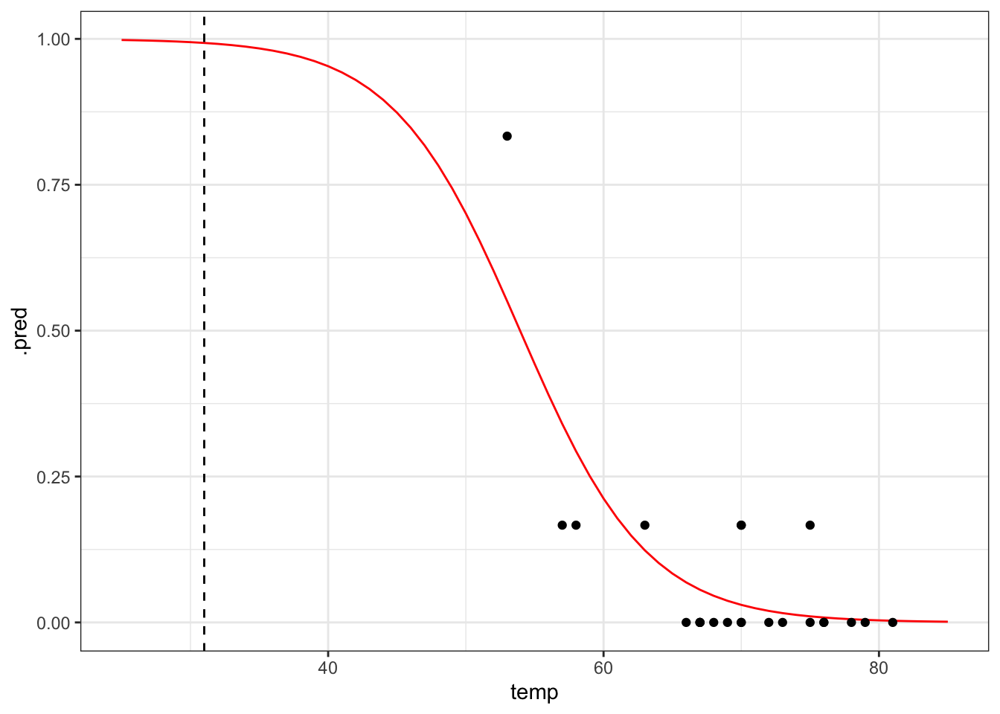

`<style>.panelset{--panel-tab-font-family: inherit;}</style>`{=html}


# Logistic regression - proportion response

## Objectives
:::objectives
**Questions**

- How do I analyse proportion responses?

**Objectives**

- Be able to create a logistic model to test proportion response variables
- Be able to plot the data and fitted curve
- Assess the significance of the fit
:::

## Libraries and functions

::::: {.panelset}

::: {.panel}
[tidyverse]{.panel-name}

| Library| Description|
|:- |:- |
|`tidyverse`| A collection of R packages designed for data science |
|`tidymodels`| A collection of packages for modelling and machine learning using tidyverse principles |

:::
:::::

## Datasets

::::: {.panelset}
::: {.panel}
[Diabetes]{.panel-name}

The example in this section uses the following data set:

`data/challenger.csv`

These data, obtained from the [faraway package](https://www.rdocumentation.org/packages/faraway/versions/1.0.7), contain information related to the explosion of the USA Space Shuttle Challenger on 28 January, 1986. An investigation after the disaster traced back to certain joints on one of the two solid booster rockets, each containing two O-rings (primary and secondary) that ensured no exhaust gases could escape from the booster.

The night before the launch was unusually cold, with temperatures below freezing. The final report suggested that the cold snap during the night made the o-rings stiff, and unable to adjust to changes in pressure. As a result, exhaust gases leaked away from the solid booster rockets, causing one of them to break loose and rupture the main fuel tank, leading to the final explosion.

The question we're trying to answer in this session is: based on the data from the previous flights, would it have been possible to predict the failure of most both o-rings on the Challenger flight?
:::
:::::

## Visualise the data
First, we read in the data:

::::: {.panelset}

::: {.panel}
[tidyverse]{.panel-name}

```r
challenger <- read_csv("data/challenger.csv")
```

```
## Rows: 23 Columns: 2
## ── Column specification ────────────────────────────────────────────────────────
## Delimiter: ","
## dbl (2): temp, damage
## 
## ℹ Use `spec()` to retrieve the full column specification for this data.
## ℹ Specify the column types or set `show_col_types = FALSE` to quiet this message.
```

```r
challenger
```

```
## # A tibble: 23 × 2
##     temp damage
##    <dbl>  <dbl>
##  1    53      5
##  2    57      1
##  3    58      1
##  4    63      1
##  5    66      0
##  6    67      0
##  7    67      0
##  8    67      0
##  9    68      0
## 10    69      0
## # … with 13 more rows
```
:::
:::::

The data set contains several columns:

1. `temp`, the launch temperature in degrees Fahrenheit
2. `damage`, the number of o-rings that showed erosion

Before we have a further look at the data, let's calculate the proportion of damaged o-rings (`prop_damaged`) and the total number of o-rings (`total`) and update our data set.

::::: {.panelset}

::: {.panel}
[tidyverse]{.panel-name}

```r
challenger <-
challenger %>%
  mutate(total = 6,                     # total number of o-rings
         intact = 6 - damage,           # number of undamaged o-rings
         prop_damaged = damage / total) # proportion damaged o-rings

challenger
```

```
## # A tibble: 23 × 5
##     temp damage total intact prop_damaged
##    <dbl>  <dbl> <dbl>  <dbl>        <dbl>
##  1    53      5     6      1        0.833
##  2    57      1     6      5        0.167
##  3    58      1     6      5        0.167
##  4    63      1     6      5        0.167
##  5    66      0     6      6        0    
##  6    67      0     6      6        0    
##  7    67      0     6      6        0    
##  8    67      0     6      6        0    
##  9    68      0     6      6        0    
## 10    69      0     6      6        0    
## # … with 13 more rows
```
:::
:::::

Plotting the proportion of damaged o-rings against the launch temperature shows the following picture:

::::: {.panelset}

::: {.panel}
[tidyverse]{.panel-name}

```r
ggplot(challenger, aes(x = temp, y = prop_damaged)) +
  geom_point()
```


:::
:::::
The point on the left is the data point corresponding to the coldest flight experienced before the disaster, where five damaged o-rings were found. Fortunately, this did not result in a disaster.

Here we'll explore if we could have predicted the failure of both o-rings on the Challenger flight, where the launch temperature was 31 degrees Fahrenheit.

## Model building
There is little point in evaluating the model using a training/test data set, since there are only 23 data points in total. So we're building a model and testing that on the available data.

::::: {.panelset}

::: {.panel}
[tidyverse]{.panel-name}
We are using a logistic regression for a proportion response in this case, since we're interested in the proportion of o-rings that are damaged.

The `logistic_reg()` function we used in the binary response section does not work here, because it expects a binary (yes/no; positive/negative; 0/1 etc) response.

To deal with that, we are using the standard `linear_reg()` function, still using the `glm` or generalised linear model engine, with the family or error distribution set to _binomial_ (as before).

First we set the model specification:

```r
chl_mod <- linear_reg(mode = "regression") %>%
  set_engine("glm", family = "binomial")
```

Then we fit the data. Fitting the data for proportion responses is a bit annoying, where you have to give the `glm` model a two-column matrix to specify the response variable.

Here, the first column corresponds to the number of damaged o-rings, whereas the second column refers to the number of intact o-rings. We use the `cbind()` function to bind these two together into a matrix.

```r
chl_fit <- chl_mod %>% 
  fit(cbind(damage, intact) ~ temp,
      data = challenger)
```

Next, we can have a closer look at the results:

```r
chl_fit %>% tidy()
```

```
## # A tibble: 2 × 5
##   term        estimate std.error statistic   p.value
##   <chr>          <dbl>     <dbl>     <dbl>     <dbl>
## 1 (Intercept)   11.7      3.30        3.54 0.000403 
## 2 temp          -0.216    0.0532     -4.07 0.0000478
```

We can see that the p-values of the `intercept` and `temp` are significant. We can also use the intercept and `temp` coefficients to construct the logistic equation, which we can use to sketch the logistic curve.

\begin{equation}
P(o-ring \ failure) = \frac{1}{1 + {e}^{-(11.66 -  0.22 \cdot temp)}}
\end{equation}

Let's see how well our model would have performed if we would have fed it the data from the ill-fated Challenger launch.

First we generate a table with data for a range of temperatures, from 25 to 85 degrees Fahrenheit, in steps of 1. We can then use these data to generate the logistic curve, based on the fitted model.

```r
model <- tibble(temp = seq(25, 85, 1))
```


```r
# get the predicted proportions for the curve
curve <- chl_fit %>% augment(new_data = model)

# plot the curve and the original data
ggplot(curve, aes(temp, .pred)) +
  geom_line(colour = "red") +
  geom_point(data = challenger, aes(temp, prop_damaged)) +
  # add a vertical line at the disaster launch temperature
  geom_vline(xintercept = 31, linetype = "dashed")
```



It seems that there was a high probability of both o-rings failing at that launch temperature. One thing that the graph shows is that there is a lot of uncertainty involved in this model.
:::
:::::

## Exercise

:::exercise ::::::

The data point at 53 degrees Fahrenheit is quite influential for the analysis. Remove this data point and repeat the analysis. Is there still a predicted link between launch temperature and o-ring failure?

<details><summary>Answer</summary>

::::: {.panelset}

::: {.panel}
[tidyverse]{.panel-name}

First, we need to remove the influential data point:

```r
challenger_new <- challenger %>% filter(temp != 53)
```

We can reuse the model specification, but we do have to update our fit:

```r
chl_new_fit <- chl_mod %>% 
  fit(cbind(damage, intact) ~ temp,
      data = challenger_new)
```


```r
# get the predicted proportions for the curve
curve_new <- chl_new_fit %>% augment(new_data = model)

# plot the curve and the original data
ggplot(curve_new, aes(temp, .pred)) +
  geom_line(colour = "red") +
  geom_point(data = challenger_new, aes(temp, prop_damaged)) +
  # add a vertical line at the disaster launch temperature
  geom_vline(xintercept = 31, linetype = "dashed")
```


The prediction proportion of damaged o-rings is markedly less in this scenario, with a failure rate of around 80%. The original fitted curve already had quite some uncertainty associated with it, but the uncertainty of this model is much greater.
:::
:::::

</details>

::::::::::::::::::

## Key points

:::keypoints
- We can use a logistic model for proportion response variables
:::
