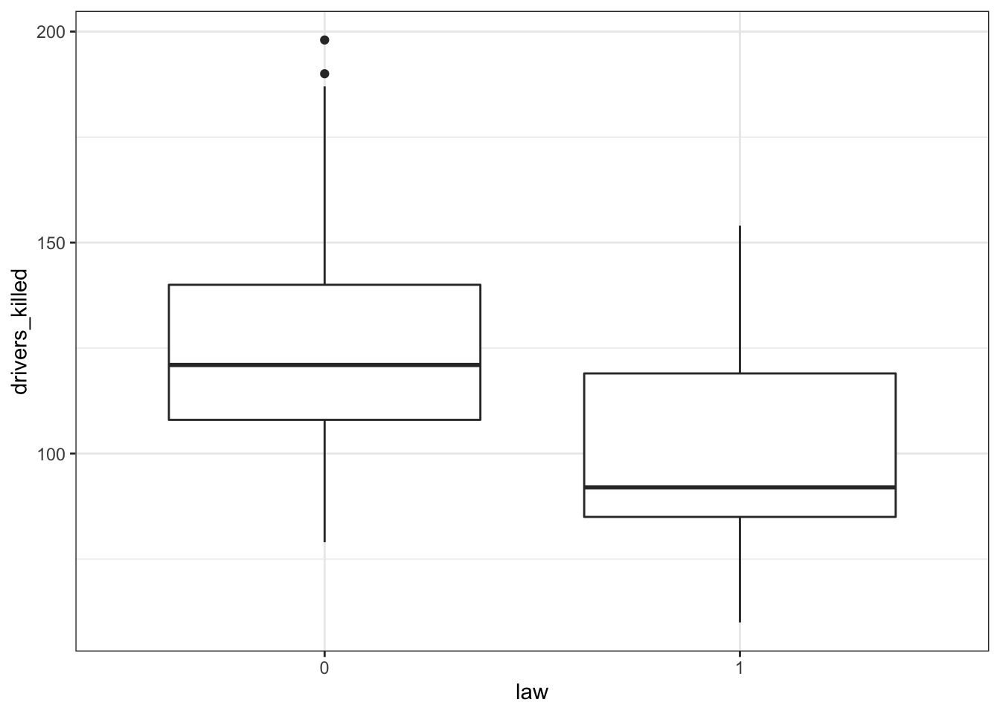
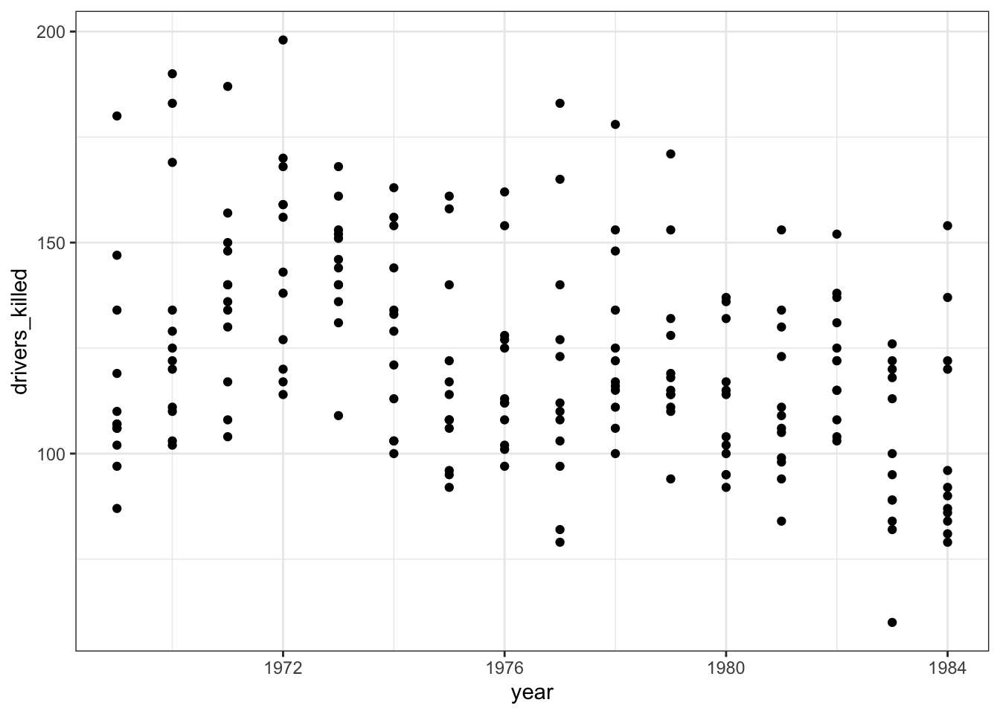
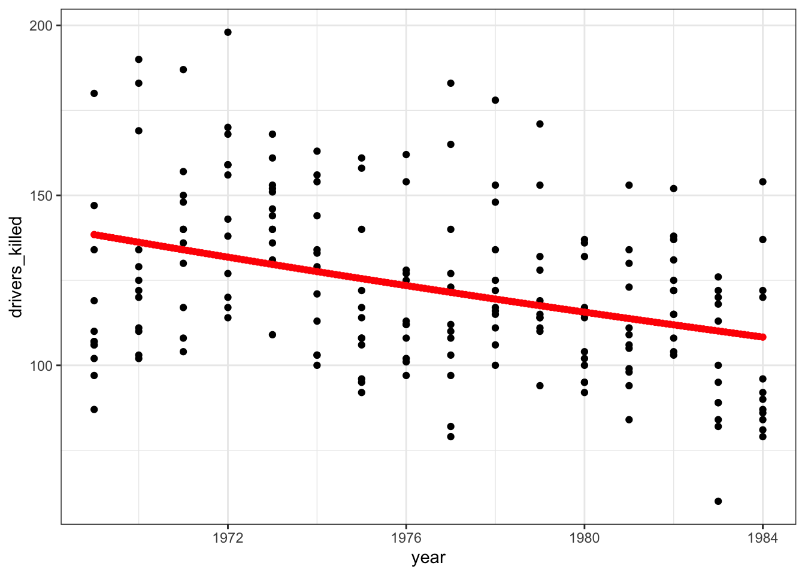

`<style>.panelset{--panel-tab-font-family: inherit;}</style>`{=html}

# Poisson Regression – Count Response

## Objectives
:::objectives
**Questions**

- How do we analyse count data?

**Objectives**

- Be able to perform a poisson regression on count data

:::

## Libraries and functions

::::: {.panelset}

::: {.panel}
[tidyverse]{.panel-name}

| Library| Description|
|:- |:- |
|`tidyverse`| A collection of R packages designed for data science |
|`tidymodels`| A collection of packages for modelling and machine learning using tidyverse principles |
|`poissonreg`| Enables the `parsnip` package to fit various types of Poisson regression models |

:::
:::::

## Datasets

::::: {.panelset}
::: {.panel}
[Islands]{.panel-name}

The example in this section uses the following data set:

`data/islands.csv`

This is a data set comprising 35 observations of two variables (one dependent and one predictor). This records the number of species recorded on different small islands along with the area (km<sup>2</sup>)of the islands. The variables are `species` and `area`.
:::
:::::

## Visualise the data
First we load the data, then we visualise it.

::::: {.panelset}
::: {.panel}
[tidyverse]{.panel-name}
First, we load and inspect the data:


```r
islands <- read_csv("data/island.csv")

islands
```

```
## # A tibble: 35 × 2
##    species  area
##      <dbl> <dbl>
##  1     114  12.1
##  2     130  13.4
##  3     113  13.7
##  4     109  14.5
##  5     118  16.8
##  6     136  19.0
##  7     149  19.6
##  8     162  20.6
##  9     145  20.9
## 10     148  21.0
## # … with 25 more rows
```

Looking at the data, we can see that there are two columns: `species`, which contains the number of species recorded on each island and `area`, which contains the surface area of the island in square kilometers.

We can plot the data:


```r
islands %>% 
  ggplot(aes(x = area, y = species)) +
  geom_point()
```


:::
:::::

It looks as though `area` may have an effect on the number of species that we observe on each island. We note that the response variable is count data and so we try to construct a Poisson regression.

## Model building
To create a poisson regression we do the following:

::::: {.panelset}

::: {.panel}
[tidyverse]{.panel-name}

Again, similar to what we've done for the logistic models, we will use the `parsnip` package from the `tidymodels` library. Yes, the workflow still seems a bit faffy, but it provides a common syntax for a whole range of modelling libraries. This means that the syntax will stay the same as you do different kind of model comparisons.

If you haven't loaded `tidymodels` yet, now is a really good time. We also need to load `poissonreg`, which adds extra functionality to `parsnip`.


```r
# install.packages("tidymodels")
library(tidymodels)
# install.packages("poissonreg")
library(poissonreg)
```

Remember that the workflow in `parsnip` is a bit different to what we're used to so far. Using `parsnip` we approach things in a more systematic manner. We specify a model in three steps:

1. **Specify the type of model based on its mathematical structure** (e.g., linear regression, random forest, K-nearest neighbors, etc).
2. **When required, declare the mode of the model.** The mode reflects the type of prediction outcome. For numeric outcomes, the mode is regression; for qualitative outcomes, it is classification. If a model can only create one type of model, such as logistic regression, the mode is already set.
3. **Specify the engine for fitting the model.** This usually is the software package or library that should be used.

So, we can create the model as follows:


```r
isl_mod <- poisson_reg() %>% 
  set_mode("regression") %>% 
  set_engine("glm")
```

Again, note that we are not actually specifying any of the variables yet. All we've done is tell R what kind of model we're planning to use. If we want to see how `parsnip` converts this code to the package syntax, we can check this with `translate()`:


```r
isl_mod %>% translate()
```

```
## Poisson Regression Model Specification (regression)
## 
## Computational engine: glm 
## 
## Model fit template:
## stats::glm(formula = missing_arg(), data = missing_arg(), weights = missing_arg(), 
##     family = stats::poisson)
```

This shows that we have a poisson regression model, where the outcome is going to be a regression. The model fit template tells us that we'll be using the `glm()` function from the `stats` package, which can take a `formula`, `data`, `weights` and `family` argument. The `family` argument is already set to poisson.

Now we've specified what kind of model we're planning to use, we can fit our data to it, using the `fit()` function:


```r
isl_fit <- isl_mod %>% 
  fit(species ~ area,
      data = islands)
```

We can look at the output directly, but I prefer to tidy the data up using the `tidy()` function from `broom` package:


```r
isl_fit %>% tidy()
```

```
## # A tibble: 2 × 5
##   term        estimate std.error statistic   p.value
##   <chr>          <dbl>     <dbl>     <dbl>     <dbl>
## 1 (Intercept)   4.24     0.0413      103.  0        
## 2 area          0.0356   0.00125      28.6 2.73e-179
```

The output is strikingly similar to the logistic regression models (who’d have guessed, eh?) and the main numbers to extract from the output are the two numbers in the `estimate` column.
:::
:::::

These are the coefficients of the Poisson model equation and need to be placed in the following formula in order to estimate the expected number of species as a function of island size:

\begin{equation}
E(species) = {e}^{(4.24 + 0.036 \times area)}
\end{equation}

Interpreting this requires a bit of thought (not much, but a bit).

The intercept coefficient ($\beta_0$), 4.24, is related to the number of species we would expect on an island of zero area (this is statistics, not real life. You’d do well to remember that before you worry too much about what that even means). But in order to turn this number into something meaningful we have to exponentiate it. Since ${e}^{(4.24) \approx 70}$, we can say that the baseline number of species the model expects on any island is 70. This isn’t actually the interesting bit though.

The coefficient of `area` ($\beta_1$) is the fun bit. For starters we can see that it is a positive number which does mean that increasing area leads to increasing numbers of species. Good so far - since this matches what we saw when we plotted our data. But what does the value 0.036 actually mean?

Well, if we exponentiate it too we get ${e}^{(0.036)} \approx 1.04$. This means that for every increase in area of 1 km<sup>2</sup> (the original units of the `area` variable) the number of species on the island is multiplied by 1.04. So, an island of area 1 km<sup>2</sup> is predicted to have $1.04 \times 70 \approx 72$ species.

So, in order to interpret Poisson coefficients, you have to exponentiate them.

## Model predictions

Now that we can interpret the Poisson coefficients, it would be good to see if using a poisson regression to describe these data is actually a good idea.

Visualisation is always useful, so in order to get an idea of how our data fits a Poisson regression, we'll plot the Poisson regression curve. Next, we overlay our original data.

::::: {.panelset}

::: {.panel}
[tidyverse]{.panel-name}

First, we create a table that contains data for the curve, starting for an `area` with value 1 to 50, in steps of 1.


```r
model <- tibble(area = seq(1, 50, 1))
```

Next, we feed our model these data:


```r
curve <- isl_fit %>% augment(new_data = model)
```

This gives the predicted number of `species` for each given value of `area`. If we have a closer look at these data we can see that, for example, for an `area` with a surface area of 4 km<sup>2</sup> the predicted number of species is around 80. Nice.


```r
head(curve)
```

```
## # A tibble: 6 × 2
##    area .pred
##   <dbl> <dbl>
## 1     1  72.0
## 2     2  74.6
## 3     3  77.3
## 4     4  80.1
## 5     5  83.0
## 6     6  86.0
```

Using these data, we can now plot all the _predicted_ number of species and overlay our original _measured_ data.


```r
ggplot(curve, aes(area, .pred)) +
  geom_line(colour = "red") +
  geom_point(data = islands, aes(area, species))
```


:::
:::::

That looks like a pretty decent fit, really. But of course we want to have a (slightly) less hand-wavy conclusion than that.

### Goodness-of-fit
We can use the model's residual deviance to assess how much the predicted values differ from the observed. This gives us an idea of how well-specified the model is. When a model is "true", _i.e._ the model makes pretty accurate predictions, then we expect the residual deviance to be distributed as a $\chi^2$
 random variable with degrees of freedom equal to the model's residual degrees of freedom.
 
We can get these parameters as follows and we'll store them in a new object, so we can extract them in a bit.
 

```r
isl_fit %>% glance()
```

```
## # A tibble: 1 × 8
##   null.deviance df.null logLik   AIC   BIC deviance df.residual  nobs
##           <dbl>   <int>  <dbl> <dbl> <dbl>    <dbl>       <int> <int>
## 1          857.      34  -139.  283.  286.     30.4          33    35
```

```r
isl_parameters <- isl_fit %>% glance()
```
The values we are interested in are in the `deviance` and `df.residual` columns, respectively.

Next, we use the `pchisq()` function to calculate the correct probability.

```r
pchisq(isl_parameters$deviance,
       isl_parameters$df.residual,
       lower.tail = FALSE)
```

```
## [1] 0.595347
```

This gives us a value of around 0.60. This suggests that this model is actually a pretty good one (if it wasn't then the value would be close to zero) and that the data are pretty well supported by the model.

:::note
The `pchisq()` function gives the lower tail probability that $\chi^2 \le x$ by default. We're actually interested in the probability that $\chi^2 \ge x$. These two probabilities must sum to one, so we get the upper tail probability by setting the argument `lower.tail = FALSE`. An alternative way would be to use the default, but do `1 - pchisq()`.
:::

For Poisson models this has an extra interpretation. This can be used to assess whether we have significant overdispersion in our data. For a Poisson model to be appropriate we need that the variance of the data to be exactly the same as the mean of the data. If there is overdispersion then the data would spread out more for higher predicted values of species than for lower ones. Our visualisation shows that this isn't really happening. The spread is unlikely to be perfectly homogeneous, but we don’t want the data to spread out too much. 

The easy way to check this is to look at the ratio of the residual deviance to the residual degrees of freedom (in this case 0.922). For a Poisson model to be valid, this ratio should be about 1. If the ratio is significantly bigger than 1 then we say that we have over-dispersion in the model and we wouldn’t be able to trust any of the significance testing using a Poisson regression.

### Confidence intervals
We can also assess how reliable our model is by looking at the confidence intervals of the estimated parameters.

We extracted the parameters of the model by using


```r
isl_fit %>% tidy()
```

```
## # A tibble: 2 × 5
##   term        estimate std.error statistic   p.value
##   <chr>          <dbl>     <dbl>     <dbl>     <dbl>
## 1 (Intercept)   4.24     0.0413      103.  0        
## 2 area          0.0356   0.00125      28.6 2.73e-179
```

Although we focussed on the `estimate` column, we can see that the associated standard errors for each estimate is also given in the `std.error` column. We can use these values to calculate the 95% confidence intervals.

We can either do this by hand through multiplying the standard errors by 1.96. We can then subtract from (giving the lower confidence estimate) or add to (giving the higher confidence estimate) the estimated parameter. This gives a pretty decent approximation.

But then again, life is short, so we can just use the additional argument that is available for the `tidy()` function. You can look at what columns are returned, but I'm selecting the relevant ones here:


```r
isl_fit %>% tidy(conf.int = TRUE,        # default is FALSE
                 conf.level = 0.95) %>%  # is the default
  select(term, estimate, conf.low, conf.high)
```

```
## # A tibble: 2 × 4
##   term        estimate conf.low conf.high
##   <chr>          <dbl>    <dbl>     <dbl>
## 1 (Intercept)   4.24     4.16      4.32  
## 2 area          0.0356   0.0332    0.0381
```

What we're interested in here is the confidence intervals for the `area` parameter. Before we delve into that, I'm also going to calculate the exponent for these confidence intervals. We can do this using the `exp()` function.


```r
isl_fit %>% tidy(conf.int = TRUE,        # default is FALSE
                 conf.level = 0.95) %>%  # is the default
  select(term, estimate, conf.low, conf.high) %>% 
  mutate(conf.low_exp = exp(conf.low),
         conf.high_exp = exp(conf.high))
```

```
## # A tibble: 2 × 6
##   term        estimate conf.low conf.high conf.low_exp conf.high_exp
##   <chr>          <dbl>    <dbl>     <dbl>        <dbl>         <dbl>
## 1 (Intercept)   4.24     4.16      4.32          64.1          75.3 
## 2 area          0.0356   0.0332    0.0381         1.03          1.04
```

These values are a bit familiar, since we've previously determined based on the `area` coefficient that for each increase in square kilometer, the number of species increases by approximately 1.04.

What these values tell us is that we can be 95% certain that for every increase in square kilometer of island area size, the number of species increases somewhere between 1.034 and 1.039.

:::note
If there was no association between `area` and `species`, then the $\beta_1$ coefficient would be zero. That would mean that the exponent would be ${e}^{\beta_1}=1$. The interval that we calculated for ${e}^{\beta_1}$ lies between 1.034 and 1.039 and therefore does not include 1, so the model with `area` is preferred over the model without `area`.

Similarly, the interval for $\beta_1$ (0.033 - 0.038) does not include 0, again showing the significance of `area` as a predictor of `species`.
:::

## Exercise: Seatbelts

:::exercise ::::::

The `Seatbelts` data set in R is a multiple time-series data set that was commissioned by the Department of Transport in 1984 to measure differences in deaths before and after front seatbelt legislation was introduced on 31st January 1983. It provides monthly total numerical data on a number of incidents including those related to death and injury in Road Traffic Accidents (RTA's). The data set starts in January 1969 and observations run until December 1984.

I'd like you to do the following:

1. Load the data (see code below)
2. Visualise the data and create a poisson regression model
3. Plot the regression model on top of the data
4. Assess if the model is a decent predictor for the number of fatalities

<details><summary>Loading the data</summary>
::::: {.panelset}
::: {.panel}
[tidyverse]{.panel-name}
We can load the data directly in R, but unfortunately the data is not in a very friendly format. So we need to do a bit of data wrangling and tidying. 
We can make our life (a bit) easier with the `janitor` library - it's an addition to tidyverse and has a `clean_names()` function that enables you to clean up messy column names. Install it if needed, then load it.

Don't worry too much about what the code means that tidies the data. Just copy/paste it, so that you end up with a tidy `seatbelts` object.


```r
# install.packages("janitor")
library(janitor)
```

```
## 
## Attaching package: 'janitor'
```

```
## The following objects are masked from 'package:stats':
## 
##     chisq.test, fisher.test
```

```r
data(Seatbelts)

seatbelts <- Seatbelts %>%
  as_tibble() %>%
  mutate(Year = floor(time(Seatbelts)),
         Year = as.numeric(Year),
         Month = factor(cycle(Seatbelts),
                        labels = month.abb),
         law = factor(law)) %>% 
  clean_names()

# check if the data is now in a decent format
seatbelts
```

```
## # A tibble: 192 × 10
##    drivers_killed drivers front  rear   kms petrol_price van_killed law    year
##             <dbl>   <dbl> <dbl> <dbl> <dbl>        <dbl>      <dbl> <fct> <dbl>
##  1            107    1687   867   269  9059        0.103         12 0      1969
##  2             97    1508   825   265  7685        0.102          6 0      1969
##  3            102    1507   806   319  9963        0.102         12 0      1969
##  4             87    1385   814   407 10955        0.101          8 0      1969
##  5            119    1632   991   454 11823        0.101         10 0      1969
##  6            106    1511   945   427 12391        0.101         13 0      1969
##  7            110    1559  1004   522 13460        0.104         11 0      1969
##  8            106    1630  1091   536 14055        0.104          6 0      1969
##  9            107    1579   958   405 12106        0.104         10 0      1969
## 10            134    1653   850   437 11372        0.103         16 0      1969
## # … with 182 more rows, and 1 more variable: month <fct>
```

:::
:::::
</details>

<details><summary>Answer</summary>
::::: {.panelset}
::: {.panel}
[tidyverse]{.panel-name}


### Visualise the data

The data tracks the number of drivers killed in road traffic accidents, before and after the seatbelt law was introduced. The information on whether the law was in place is encoded in the `law` column as `0` (law not in place) or `1` (law in place).

There are many more observations when the law was _not_ in place, so we need to keep this in mind when we're interpreting the data.

First we have a look at the data comparing no law vs law:

```r
seatbelts %>% 
  ggplot(aes(law, drivers_killed)) +
  geom_boxplot()
```



The data are recorded by month and year, so we can also display the number of drivers killed by year:

```r
seatbelts %>% 
  ggplot(aes(year, drivers_killed)) +
  geom_point()
```



The data look a bit weird. There is quite some variation within years (keeping in mind that the data are aggregated monthly). The data also seems to wave around a bit... with some vague peaks (e.g. 1972 - 1973) and some troughs (e.g. around 1976).

So my initial thought is that these data are going to be a bit tricky to interpret. But that's OK.

### Model building
We're dealing with count data, so we're going to use a poisson regression.

As before, we first define the model type.

```r
stb_mod <- poisson_reg() %>% 
  set_mode("regression") %>% 
  set_engine("glm")
```

And check that everything is in order.

```r
stb_mod %>% translate()
```

```
## Poisson Regression Model Specification (regression)
## 
## Computational engine: glm 
## 
## Model fit template:
## stats::glm(formula = missing_arg(), data = missing_arg(), weights = missing_arg(), 
##     family = stats::poisson)
```

Next, we fit our data to the model we just specified:


```r
stb_fit <- stb_mod %>% 
  fit(drivers_killed ~ year,
      data = seatbelts)
```

And we can extract the estimated coefficients from these fitted data:


```r
stb_fit %>% tidy()
```

```
## # A tibble: 2 × 5
##   term        estimate std.error statistic  p.value
##   <chr>          <dbl>     <dbl>     <dbl>    <dbl>
## 1 (Intercept)  37.2      2.80         13.3 2.62e-40
## 2 year         -0.0164   0.00142     -11.6 5.88e-31
```
### Visualise the model

To see if the model is actually a decent prediction for our data, we can plot it.

To do this, we create modelled values for our predictor variable `year`. Because we have monthly data, we create a sequence of "years" in 1/12th intervals - one for each month.

Next, we ask the model to predict the number of drivers killed based on these values.

Lastly, we can plot those predicted values against the observed values in our data set.


```r
# create the sequence of values that are used
# in predicting number of deaths
model <- tibble(year = seq(1969, 1984, (1/12)))

# fit these data to the model
stb_curve <- stb_fit %>% augment(new_data = model)

# plot the predicted values
# and overlay the observed values
ggplot(seatbelts, aes(year, drivers_killed)) +
  geom_point() +
  geom_point(data = stb_curve, aes(x = year, y = .pred),
             colour = "red")
```



That does not look like a very good fit, but then again the data look rather messy as well.

### Goodness-of-fit
Let's check the goodness-of-fit.

First we store the parameter estimates in an object. Then we use the `pchisq()` function to calculate the probability that the residual deviance is actually distributed as a $\chi^2$ random variable with degrees of freedom equal to the model's residual degrees of freedom.

Yes, you can read that sentence three times and still wonder what that really means. Suffice to say is that the outcome gives us a measure of how well-specified the model is.


```r
stb_parameter <- stb_fit %>% glance()

stb_parameter
```

```
## # A tibble: 1 × 8
##   null.deviance df.null logLik   AIC   BIC deviance df.residual  nobs
##           <dbl>   <int>  <dbl> <dbl> <dbl>    <dbl>       <int> <int>
## 1          984.     191 -1062. 2127. 2134.     850.         190   192
```

```r
pchisq(stb_parameter$deviance,
       stb_parameter$df.residual,
       lower.tail = FALSE)
```

```
## [1] 3.12987e-84
```

Well, that's a bit of a blow. The probability value is extremely low, suggesting that the model is not very well-specified. Which kind of matches what we already saw in the plot. It might still be better than the null model ("the data can be modelled as the average across all the observations"), but we seem to be missing some parameters here.

### Confidence intervals
Similar to the `islands` example, we can also calculate the confidence intervals associated with our estimated parameters.


```r
stb_fit %>% tidy(conf.int = TRUE,        # default is FALSE
                 conf.level = 0.95) %>%  # is the default
  select(term, estimate, conf.low, conf.high) %>% 
  mutate(conf.low_exp = exp(conf.low),
         conf.high_exp = exp(conf.high))
```

```
## # A tibble: 2 × 6
##   term        estimate conf.low conf.high conf.low_exp conf.high_exp
##   <chr>          <dbl>    <dbl>     <dbl>        <dbl>         <dbl>
## 1 (Intercept)  37.2     31.7      42.7        5.78e+13      3.34e+18
## 2 year         -0.0164  -0.0191   -0.0136     9.81e- 1      9.86e- 1
```

We're interested in the confidence interval for the `year` variable. Remember that if there is no association at all between `year` and `drivers_killed` then the parameter $e^{\beta_1} = 1$.

In our case the interval we calculated for $e^{\beta_1}$ lies between 0.981 and 0.986. This does not include 1, so it seems that the model that takes `year` into account is still preferred over a model that doesn't.

:::
:::::
</details>

::::::::::::::::::


## Key points

:::keypoints

- 
:::
