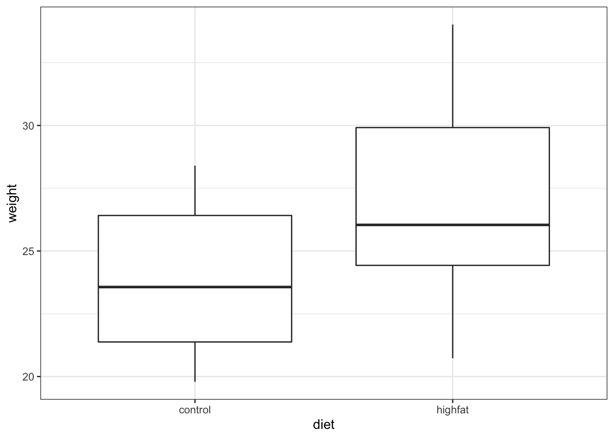
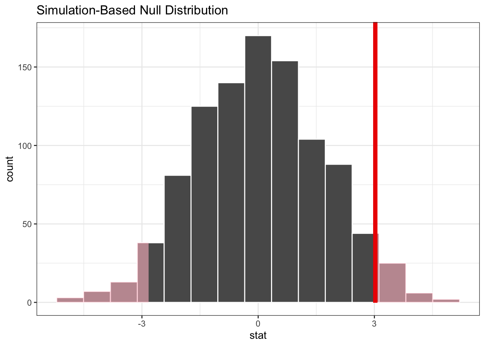
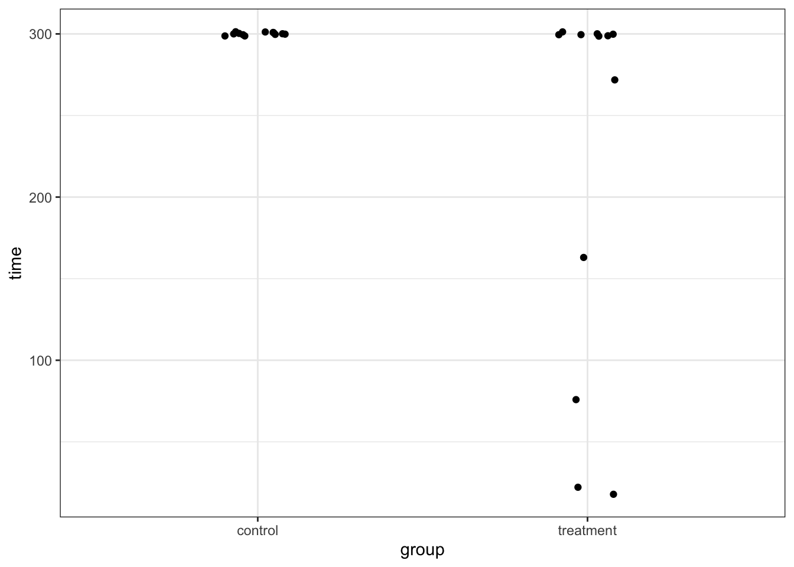
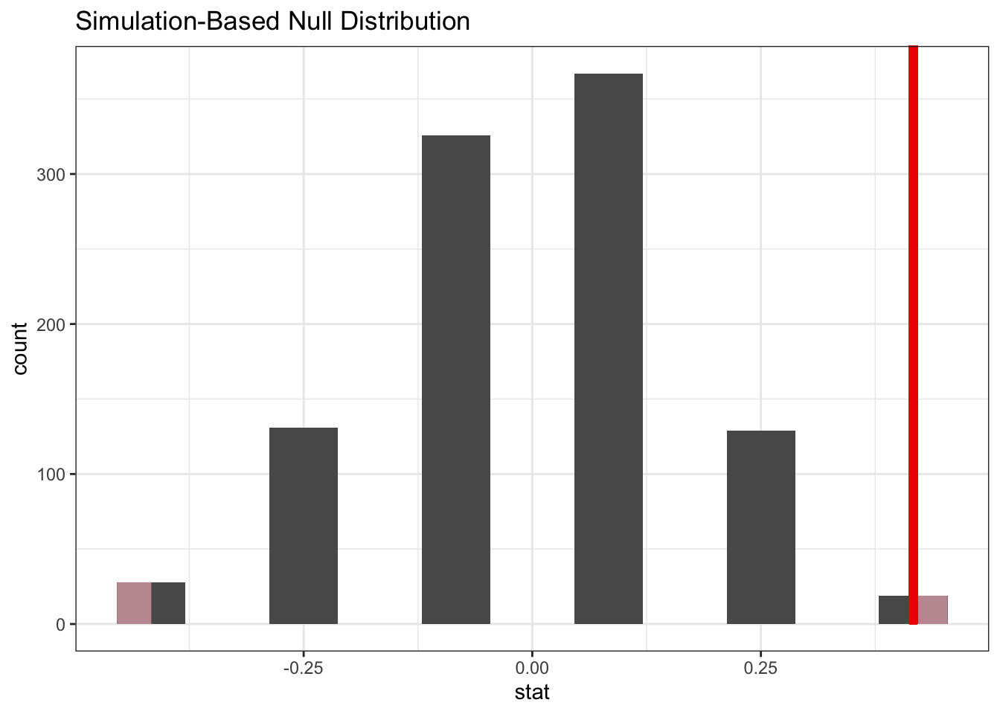
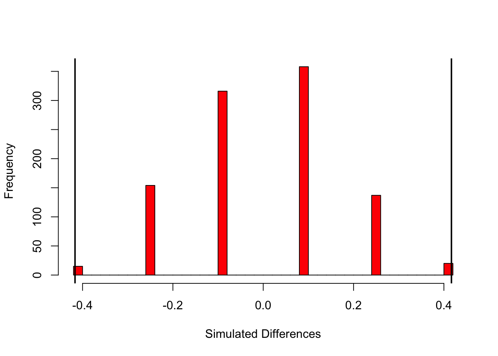
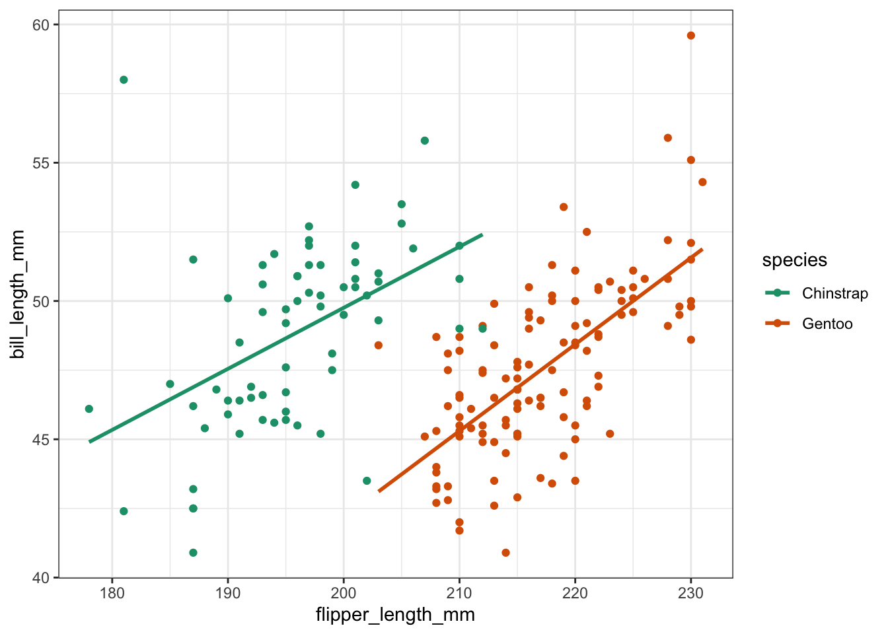
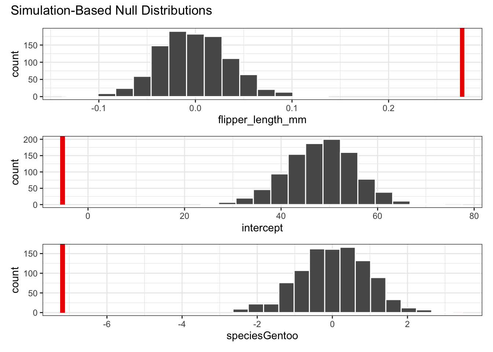

```
## Warning: 'xaringanExtra::style_panelset' is deprecated.
## Use 'style_panelset_tabs' instead.
## See help("Deprecated")
```

`<style>.panelset{--panel-tab-font-family: inherit;}</style>`{=html}

# Single predictor permutation tests

## Objectives
:::objectives
**Objectives**

- Understand how resampling techniques work in R
- Be able to carry out permutation techniques on single predictors
- Be able to define the statistic to permute
- Understand the advantages and limitations of permutation techniques
:::

## Libraries and functions

::::: {.panelset}

::: {.panel}
[tidyverse]{.panel-name}

| Library| Description|
|:- |:- |
|`tidyverse`| A collection of R packages designed for data science |
|`tidymodels`| A collection of packages for modelling and machine learning using tidyverse principles |

:::
:::::

## Purpose and aim
If we wish to test for a difference between two groups in the case where the assumptions of a two-sample t-test just aren’t met, then a two-sample permutation test procedure is appropriate. It is also appropriate even if the assumptions of a t-test are met, but in that case, it would be easier to just do the t-test.

One of the additional benefits of permutation test is that we aren’t just restricted to testing hypotheses about the means of the two groups. We can test hypotheses about absolutely anything we want! So, we could see if the ranges of the two groups differed significantly etc.


## Data and hypotheses
Let’s consider an experimental data set where we have measured the weights of two groups of 12 female mice (so 24 mice in total). One group of mice was given a perfectly normal diet (control) and the other group of mice was given a high fat diet for several months. We want to test whether there is any difference in the mean weight of the two groups. We still need to specify the hypotheses:

$H_0$: there is no difference in the means of the two groups

$H_1$: there is a difference in the means of the two groups

### Load and visualise the data {.panelset}
First we load the data, then we visualise it.

::::: {.panelset}
::: {.panel}
[tidyverse]{.panel-name}

```r
# load the data
mice <- read_csv("data/mice.csv")

# view the data
mice
```

```
## # A tibble: 24 × 2
##    diet    weight
##    <chr>    <dbl>
##  1 control   21.5
##  2 control   28.1
##  3 control   24.0
##  4 control   23.4
##  5 control   23.7
##  6 control   19.8
##  7 control   28.4
##  8 control   21.0
##  9 control   22.5
## 10 control   20.1
## # … with 14 more rows
```


```r
ggplot(mice, aes(x = diet, y = weight)) +
  geom_boxplot()
```



It looks as if the mice that are fed on a high fat diet have a greater weight than in the control (hardly surprising!). To look at this a bit more closely we calculate the difference in mean weight between the two groups:


```r
# determine mean weight per group
mice %>% 
  group_by(diet) %>%                         # split data by diet
  summarise(mean_weight = mean(weight)) %>%  # calculate mean weight per group
  ungroup() %>%                              # remove the grouping
  pull(mean_weight) %>%                      # extract group values
  diff()                                     # calculate the difference
```

```
## [1] 3.020833
```

Let's store this value in an object called `mice_diff`.


:::
:::::

Right, so the difference between the two group means in about 3.02, hoorah! But is that difference a lot? Is it unusual/big/statistically significant?

Specifically, how likely would it be to get a difference this big if there were no difference between the two groups? Let's find out!

## Permutation Test Theory
The key idea behind permutation techniques is that if the null hypothesis is true, and there is no difference between the two groups then if I were to switch some of the mice from one group to the next then this wouldn’t change the difference between the groups too much. If on the other hand there actually is a difference between the groups (with one group having much higher weights than the other), then if I were to switch some mice between the groups then this should average out the two groups leading to a smaller difference in group means.

So, what we do is we shuffle the mice weights around lots and lots of times, calculating the difference between the group means each time. Once we have done this shuffling hundreds or thousands of times, we will have loads of possible values for the difference in the two group means. At this stage we can look at our actual difference (the one we calculated from our original data) and see how this compares to all of the simulated differences.
We can calculate how many of the simulated differences are bigger than our real difference and this proportion is exactly the p-value that we’re looking for!
Let look at how to carry this out in practice.

::::: {.panelset}

::: {.panel}
[tidyverse]{.panel-name}

```r
set.seed(123)

mice_resample <- mice %>% 
  specify(weight ~ diet) %>% 
  hypothesise(null = "independence") %>% 
  generate(reps = 1000, type = "permute") %>% 
  calculate("diff in means", order = c("control", "highfat"))

mice_resample %>% 
  visualise() +
  shade_p_value(obs_stat = mice_diff, direction = "two-sided")
```


:::

::: {.panel}
[base R]{.panel-name}

```r
set.seed(123)
reps<-1000
sim_diff<-numeric(reps)
for(i in 1:reps){
  new_dat<-mice
  new_dat$diet<-sample(new_dat$diet)
  new_means <- aggregate(weight ~ diet , new_dat , mean)$weight
  new_diff <- diff(new_means)
  
  sim_diff[i]<-new_diff  
}
```


```r
hist(sim_diff , breaks = 30 , col="red")
abline(v = mice_diff , col="black" , lwd=2)
```


:::

:::::

::::: {.panelset}

::: {.panel}
[tidyverse]{.panel-name}

To get a better sense of how reliable this p-value might be, we repeat the whole process many times and obtain the resulting p-values. 

One way of getting the p-value from a single iteration is as follows:

```r
# get a two-tailed p-value
p_value <- mice_resample %>%
  get_p_value(obs_stat = mice_diff, direction = "two-sided")

p_value
```

```
## # A tibble: 1 × 1
##   p_value
##     <dbl>
## 1   0.074
```

If we want to repeat the iterations many times we can wrap the whole workflow that we used to obtain the p-value within the `replicate()` function and tell it how many times we want to repeat it. Here we repeat the whole process 100 times.

:::highlight

This workflow takes into account several steps:

1. `specify()` the variables of interest in your data
2. `hypothesise()` to define the null hypothesis
3. `generate()` replicates
4. `calculate()` the summary statistic of interest
5. `visualize()` the resulting distribution and confidence interval.
:::


```r
# remove the set.seed()
# otherwise we get the same result 100 times
set.seed(NULL)

resample_replicates <- replicate(100, mice %>% 
  specify(weight ~ diet) %>% 
  hypothesise(null = "independence") %>% 
  generate(reps = 1000, type = "permute") %>% 
  calculate("diff in means", order = c("control", "highfat")) %>% 
  get_p_value(obs_stat = mice_diff, direction = "two-sided") %>% 
  pull()) %>% 
  as_tibble() %>% 
  mutate(n_rep = 1:n(),
         p_value = value) %>% 
  select(-value)

ggplot(resample_replicates, aes(x = p_value)) +
  geom_histogram(bins = 10)
```


You might get a warning about reporting a p-value of zero. This depends on the number of `reps` chosen in the `generate()` function. If it's too low then, due to the simulation-based nature of the package it could be that the observed statistic is more extreme than the test statistic generated to form the null hypothesis. If that happens, the approximate p-value is zero. Ending in a warning, because a true p-value of zero is impossible.

:::
:::::


## Exercise: Rats on a wheel
:::exercise ::::::
The data set `data/rats.csv` contains information on the length of time that 24 rats were able to stay balanced on a rotating wheel. 12 of the rats were assigned to the control group and the other 12 were given a dose of a centrally acting muscle relaxant. The animals were placed on a rotating cylinder and the length of time that each rat remained on the cylinder was measured, up to a maximum of 300 seconds. The data set contains two variables time and group. 
Whilst you could explore differences in means between these two groups, in this case an alternative statistic presents itself. When you look at the data you should notice that for the control group that all 12 rats manage to stay on the roller for the maximum 300 seconds, whereas in the treated group 5 out of the 12 fall off earlier.

For this exercise, instead of calculating the mean length of time for each group, you should calculate the proportion of rats that make it to 300s in each group and find the difference. This will be your statistic.

Use a permutation test to decide whether the proportion of rats that survive is the same between each group.

<details><summary>Hint</summary>
::::: {.panelset}
::: {.panel}
[tidyverse]{.panel-name}
Have a look at the `stat` options in the `calculate()` function
:::
:::::
</details>

<details><summary>Answer</summary>
::::: {.panelset}
::: {.panel}
[tidyverse]{.panel-name}

As always, let's first load and visualise the data:


```r
rats <- read_csv("data/rats.csv")

rats
```

```
## # A tibble: 24 × 2
##     time group  
##    <dbl> <chr>  
##  1   300 control
##  2   300 control
##  3   300 control
##  4   300 control
##  5   300 control
##  6   300 control
##  7   300 control
##  8   300 control
##  9   300 control
## 10   300 control
## # … with 14 more rows
```

Because there is a lot of overlap in some of our values (many rats manage to stay on the wheel for the entire 300s), we need to jitter the data a bit.

```r
rats %>% 
  ggplot(aes(x = group, y = time)) +
  geom_jitter(width = 0.1)
```



We're interested in the proportion of rats that make it to the full 300s. So, let's calculate this:


```r
rats <- rats %>% 
  group_by(group) %>% 
  mutate(full_time = time == 300,
         full_time = as.character(full_time))
```

So, this means that the proportion of rats that make it to full-time is as follows:

```r
full_time_control = 12/12
full_time_treatment = 7/12

rats_diff <- full_time_control - full_time_treatment
```

Now, the question is, is that difference in proportion likely or not? To check that, we resample our data and see how likely the proportional difference we observe is.


```r
set.seed(123)
rats_resample <- rats %>% 
  specify(full_time ~ group, success = "TRUE") %>% 
  hypothesise(null = "independence") %>% 
  generate(reps = 1000, type = "permute") %>% 
  calculate("diff in props", order = c("control", "treatment"))

rats_resample %>% 
  visualise() +
  shade_p_value(obs_stat = rats_diff, direction = "two-sided")
```



The answer is: not very likely. One thing to keep in mind is that we've resampled a thousand times here. But that's not really fair, since there are not a thousand different options possible due to the low sample size. However, it just means that the same responses occur more often. You would be able to calculate it exactly, without using resampling, but this is a bit of a headache. Importantly, you would not really use this technique very much if you have so few samples, but it's a good illustration to how you can use the technique to analyse different statistics.

To put a number to it, we can get the p-value like we did before:


```r
# get a two-tailed p-value
p_value <- rats_resample %>%
  get_p_value(obs_stat = rats_diff, direction = "two-sided")

p_value
```

```
## # A tibble: 1 × 1
##   p_value
##     <dbl>
## 1   0.038
```

:::

::: {.panel}
[base R]{.panel-name}


```r
set.seed(123)
rats_r <- read.csv("data/rats.csv")

unstRats<-unstack(rats_r)

propControl <- length(
  which(unstRats$control==300)) / length(unstRats$control)

propTreatment <- length(
  which(unstRats$treatment==300)) / length(unstRats$treatment)

ratDiff <- propControl - propTreatment

nReps <- 1000
simRat<-numeric(nReps)

for(i in 1:nReps){
  
  newdat <- rats_r
  newdat$group <- sample(newdat$group)
  
  newUnstRats <- unstack(newdat)
  
  newPropControl <- length(
    which(newUnstRats$control==300))/length(newUnstRats$control)
  
  newPropTreatment <- length(
    which(newUnstRats$treatment==300))/length(newUnstRats$treatment)
  
  newDiff <- newPropControl - newPropTreatment
  
  simRat[i] <- newDiff
}

hist(simRat, breaks = 30, col='red' , main="" , xlab="Simulated Differences")
abline(v = ratDiff, col = "black", lwd = 2)
abline(v = -ratDiff, col = "black", lwd = 2)
```



:::
:::::


</details>

::::::::::::::::::

## Resampling based on a linear regression

So far you've seen two examples of how we can use permutation techniques to look at our data: by looking at the difference in means (the mice-on-a-diet example) and by comparing the difference in proportion (rats-on-a-wheel exercise).

You might have noticed from the code that there is very little difference in the approach, which is good! We're going to adjust the code slightly, so that we can do a similar resampling exercise using a linear model. To look at this, we're using a data set about penguins.

::::: {.panelset}

::: {.panel}
[tidyverse]{.panel-name}

The `penguins` data set is part of a library called `palmerpenguins`, which we'll have to install and load:


```r
install.packages("palmerpenguins")
```


```r
library(palmerpenguins)
```

Let's attach the data and remove the missing values. We're also filter out data on one type of penguin, just to make our analysis a bit easier to follow.

```r
data("penguins")

penguins <- penguins %>%
  filter(species != "Adelie") %>% 
  drop_na()

penguins
```

```
## # A tibble: 187 × 8
##    species island bill_length_mm bill_depth_mm flipper_length_mm body_mass_g
##    <fct>   <fct>           <dbl>         <dbl>             <int>       <int>
##  1 Gentoo  Biscoe           46.1          13.2               211        4500
##  2 Gentoo  Biscoe           50            16.3               230        5700
##  3 Gentoo  Biscoe           48.7          14.1               210        4450
##  4 Gentoo  Biscoe           50            15.2               218        5700
##  5 Gentoo  Biscoe           47.6          14.5               215        5400
##  6 Gentoo  Biscoe           46.5          13.5               210        4550
##  7 Gentoo  Biscoe           45.4          14.6               211        4800
##  8 Gentoo  Biscoe           46.7          15.3               219        5200
##  9 Gentoo  Biscoe           43.3          13.4               209        4400
## 10 Gentoo  Biscoe           46.8          15.4               215        5150
## # … with 177 more rows, and 2 more variables: sex <fct>, year <int>
```
:::
:::::

We can see that there are 8 variables. We'll come back to some of them in later sessions, but for now we're focussing on 3:

1. `species` the type of penguin
2. `flipper_length_mm` the length of the flipper in mm
3. `bill_length_mm` the length of the bill in mm

To practise, we'll look at the relationship between flipper length and bill length, comparing the two species we selected.

::::: {.panelset}

::: {.panel}
[tidyverse]{.panel-name}


```r
ggplot(penguins, aes(x = flipper_length_mm,
                     y = bill_length_mm,
                     colour = species)) +
  geom_point() +
  geom_smooth(method = "lm", se = FALSE)
```


:::
:::::

Looking at the data, it seems that there is an overall positive relationship between flipper length and bill length. The relationship is species-dependent, but there doesn't seem to be much of an interaction going on, since the lines of best fit are pretty much parallel.

Let's look at these models from a resampling perspective.

::::: {.panelset} ::::::

::: {.panel}
[tidyverse]{.panel-name}

First, we specify the model. We're creating an additive model, where `bill_length_mm` depends on `flipper_length_mm` and `species`:

```r
observed_fit <- penguins %>% 
  specify(bill_length_mm ~ flipper_length_mm + species) %>% 
  fit()
```

:::note
As an aside, in the Power analysis session of Core statistics we looked at model evaluation. We could do something similar here to see if there is an interaction between `flipper_length_mm` and `species`:

```r
# define the model
lm_penguins <- lm(bill_length_mm ~ flipper_length_mm * species,
                  data = penguins)

# have a look at the coefficients
summary(lm_penguins)
```

```
## 
## Call:
## lm(formula = bill_length_mm ~ flipper_length_mm * species, data = penguins)
## 
## Residuals:
##     Min      1Q  Median      3Q     Max 
## -6.6977 -1.6578 -0.0014  1.4064 12.4394 
## 
## Coefficients:
##                                  Estimate Std. Error t value Pr(>|t|)    
## (Intercept)                       5.59338    8.65665   0.646   0.5190    
## flipper_length_mm                 0.22081    0.04418   4.998 1.35e-06 ***
## speciesGentoo                   -26.08126   11.67592  -2.234   0.0267 *  
## flipper_length_mm:speciesGentoo   0.09247    0.05702   1.622   0.1066    
## ---
## Signif. codes:  0 '***' 0.001 '**' 0.01 '*' 0.05 '.' 0.1 ' ' 1
## 
## Residual standard error: 2.579 on 183 degrees of freedom
## Multiple R-squared:  0.3774,	Adjusted R-squared:  0.3672 
## F-statistic: 36.97 on 3 and 183 DF,  p-value: < 2.2e-16
```

```r
# do a backwards stepwise elimination
stats::step(lm_penguins)
```

```
## Start:  AIC=358.28
## bill_length_mm ~ flipper_length_mm * species
## 
##                             Df Sum of Sq    RSS    AIC
## <none>                                   1217.1 358.28
## - flipper_length_mm:species  1    17.491 1234.6 358.95
```

```
## 
## Call:
## lm(formula = bill_length_mm ~ flipper_length_mm * species, data = penguins)
## 
## Coefficients:
##                     (Intercept)                flipper_length_mm  
##                         5.59338                          0.22081  
##                   speciesGentoo  flipper_length_mm:speciesGentoo  
##                       -26.08126                          0.09247
```

There we can see that the AIC value gets a tiny bit worse if we drop the interaction term. This means that `species` is contributing to the model, although only a tiny bit.
:::

Next, we fit models to resamples of our data set:

```r
penguins_resample <- penguins %>% 
  specify(bill_length_mm ~ flipper_length_mm + species) %>% 
  hypothesise(null = "independence") %>% 
  generate(reps = 1000, type = "permute") %>% 
  fit()
```

Lastly, we can get the p-value, comparing how likely our `observed_fit` is based on the resampled fits we simulated:

```r
get_p_value(penguins_resample, obs_stat = observed_fit, direction = "two-sided")
```

```
## # A tibble: 3 × 2
##   term              p_value
##   <chr>               <dbl>
## 1 flipper_length_mm       0
## 2 intercept               0
## 3 speciesGentoo           0
```

Again, you're likely to get a warning stating that the result is an approximation based on the number of `reps` chosen. It's very unlikely that the true p-value is zero.

But based on this, it seems very unlikely that we'd get these coefficients of the linear model if the data were described best by a horizontal line (which is pretty obvious by looking at the data!).

Alternatively, we can view this by plotting the simulated null distributions and placing the coefficient values of our observed linear model on top:

```r
penguins_resample %>% 
  visualise() +
  shade_p_value(obs_stat = observed_fit, direction = "two-sided")
```



We can also compare this by looking at the confidence intervals of the simulated coefficients. Here we're showing the 95% confidence intervals, comparing them with the observed values for the coefficients (i.e. the ones we get by fitting the model to our actual data).

```r
# generate the 95% confidence intervals
get_confidence_interval(
  penguins_resample, 
  point_estimate = observed_fit, 
  level = .95
)
```

```
## # A tibble: 3 × 3
##   term              lower_ci upper_ci
##   <chr>                <dbl>    <dbl>
## 1 flipper_length_mm  -0.0703   0.0753
## 2 intercept          33.1     61.7   
## 3 speciesGentoo      -1.91     1.78
```

```r
# display the coefficients of the observed linear model
observed_fit
```

```
## # A tibble: 3 × 2
##   term              estimate
##   <chr>                <dbl>
## 1 intercept           -5.28 
## 2 flipper_length_mm    0.276
## 3 speciesGentoo       -7.18
```

So, how do we interpret these results? Well, the coefficients of the linear model that we fitted to our actual data are miles away from the coefficients that are obtained from the simulated data. Remember, when we simulated the data we permuted (randomly shuffled) the `bill_length_mm` values, refitted a linear model and calculated the corresponding coefficients.

This would be fine if there was no relationship between bill length, flipper length and species. Then reshuffling the data would not have any effect. But there clearly is a relationship between these variables, which we can see from the plotted data with the line of best fit.

Just to satisfy our curiosity (if you're still here at this point then surely you must be curious!), we can check this with a normal approach, where we fit a linear model and perform an ANOVA:


```r
# fit the model
lm_penguins <- lm(bill_length_mm ~ flipper_length_mm * species,
                  data = penguins)

# check assumptions (which all look fine)
library(ggResidpanel)
lm_penguins %>% 
  resid_panel(c("resid", "qq", "ls", "cookd"),
              smoother = TRUE)
```


```r
anova(lm_penguins)
```

```
## Analysis of Variance Table
## 
## Response: bill_length_mm
##                            Df  Sum Sq Mean Sq  F value    Pr(>F)    
## flipper_length_mm           1   49.33   49.33   7.4174  0.007085 ** 
## species                     1  670.92  670.92 100.8749 < 2.2e-16 ***
## flipper_length_mm:species   1   17.49   17.49   2.6298  0.106594    
## Residuals                 183 1217.14    6.65                       
## ---
## Signif. codes:  0 '***' 0.001 '**' 0.01 '*' 0.05 '.' 0.1 ' ' 1
```
Note that here we've included the interaction between flipper length and species (`flipper_length_mm:species`) and, consistent with the AIC result, there's not much in the data to suggest that there is an interaction between these two variables.

Finally, the ANOVA confirms what we're seeing with the permutation test: that these data are **NOT** described best with a horizontal line, but that the linear model is able to account for a good proportion of the variance in the data (with an adjusted R-squared value of 0.37).
:::
::::::::::::::::::


## Key points

:::keypoints

- Permutation techniques are applicable regardless of the underlying distribution
- They allow you to test for non-standard metrics
- They do require you to have sufficient data
- We can use the workflow from the `infer` package, which is part of `tidymodels` to perform permutations on our data
- We `specify()` a model, use `hypothesise()` to define the null hypothesis, `generate()` reshuffled data and `calculate()` the statistic of interest
- We can reiterate over this workflow to obtain a distribution of p-values

:::
